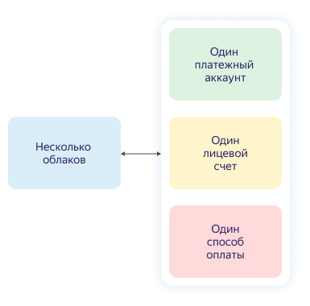

# Платежный аккаунт

Платежный аккаунт используется для идентификации пользователя, оплачивающего ресурсы в Яндекс.Облаке.

Платежный аккаунт может быть привязан только к одному [лицевому счету](personal-account.md) и одному облаку. В рамках лицевого счета можно использовать только тот способ оплаты, который соответствует типу платежного аккаунта и [договору](contract.md).

Взаимосвязь между облаком, платежным аккаунтом, лицевым счетом и способом оплаты представлена на схеме ниже.



Платежный аккаунт не используется для управления ресурсами Яндекс.Облака.



## Типы платежных аккаунтов {#ba-types}

Тип платежного аккаунта определяет [способ оплаты](../payment/payment-methods.md) ресурсов в Яндекс.Облаке.



 - Личный аккаунт
  
   - Предназначен для резидентов РФ.
   - Для оплаты потребленных ресурсов используется банковская карта.
   - Средства за потребленные ресурсы списываются автоматически. Подробнее см. раздел [Цикл оплаты для физических лиц](../payment/billing-cycle-individual.md).
   - После списания средств с банковской карты на электронную почту высылается [чек об оплате](individual-bill.md).
  
 - Бизнес-аккаунт
  
   - Предназначен для резидентов РФ.
   - Для оплаты потребленных ресурсов используется банковский перевод с расчетного счета организации и перевод с корпоративной банковской карты.
   - Потребленные ресурсы оплачиваются либо на основании [договора](../concepts/contract.md) и [счета](bill.md), либо списываются автоматически с привязанной банковской карты. Подробнее см. раздел [Цикл оплаты для юридических лиц](../payment/billing-cycle-business.md).
   - Акт на оказанные услуги и счет-фактура высылаются на электронную почту в начале следующего расчетного периода. Подробнее см. раздел [Финансовые документы](../payment/documents.md).
  
  
  


## Срок действия  {#dates}

Срок действия у платежного аккаунта отсутствует.

Однако если использование сервисов Яндекс.Облака было приостановлено из-за наличия задолженности и вы не оплатили эту задолженность в течение 30 дней после приостановки, то все ваши данные, включая платежный аккаунт, будут заблокированы и удалены без возможности восстановления.

## Количество платежных аккаунтов {#restrictions}

Один клиент может создать только один платежный аккаунт.

