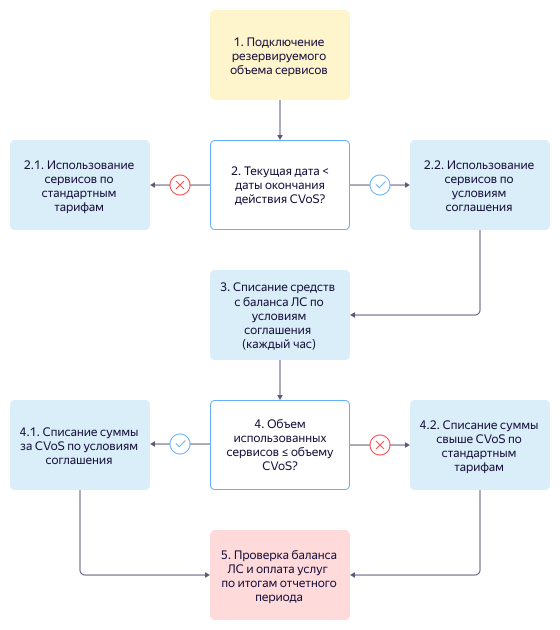
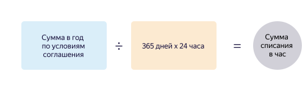
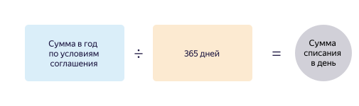
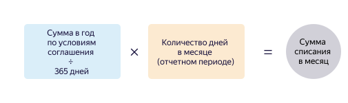

# Резервируемое потребление





Соглашение предусматривает только предоставление скидки на определенный объем сервисов, однако не гарантирует наличие мощностей в дата-центрах.



## Размер скидки {#amount}

Размер гарантированной скидки зависит от объема ресурсов сервиса, который вы планируете использовать, а также от срока действия CVoS. Чем больше срок действия CVoS, тем больше скидка. Подробности о ценах и правилах тарификации для всех сервисов можно найти на странице [Тарифы](/prices). Мы поможем рассчитать выгоду от резервирования ресурсов, если у вас возникнут вопросы. Напишите нам на [cloud-sales@yandex-team.ru](mailto:cloud-sales@yandex-team.ru).

## Подключение и срок действия {#how-to-enable}

Ознакомиться с доступными предложениями и подключить CVoS вы можете в консоли управления в разделе **Резервы**.

При [подключении CVoS](../operations/purchase-cvos.md) вы самостоятельно выбираете:
* срок действия — 6 месяцев или 1 год;
* дату начала действия — следующий календарный день или желаемую дату.

С момента подключения CVoS и принятия оферты обе стороны начинают действовать в рамках договора согласно Гражданскому кодексу РФ. С условиями договора вы можете ознакомиться в разделе [Правовые документы](https://yandex.ru/legal/cloud_oferta/).

Информация об использовании и окончании срока действия CVoS отображается в консоли управления.



Услуги сервисов {{ yandex-cloud }}, на которые не распространяются условия CVoS, оплачиваются по стандартным тарифам. Подробности о ценах и правилах тарификации для всех сервисов можно найти на странице [Тарифы](/prices).



## Использование и оплата {#how-to-pay}

После подключения CVoS скидка на использование сервисов применяется автоматически.

В течение выбранного срока действия вы обязаны оплачивать CVoS, даже если не используете сервисы {{ yandex-cloud }}. [Способ оплаты](../payment/index.md) зависит от юридического статуса ([типа платежного аккаунта](../concepts/billing-account.md#ba-types)).

Подробная схема использования и оплаты CVoS представлена ниже.

1. Вы подключаете CVoS на 6 месяцев или 1 год. CVoS начинает действовать с даты, выбранной вами при подключении.
1. В течение всего отчетного периода проверяется срок действия CVoS:

   2.1. Если срок действия истек (текущая дата > даты окончания действия CVoS), вы используете сервисы {{ yandex-cloud }} по [стандартным тарифам](/prices).

   2.2. Если срок действия не истек (текущая дата < даты окончания действия CVoS), вы используете сервисы {{ yandex-cloud }} по условиям соглашения. Перейдите к шагу 3.

1. Каждый час с вашего лицевого счета (ЛС) списывается [сумма](#formula), соответствующая соглашению, независимо от того, используете ли вы сервисы {{ yandex-cloud }}. Перейдите к шагу 4.

1. В течение всего отчетного периода проверяется объем использованных сервисов:

   4.1. Если фактический объем меньше или равен объему CVoS, списывается только сумма, соответствующую соглашению. Для расчета суммы списания используйте одну из [формул](#formula).

    Средства за использование сервисов {{ yandex-cloud }}, на которые не распространяются условия соглашения, списываются по стандартным тарифам. Перейдите к шагу 5.

   4.2. Если фактический объем превышает объем CVoS, дополнительно списывается разница между общим объемом и объемом CVoS по [стандартным тарифам](/prices). Перейдите к шагу 5.

1. В начале следующего отчетного периода проверяется баланс лицевого счета и оплата использованных сервисов: в зависимости от [типа платежного аккаунта](../concepts/billing-account.md#ba-types) вам может быть выставлен счет на оплату или могут быть списаны средства с привязанной банковской карты. Подробную информацию см. в разделах [Цикл оплаты для физических лиц](../../billing/payment/billing-cycle-individual.md) и [Цикл оплаты для организаций и ИП](../../billing/payment/billing-cycle-business.md).

## Сумма списания {#formula}

Сумма списания за CVoS определяется по формулам:



- Сумма списания в час

  

- Сумма списания в день

  

- Сумма списания в месяц

  



Итоговая сумма списания зависит от того, были ли в течение отчетного периода использованы услуги сервисов {{ yandex-cloud }}, на которые не распространяются условия CVoS. Дополнительную информацию читайте в разделе [Оплата ресурсов](../payment/index.md).

## Изменение и продление {#how-to-update}

Согласно договору изменить условия уже подключенного CVoS, продлить или отказаться от него невозможно.

Однако вы можете подключить новый CVoS, если вам будут доступны предложения в консоли управления. Подробную инструкцию читайте в разделе [Подключить CVoS](../operations/purchase-cvos.md).

## Сервисы, для которых доступно резервируемое потребление {#cvos-services}

Тарифы сервисов, для которых доступно резервируемое потребление:
* [{{ compute-name }}](../../compute/pricing.md#cvos)
* [{{ mch-name }}](../../managed-clickhouse/pricing.md#cvos)
* [{{ mmy-name }}](../../managed-mysql/pricing.md#cvos)
* [{{ mpg-name }}](../../managed-postgresql/pricing.md#cvos)
* [{{ mrd-name }}](../../managed-redis/pricing.md#cvos)
* [{{ mkf-name }}](../../managed-kafka/pricing.md#cvos)
* [{{ ydb-name }}](../../ydb/pricing/dedicated.md#cvos)
