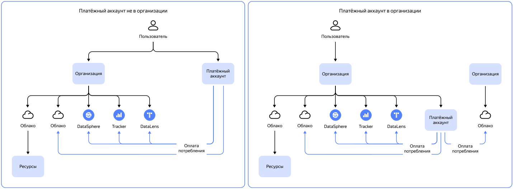

# Организация

_Организация_ — это рабочее пространство, которое объединяет разные типы ресурсов {{ yandex-cloud }} и пользователей.

Члены [организации](../../organization/quickstart.md) — [пользователи](../../overview/roles-and-resources.md#users), которые состоят в организации и могут получать доступ к сервисам внутри организации.
Пользователи, не являющиеся членами организации, не имеют доступа к ресурсам внутри организации.

Способ работы с платежными аккаунтами в сервисе {{ billing-name }} зависит от того, был ли добавлен платежный аккаунт в организацию.

См. разделы:

* [Привязка облака](../operations/pin-cloud.md#bind-cloud-organization)
* [Управление доступом](../security/index.md)





## Как понять, добавлен ли платежный аккаунт в организацию {#check-organization}



Если у вас возникли вопросы по работе с вашим платежным аккаунтом в организации, [создайте запрос в техническую поддержку]({{ link-console-support }}).