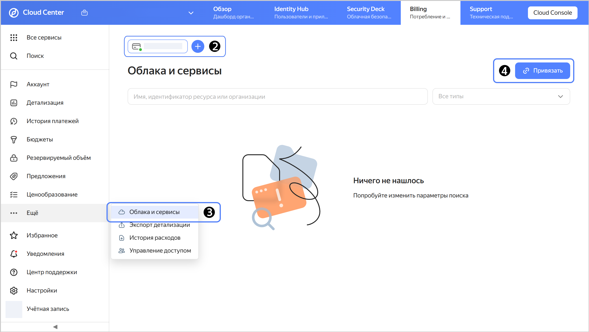
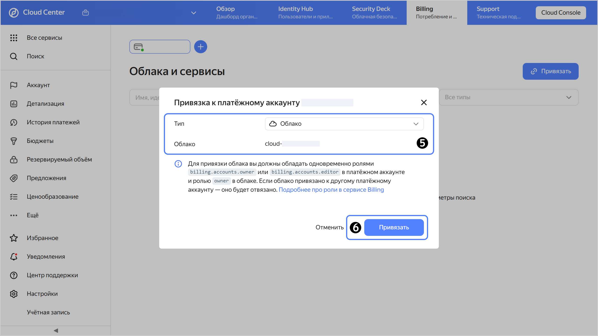

# Привязать облако к платежному аккаунту



## Что нужно для привязки облака {#bind-roles}

Перед привязкой [облака](../../resource-manager/concepts/resources-hierarchy.md#cloud) убедитесь, что соблюдены следующие условия:
1. [Платежный аккаунт](../concepts/billing-account.md) прошел активацию (находится в [статусе](../concepts/billing-account-statuses.md) `ACTIVE` или `TRIAL_ACTIVE`).
1. Пользователь обладает одновременно [ролями](../../iam/concepts/access-control/roles.md):
   * [resource-manager.clouds.owner](../../resource-manager/security/index.md#resource-manager-clouds-owner) на облако;
   * [billing.accounts.editor](../security/index.md##billing-accounts-editor) и выше в платежном аккаунте.

## Как привязать облако {#bind-cloud}

Чтобы привязать облако к платежному аккаунту или перепривязать облако к другому аккаунту:



- {{ billing-interface }} {#billing}

  1. 
  1. Выберите платежный аккаунт, к которому хотите привязать облако.
  1. На панели слева выберите  **{{ ui-key.yacloud_org.billing.account.entities.label_title }}**.
  1. Нажмите  **{{ ui-key.yacloud_billing.billing.account.bind-cloud.button_bind }}** в верхнем правом углу страницы.

     
  
  1. В поле **{{ ui-key.yacloud_org.billing.account.entities.label_type }}** выберите нужный тип сущности из списка, а затем — ресурс, который хотите привязать к платежному аккаунту.
  1. Нажмите кнопку **{{ ui-key.yacloud_billing.billing.account.bind-cloud.button_bind }}** — добавленное облако или сервис появится в списке.
  1. Погасите задолженность на старом платежном аккаунте, если перепривязали облако.

      

- {{ TF }} {#tf}

  

  Для привязки облака у [сервисного аккаунта](../../iam/concepts/users/service-accounts.md) должна быть [назначена роль](../security/index.md#set-role) не ниже `billing.accounts.editor` на платежный аккаунт, к которому будет привязано облако.

  Чтобы привязать облако к платежному аккаунту:
  
  1. Опишите в конфигурационном файле параметры ресурсов, которые необходимо создать:

     ```hcl
     resource "yandex_billing_cloud_binding" "mycloud" {
       billing_account_id = "<идентификатор_платежного_аккаунта>"
       cloud_id           = "<идентификатор_облака>"
     }
     ```

     Где:
     * `billing_account_id` — идентификатор платежного аккаунта, к которому вы хотите привязать облако.
     * `cloud_id` — идентификатор облака, которое вы хотите привязать к платежному аккаунту.

     Более подробную информацию о параметрах ресурса `yandex_billing_cloud_binding` в {{ TF }}, см. в [документации провайдера]({{ tf-provider-resources-link }}/billing_cloud_binding).
  1. Создайте ресурсы:

     

  После этого облако будет привязано к платежному аккаунту. Проверить привязку облака к аккаунту можно на странице платежного аккаунта в [сервисе {{ billing-name }}]({{ link-console-billing }}).

- API {#api}

  Чтобы привязать облако, воспользуйтесь методом REST API [bindBillableObject](../api-ref/BillingAccount/bindBillableObject.md) для ресурса [BillingAccount](../api-ref/BillingAccount/index.md) или вызовом gRPC API [BillingAccountService/BindBillableObject](../api-ref/grpc/BillingAccount/bindBillableObject.md).



Если вы хотите перестать использовать старый платежный аккаунт, проверьте, что в нем подключен бесплатный тарифный план «Базовый», чтобы предотвратить списания. В противном случае, даже если у аккаунта не останется привязанных облаков, начисления за платный тарифный план продолжат списываться.



Привязка облака или другого контейнера к [заблокированному аккаунту](../concepts/billing-account-statuses.md) приведет к остановке всех ваших ресурсов.



## Особенности управления ресурсами в организациях {#bind-cloud-organization}

1. 
1. 
