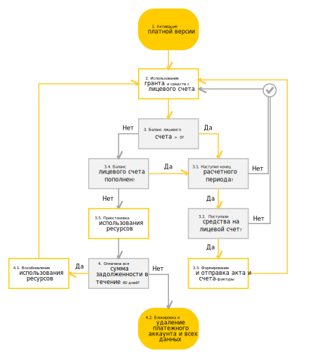
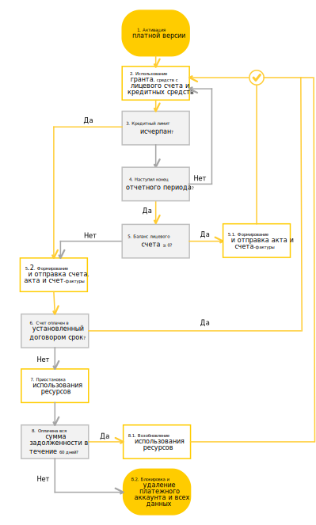

# Цикл оплаты для юридических лиц

Цикл выставления и оплаты счетов для юридических лиц, а также приостановки и блокировки использования ресурсов представлен на схемах ниже.

--- 

**[!TAB Я не использую кредитный лимит]**

1. Вы [активируете платную версию](../operations/activate-commercial.md) до истечения срока действия пробного периода. 
    Если вы не потратили всю сумму [стартового гранта](../concepts/bonus-account.md), то оставшуюся сумму можно использовать после перехода на платную версию.
1. Если вам предоставлен грант, вы используете его. Сумма гранта уменьшается по мере потребления ресурсов сервисов Яндекс.Облака. 
1. В течение всего расчетного периода проверяется сумма гранта и срок его действия.  Описание представлено в таблице ниже. 
   
   Сумма гранта | Описание 
   ----- | ----- 
   Больше нуля | Если срок действия не истек, вернитесь к шагу 2.  Если срок действия истек, перейдите к шагу 4.  
   Равна нулю | Перейдите к шагу 4 (независимо от срока действия гранта).
1. Необходимо [пополнить](../operations/pay-the-bill.md) лицевой счет:
   - Если вы пополните счет, перейдите к шагу 5.   
   - Если вы не пополните счет, перейдите к шагу 7. 
1. Вы потребляете ресурсы сервисов Яндекс.Облака. [Баланс лицевого счета](../concepts/personal-account.md#balance) уменьшается по мере потребления ресурсов. Перейдите к шагу 6.
1. В течение всего расчетного периода проверяется баланс вашего лицевого счета.  Описание представлено в таблице ниже. 
   
   Баланс | Описание 
   ----- | ----- 
   Больше нуля | 6.1. Если конец расчетного периода не наступил, вернитесь к шагу 5.  6.2. Если наступил конец расчетного периода, то формируются [акт](../concepts/act.md) и [счет-фактура](../concepts/invoice.md). Копии этих документов отправляются на электронную почту владельца платежного аккаунта. Вернитесь к шагу 5.
   Равен нулю | Вернитесь к шагу 4. 
1. Использование сервисов Яндекс.Облака может быть приостановлено:
   - Ваши виртуальные машины и кластеры баз данных полностью остановятся. 
   - Вы не сможете прочитать или скачать сохраненные данные. 
  
   Статус лицевого счета поменяется на [Приостановлен](../concepts/personal-account.md#conditions). В период приостановки взимается плата за услуги хранения данных и пени за неуплату. Перейдите к шагу 8. 
1. В течение шестидесяти дней с начала приостановки проверяется оплата всей суммы задолженности:
     8.1. Если в течение этого срока вы оплатите полную сумму задолженности, возможность потреблять ресурсы восстановится в течение суток. Статус лицевого счета поменяется на [Активный](../concepts/personal-account.md#conditions). Вернитесь к шагу 5.
     8.2. В противном случае использование сервисов Яндекс.Облака может быть полностью заблокировано. Все ваши данные, включая [платежный аккаунт](../concepts/billing-account.md), будут удалены без возможности восстановления. 

   > [!NOTE]
   >
   > После того, как доступ к ресурсам восстановится, вы можете самостоятельно [запустить виртуальные машины](../../compute/operations/vm-control/vm-stop-and-start.md). Чтобы запустить кластеры баз данных, обратитесь в службу технической поддержки.

**[!TAB Я использую кредитный лимит]**

1. Вы [активируете платную версию](../operations/activate-commercial.md) до истечения срока действия пробного периода. 
    Если вы не потратили всю сумму [стартового гранта](../concepts/bonus-account.md), то оставшуюся сумму можно использовать после перехода на платную версию.
1. Если вам предоставлен грант, вы используете его. Размер гранта уменьшается по мере потребления ресурсов сервисов Яндекс.Облака. 
1. В течение всего расчетного периода проверяется сумма гранта и срок его действия.  Описание представлено в таблице ниже. 
   
   Сумма гранта | Описание 
   ----- | ----- 
   Больше нуля | Если срок действия не истек, вернитесь к шагу 2.  Если срок действия истек, перейдите к шагу 4.  
   Равна нулю | Перейдите к шагу 4 (независимо от срока действия гранта).
1. Необходимо [пополнить](../operations/pay-the-bill.md) лицевой счет:
   - Если вы пополнили счет, перейдите к шагу 5.   
   - Если вы не пополнили счет, перейдите к шагу 7. 
1. Вы потребляете ресурсы сервисов Яндекс.Облака. [Баланс лицевого счета](../concepts/personal-account.md#balance) уменьшается по мере потребления ресурсов. Перейдите к шагу 6.
1. В течение всего расчетного периода проверяется баланс вашего лицевого счета.  Описание представлено в таблице ниже. 
    
    Баланс | Описание 
    ----- | ----- 
    Больше нуля | 6.1. Если конец расчетного периода не наступил, вернитесь к шагу 5.  6.2. Если наступил конец расчетного периода, то формируются [акт](../concepts/act.md) и [счет-фактура](../concepts/invoice.md). Копии этих документов отправляются на электронную почту владельца платежного аккаунта. Вернитесь к шагу 5.
    Меньше нуля | Перейдите к шагу 7.
1. Вы используете [кредитный лимит](../concepts/credit-limit.md) и возникает задолженность. Перейдите к шагу 8. 
1. В течение всего расчетного периода проверяется баланс вашего лицевого счета: 

     Баланс | Описание 
     ----- | -----  
     Кредитный лимит не исчерпан |8.1. Если конец расчетного периода не наступил, вернитесь к шагу 7 или [пополните](../operations/pay-the-bill.md) лицевой счет (шаг 4).  8.2. Если наступил конец расчетного периода:   - [Пополните](../operations/pay-the-bill.md) лицевой счет до положительного значения в сроки, установленные договором. Перейдите к шагу 4.   - В противном случае Яндекс.Облако оставляет за собой право поменять статус вашего лицевого счета на [Приостановлен](../concepts/personal-account.md#conditions). Подробнее см. шаг 9. 
     Кредитный лимит исчерпан | Яндекс.Облако оставляет за собой право поменять статус вашего лицевого счета на [Приостановлен](../concepts/personal-account.md#conditions). Подробнее см. шаг 9.   
     
1. Использование сервисов Яндекс.Облака может быть приостановлено при наличии задолженности:
   - Ваши виртуальные машины и кластеры баз данных полностью остановятся. 
   - Вы не сможете прочитать или скачать сохраненные данные. 
    
    В период приостановки взимается плата за услуги хранения данных и пени за неуплату. Перейдите к шагу 10. 
1. В течение шестидесяти дней с начала приостановки проверяется оплата всей суммы задолженности:
     10.1. Если в течение этого срока вы оплатите полную сумму задолженности, возможность потреблять ресурсы восстановится в течение суток. Статус лицевого счета поменяется на [Активный](../concepts/personal-account.md#conditions). Вернитесь к шагу 4.
     10.2. В противном случае использование сервисов Яндекс.Облака может быть полностью заблокировано. Все ваши данные, включая [платежный аккаунт](../concepts/billing-account.md), будут удалены без возможности восстановления. 

   > [!NOTE]
   >
   > После того, как доступ к ресурсам восстановится, вы можете самостоятельно [запустить виртуальные машины](../../compute/operations/vm-control/vm-stop-and-start.md). Чтобы запустить кластеры баз данных, обратитесь в службу технической поддержки.

--- 