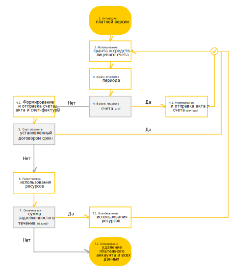

# Цикл оплаты для юридических лиц

Цикл выставления и оплаты счетов для юридических лиц, а также приостановки и блокировки использования ресурсов представлен на схеме ниже.

1. Вы [активируете платную версию](../operations/activate-commercial.md) до истечения срока действия пробного периода. 
    Если вы не потратили всю сумму [стартового гранта](../concepts/bonus-account.md), то оставшуюся сумму можно использовать после перехода на платную версию.
1. Вы потребляете ресурсы сервисов Яндекс.Облака. Сумма гранта и баланс [лицевого счета](../concepts/personal-account.md) уменьшается по мере потребления ресурсов. 
1. Наступает конец расчетного периода. Использование ресурсов, гранта и средств с лицевого счета продолжается. 
1. В начале следующего расчетного периода проверяется баланс вашего лицевого счета: 
     4.1. Если баланс положительный (больше или равен нулю), возвращаемся к шагу 2.  Если в течение расчетного периода были использованы средства с лицевого счета, то формируются [акт](../concepts/act.md) и [счет-фактура](../concepts/invoice.md). Копии этих документов отправляются на электронную почту владельца платежного аккаунта. 
     4.2. Если баланс отрицательный, формируются [счет на оплату](../concepts/bill.md), акт об оказанных услугах и счет-фактура. Копии этих документов отправляются на электронную почту владельца платежного аккаунта. 
        Оплатить счет необходимо в сроки, предусмотренные [договором](../concepts/contract.md).
1. Проверяется оплата счета. 
    Если счет был оплачен в установленные договором сроки, возвращаемся к шагу 2. В противном случае переходим к шагу 6.
1. Возникает задолженность и использование сервисов Яндекс.Облака приостанавливается. Статус лицевого счета меняется на [Приостановлен](../concepts/personal-account.md). В период приостановки взимается плата за услуги хранения данных и пени за неуплату. Максимальный срок приостановки и хранения данных — шестьдесят календарных дней. 
1. В течение шестидесяти дней с начала приостановки проверяется оплата всей суммы задолженности:
     7.1. Если в течение этого срока вы оплатите полную сумму задолженности, возможность потреблять ресурсы восстановится в течение суток. Статус лицевого счета поменяется на [Активный](../concepts/personal-account.md).
     7.2. В противном случае использование сервисов Яндекс.Облака полностью заблокируется. Все ваши данные, включая [платежный аккаунт](../concepts/billing-account.md), будут удалены без возможности восстановления. 

