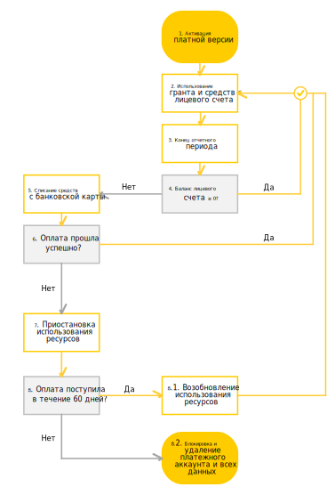

# Цикл оплаты для физических лиц

Цикл списания средств с банковской карты физических лиц, а также приостановки и блокировки использования ресурсов представлен на схеме ниже.

1. Вы [активируете платную версию](../operations/activate-commercial.md) до истечения срока действия пробного периода. 
    Если вы не потратили всю сумму [стартового гранта](../concepts/bonus-account.md), то оставшуюся сумму можно использовать после перехода на платную версию.
1. Вы потребляете ресурсы сервисов Яндекс.Облака. Сумма гранта и [баланс лицевого счета](../concepts/personal-account.md#balance) уменьшается по мере потребления ресурсов. 
1. Наступает конец расчетного периода. Использование ресурсов, гранта и средств с лицевого счета продолжается. 
1. В начале следующего расчетного периода проверяется баланс вашего лицевого счета. 
    Если баланс положительный (больше или равен нулю), возвращаемся к шагу 2.  В противном случае переходим к шагу 5.
1. [Рассчитывается](payment-methods-individual.md#payment-amount) итоговая сумма к оплате и инициируется списание средств с привязанной банковской карты. 
1. Проверяется оплата потребленных ресурсов. 
    Если средства удалось списать с карты в течение одного дня, возвращаемся к шагу 2.  В противном случае переходим к шагу 7.
1. Возникает задолженность и использование сервисов Яндекс.Облака приостанавливается. Статус лицевого счета меняется на [Приостановлен](../concepts/personal-account.md#conditions). В период приостановки взимается плата за услуги хранения данных и пени за неуплату. Максимальный срок приостановки и хранения данных — шестьдесят календарных дней. 
1. В течение шестидесяти дней с начала приостановки проверяется оплата всей суммы задолженности:
     8.1. Если в течение этого срока вы оплатите полную сумму задолженности, возможность потреблять ресурсы восстановится в течение суток. Статус лицевого счета поменяется на [Активный](../concepts/personal-account.md#conditions).
     8.2. В противном случае использование сервисов Яндекс.Облака полностью заблокируется. Все ваши данные, включая [платежный аккаунт](../concepts/billing-account.md), будут удалены без возможности восстановления. 

