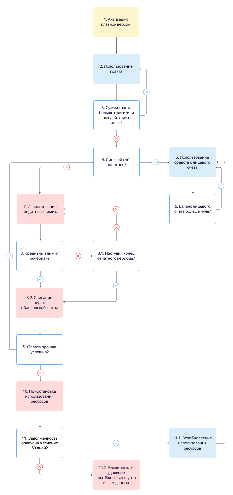

# Цикл оплаты для физических лиц



Цикл списания средств с банковской карты физических лиц, а также приостановки и блокировки использования ресурсов представлен на схеме ниже.

1. Вы создаете аккаунт с платным потреблением.
1. Если вам предоставлен грант, вы используете его. Сумма гранта уменьшается по мере потребления ресурсов сервисов {{ yandex-cloud }}.
1. В течение всего отчетного периода проверяется сумма гранта и срок его действия.  Описание представлено в таблице ниже.

   Сумма гранта | Описание
   ----- | -----
   Больше нуля | Если срок действия не истек, вернитесь к шагу 2.  Если срок действия истек, перейдите к шагу 4.
   Равна нулю | Перейдите к шагу 4 (независимо от срока действия гранта).

1. Необходимо [пополнить](../operations/pay-the-bill.md) лицевой счет:
   - Если вы пополнили счет, перейдите к шагу 5.
   - Если вы не пополнили счет, перейдите к шагу 7.
1. Вы потребляете ресурсы сервисов {{ yandex-cloud }}. [Баланс лицевого счета](../concepts/personal-account.md#balance) уменьшается по мере потребления ресурсов. Перейдите к шагу 6.
1. В течение всего отчетного периода проверяется баланс вашего лицевого счета:

     - Если баланс больше нуля, вернитесь к шагу 5.
     - Если баланс меньше нуля, перейдите к шагу 7.

1. Вы используете [порог оплаты](../concepts/billing-threshold.md) и возникает задолженность. Перейдите к шагу 8.
1. В течение всего отчетного периода проверяется баланс вашего лицевого счета:

   8.1. Если порог оплаты не исчерпан и конец отчетного периода не наступил, вернитесь к шагу 7 или [пополните](../operations/pay-the-bill.md) лицевой счет (шаг 4).
    8.2. Если наступил конец отчетного периода, [рассчитывается](payment-methods-individual.md#payment-amount) итоговая сумма к оплате и инициируется списание средств с привязанной банковской карты. Перейдите к шагу 9.

   

1. Проверяется оплата потребленных ресурсов:
   - Если средства списали в течение одного дня, вернитесь к шагу 4.
   - Если в день списания на банковской карте окажется недостаточно средств и вы самостоятельно не [пополнили](../operations/pay-the-bill.md) счет, попытка списания будет проведена повторно. Если списать средства не удастся в течение одного дня, средства могут быть списаны с одной из ваших карт, привязанных к аккаунту на Яндексе.  Если средства не удастся списать ни с одной из карт, {{ yandex-cloud }} оставляет за собой право поменять статус вашего платежного аккаунта на [PAYMENT_REQUIRED](../concepts/billing-account-statuses.md). Подробнее см. шаг 10.

     

1. Использование сервисов {{ yandex-cloud }} может быть приостановлено при наличии задолженности:
   - Ваши виртуальные машины и кластеры баз данных полностью остановятся.
   - Вы не сможете прочитать или скачать сохраненные данные.

   В период приостановки взимается плата за услуги хранения данных и пени за неуплату. Перейдите к шагу 11.
1. В течение 60 дней с начала приостановки проверяется оплата всей суммы задолженности:

    11.1. Если в течение этого срока вы оплатите полную сумму задолженности, возможность потреблять ресурсы восстановится в течение суток. Статус платежного аккаунта поменяется на [ACTIVE](../concepts/billing-account-statuses.md). Вернитесь к шагу 2.
     11.2. В противном случае использование сервисов {{ yandex-cloud }} может быть полностью заблокировано. Все ваши данные, включая [платежный аккаунт](../concepts/billing-account.md), будут удалены без возможности восстановления.

   

#### См.также

- [Грант](../concepts/bonus-account.md)
- [Порог оплаты](../concepts/billing-threshold.md)
- [Лицевой счет](../concepts/personal-account.md)
- [Платежный аккаунт](../concepts/billing-account.md)