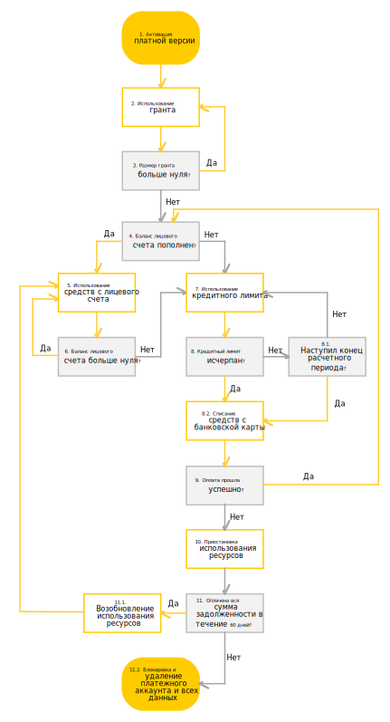

# Цикл оплаты для физических лиц

Цикл списания средств с банковской карты физических лиц, а также приостановки и блокировки использования ресурсов представлен на схеме ниже.

1. Вы [активируете платную версию](../operations/activate-commercial.md) до истечения срока действия пробного периода. 
    Если вы не потратили всю сумму [стартового гранта](../concepts/bonus-account.md), то оставшуюся сумму можно использовать после перехода на платную версию.
1. Если вам предоставлен грант, вы используете его. Сумма гранта уменьшается по мере потребления ресурсов сервисов Яндекс.Облака. 
1. В течение всего расчетного периода проверяется сумма гранта и срок его действия.  Описание представлено в таблице ниже. 
   
   Сумма гранта | Описание 
   ----- | ----- 
   Больше нуля | Если срок действия не истек, вернитесь к шагу 2.  Если срок действия истек, перейдите к шагу 4.  
   Равна нулю | Перейдите к шагу 4 (независимо от срока действия гранта).

1. Необходимо [пополнить](../operations/pay-the-bill.md) баланс лицевого счета:
   - Если вы пополнили баланс, перейдите к шагу 5.   
   - Если вы не пополнили баланс, перейдите к шагу 7. 
1. Вы потребляете ресурсы сервисов Яндекс.Облака. [Баланс лицевого счета](../concepts/personal-account.md#balance) уменьшается по мере потребления ресурсов. Перейдите к шагу 6.
1. В течение всего расчетного периода проверяется баланс вашего лицевого счета:
     
     - Если баланс больше нуля, вернитесь к шагу 5.
     - Если баланс меньше нуля, перейдите к шагу 7.
      
1. Вы используете [кредитный лимит](../concepts/credit-limit.md) и возникает задолженность. Использовать сервисы Яндекс.Облака возможно до тех пор, пока баланс лицевого счета не достигнет установленного размера кредитного лимита. Перейдите к шагу 8.
1. В течение всего расчетного периода проверяется баланс вашего лицевого счета:     
    8.1. Если кредитный лимит не исчерпан и конец расчетного периода не наступил, вернитесь к шагу 7 или [пополните](../operations/pay-the-bill.md) баланс лицевого счета (шаг 4). 
    8.2. Если кредитный лимит исчерпан или наступил конец расчетного периода, [рассчитывается](payment-methods-individual.md#payment-amount) итоговая сумма к оплате и инициируется списание средств с привязанной банковской карты. Перейдите к шагу 9. 
1. Проверяется оплата потребленных ресурсов: 
   - Если средства списали в течение одного дня, вернитесь к шагу 4. 
   - Если в день списания на банковской карте окажется недостаточно средств, попытка списания будет проведена повторно. Если списать средства не удастся в течение одного дня, средства могут быть списаны с одной из ваших карт, привязанных к аккаунту на Яндекс.Паспорте.  Если средства не удастся списать ни с одной из карт, перейдите к шагу 10.
1. Использование сервисов Яндекс.Облака приостанавливается:
   - Ваши виртуальные машины и кластеры баз данных полностью останавливаются. 
   - Вы не можете прочитать или скачать сохраненные данные. 
   
   Статус лицевого счета меняется на [Приостановлен](../concepts/personal-account.md#conditions). В период приостановки взимается плата за услуги хранения данных и пени за неуплату. Перейдите к шагу 11. 
1. В течение шестидесяти дней с начала приостановки проверяется оплата всей суммы задолженности:
     11.1. Если в течение этого срока вы оплатите полную сумму задолженности, возможность потреблять ресурсы восстановится в течение суток. Статус лицевого счета поменяется на [Активный](../concepts/personal-account.md#conditions). Вернитесь к шагу 2.
     11.2. В противном случае использование сервисов Яндекс.Облака полностью заблокируется. Все ваши данные, включая [платежный аккаунт](../concepts/billing-account.md), будут удалены без возможности восстановления. 

   > [!NOTE]
   >
   > После того, как доступ к ресурсам восстановится, вы можете самостоятельно [запустить виртуальные машины](../compute/operations/vm-control/vm-stop-and-start.md). Чтобы запустить кластеры баз данных, обратитесь в службу технической поддержки.

