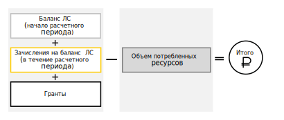

# Способы оплаты для физических лиц

Физические лица могут оплачивать потребленные ресурсы с помощью [банковской карты](#debit-card), привязанной к платежному аккаунту.

К оплате принимаются банковские карты Visa, MasterCard и МИР.
> [!NOTE]
> Не принимаются банковские карты Cirrus, Maestro, American Express и Visa Electron.

## Привязка банковской карты {#pin-card}

Физические лица обязаны привязать банковскую карту к платежному аккаунту при его [создании](../quickstart/index.md).

После привязки карты выполняется проверка ее валидности. Способ проверки зависит от типа карты, банка-эмитента и других условий.

## Списание средств {#write-off}

Списание средств с банковской карты, привязанной к платежному аккаунту, происходит автоматически в начале следующего расчетного периода, если итоговая сумма списания больше нуля. 

 > [!NOTE]
 > Средства могут быть списаны автоматически в течение текущего расчетного периода, если баланс вашего лицевого счета превысит установленный размер [кредитного лимита](../concepts/credit-limit.md).
 >

Обычно платеж зачисляется в течение 15‒20 минут. В соответствии с  [ФЗ-54 «О применении контрольно-кассовой техники»](http://base.garant.ru/12130951/) вы получите [чек об оплате](../concepts/individual-bill.md) по электронной почте. Мы рекомендуем сохранять чеки, однако даже если вы удалите их, вы можете [посмотреть историю платежей](../operations/check-bill-history.md).

Если в день списания на банковской карте окажется недостаточно средств, попытка списания будет проведена повторно. Если списать средства не удастся в течение одного дня, средства могут быть списаны с одной из ваших карт, привязанных к аккаунту на Яндекс.Паспорте. 

> [!NOTE]
> Мы рекомендуем самостоятельно отслеживать расход средств с лицевого счета и [пополнять счет до положительного значения](../operations/pay-the-bill.md). Если средства за потребленные ресурсы не удастся списать ни с одной из привязанных карт или баланс вашего лицевого счета превысит максимальный размер кредитного лимита, то использование сервисов Яндекс.Облака может быть приостановлено. Дополнительную информацию см. в разделе [Цикл оплаты](../payment/billing-cycle-individual.md).
>

## Сумма списания {#payment-amount}

Итоговая сумма списания зависит от того, был ли использован [грант](../concepts/bonus-account.md) и пополнялся ли [лицевой счет (ЛС)](../concepts/personal-account.md#balance) в течение расчетного периода.

Сумма списания определяется по формуле:

  ---  
      
 **[!TAB Пример 1]**
 
 Баланс ЛС на начало расчетного периода — 0 рублей. 
 В течение всего расчетного периода на ЛС поступило 0 рублей.
 Сумма гранта — 1 000 рублей.
 Кредитный лимит — 2 000 рублей.
 В середине расчетного периода достигнут установленный размер кредитного лимита и объем потребленных ресурсов составил 3 000 рублей. 
 Итоговая сумма: 3 000 - (0 + 0 + 1 000) = 2 000 рублей.
 В середине расчетного периода с привязанной карты может быть списано 2 000 рублей.
        
 **[!TAB Пример 2]**
 
 Баланс ЛС на начало расчетного периода — 0 рублей. 
 В течение всего расчетного периода на ЛС поступило 0 рублей.
 Сумма гранта — 1 000 рублей.
 На конец расчетного периода объем потребленных ресурсов составил 800 рублей.
 Размер гранта на конец расчетного периода составляет 200 рублей. Баланс ЛС не изменился.
 В начале следующего расчетного месяца с привязанной банковской карты средства не будут списаны.    
  
 **[!TAB Пример 3]**
   
 Баланс ЛС на начало расчетного периода — 0 рублей. 
 В течение всего расчетного периода на ЛС поступило 0 рублей.
 Сумма гранта — 1 000 рублей.
 Кредитный лимит — 2 000 рублей.
 На конец расчетного периода объем потребленных ресурсов составил 2 300 рублей. Кредитный лимит не достигнут, предоставленный грант полностью израсходован.
 Итоговая сумма: 2 300 - (0 + 0 + 1 000) = 1 300 рублей.
 В начале следующего расчетного периода с привязанной карты будет списано 1 300 рублей.
       
  ---    
