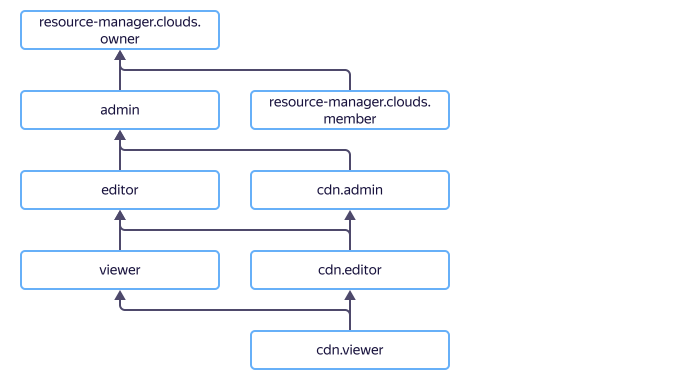

# Управление доступом в {{ cdn-name }}

Для управления правами доступа в {{ cdn-name }} используются [роли](../../iam/concepts/access-control/roles.md).

В этом разделе вы узнаете:

* [на какие ресурсы можно назначить роль](#resources);
* [какие роли действуют в сервисе](#roles-list);
* [какие роли необходимы](#required-roles) для того или иного действия.





## На какие ресурсы можно назначить роль {#resources}



## Какие роли действуют в сервисе {#roles-list}



### Сервисные роли {#service-roles}

#### cdn.viewer {#cdn-viewer}



#### cdn.editor {#cdn-editor}



#### cdn.admin {#cdn-admin}



### Примитивные роли {#primitive-roles}





## Какие роли мне необходимы {#required-roles}

В таблице ниже перечислено, какие роли нужны для выполнения указанного действия. Вы всегда можете назначить роль, которая дает более широкие разрешения, нежели указанная. Например, назначить `editor` вместо `viewer`.

Действие | Необходимые роли
-------- | --------
**Просмотр информации** | 
Просмотр информации о любом ресурсе | `cdn.viewer` на этот ресурс
**Управление CDN-ресурсами** | 
[Создание ресурса](../operations/resources/create-resource.md) | `cdn.editor` на каталог, где будут создаваться ресурсы
[Изменение основных настроек ресурса](../operations/resources/configure-basics.md) | `cdn.editor` на каталог с CDN-ресурсами
[Отключение ресурса](../operations/resources/disable-resource.md) | `cdn.editor` на каталог с CDN-ресурсами
[Настройка кеширования ресурса](../operations/resources/configure-caching.md) | `cdn.editor` на каталог с CDN-ресурсами
[Предварительная загрузка файлов на CDN-серверы](../operations/resources/prefetch-files.md) | `cdn.editor` на каталог с CDN-ресурсами
[Очистка кеша ресурса](../operations/resources/purge-cache.md) | `cdn.editor` на каталог с CDN-ресурсами
[Настройка HTTP-заголовков запросов и ответов](../operations/resources/configure-headers.md) | `cdn.editor` на каталог с CDN-ресурсами
[Настройка CORS при ответах клиентам](../operations/resources/configure-cors.md) | `cdn.editor` на каталог с CDN-ресурсами
[Настройка HTTP-методов](../operations/resources/configure-http.md) | `cdn.editor` на каталог с CDN-ресурсами
[Включение сжатия файлов](../operations/resources/enable-compression.md) | `cdn.editor` на каталог с CDN-ресурсами
[Включение сегментации файлов](../operations/resources/enable-segmentation.md) | `cdn.editor` на каталог с CDN-ресурсами
**Управление группами источников** | 
[Создание группы источников](../operations/origin-groups/create-group.md) | `cdn.editor` на каталог с группой источников
[Изменение группы источников](../operations/origin-groups/edit-group.md) | `cdn.editor` на каталог с группой источников
[Подключение группы источников к ресурсу](../operations/origin-groups/bind-group-to-resource.md) | `cdn.editor` на каталог с CDN-ресурсом
[Удаление группы источников](../operations/origin-groups/delete-group.md) | `cdn.editor` на каталог с группой источников
**Управление платными функциями** | 
Экранирование источников | `cdn.editor` на каталог с CDN-ресурсами
Выгрузка логов | `cdn.editor` на каталог с CDN-ресурсами
**Управление доступом к ресурсам** | 
[Назначение роли](../../iam/operations/roles/grant.md), [отзыв роли](../../iam/operations/roles/revoke.md) и просмотр назначенных ролей на ресурс | `admin` на этот ресурс

#### Что дальше

* [Как назначить роль](../../iam/operations/roles/grant.md).
* [Как отозвать роль](../../iam/operations/roles/revoke.md).
* [Подробнее об управлении доступом в {{ yandex-cloud }}](../../iam/concepts/access-control/index.md).
* [Подробнее о наследовании ролей](../../resource-manager/concepts/resources-hierarchy.md#access-rights-inheritance).
