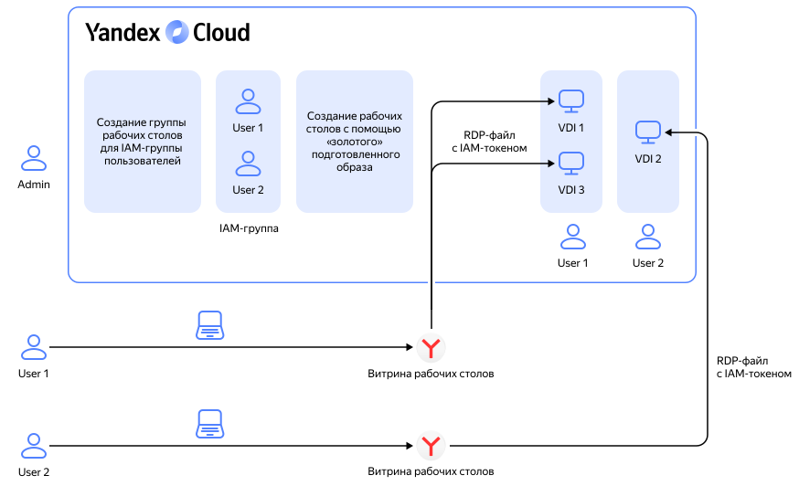

# Список управления доступом (ACL)

В {{ cloud-desktop-full-name }} управление доступом реализовано с помощью [разграничения ролей {{ iam-full-name }}](../security/index.md).

ACL {{ cloud-desktop-name }} — список разрешений для конкретной [группы рабочих столов](desktops-and-groups.md).

По умолчанию для каждой новой группы рабочих столов создается пустой ACL. Пользователь, обладающий [ролью](../security/index.md#vdi-admin) `vdi.admin`, может [отредактировать](../operations/desktop-groups/update-acl.md) ACL.

С помощью ACL можно выдать доступ к группе рабочих столов следующим получателям разрешений:
* [Пользователь {{ yandex-cloud }}](../../iam/concepts/users/accounts.md)
* [Сервисный аккаунт](../../iam/concepts/users/service-accounts.md)
* [Группа пользователей {{ org-full-name }}](../../organization/concepts/groups.md)
* [Публичная группа](../../iam/concepts/access-control/public-group.md)
* [Системная группа](../../iam/concepts/access-control/system-group.md)

За каждым конкретным рабочим столом закрепляется отдельный пользователь {{ yandex-cloud }}.

Чтобы [подключиться к рабочему столу](../operations/desktops/connect.md) пользователь получает уникальный RDP-файл, в который интегрирован [IAM-токен](../../iam/concepts/authorization/iam-token.md). Таким образом, рабочий стол доступен только определенному пользователю.

[Время жизни](../../iam/concepts/authorization/iam-token.md#lifetime) IAM-токена — 12 часов. После истечения этого срока RDP-файл становится недействительным. Чтобы подключиться к рабочему столу, пользователю нужно повторно запросить RDP-файл.

Есть получатель RDP-файла по каким-то причинам был удален из списка пользователей {{ yandex-cloud }}, например при ротации в другое подразделение или при подозрении на несанкционированную активность, то его RDP-файл становится недействительным независимо от времени выпуска.

## Пример использования механизмов доступа в {{ cloud-desktop-name }} {#example}

1. Администратор организации (пользователь с [ролью](../../organization/security/index.md#organization-manager-admin) `organization-manager.admin` на [облако](../../resource-manager/concepts/resources-hierarchy.md#cloud)) создает [группу пользователей](../../organization/concepts/groups.md) {{ org-full-name }}, для которой будет развернута группа рабочих столов.
1. Администратор {{ cloud-desktop-name }} (пользователь с [ролью](../security/index.md#vdi-admin) `vdi.admin` на [каталог](../../resource-manager/concepts/resources-hierarchy.md#folder)) [создает](../operations/desktop-groups/create.md) группу рабочих столов и [выдает](../operations/desktop-groups/update-acl.md) к ней доступ для группы пользователей.

    Также у администратора есть возможность подготовить собственный [образ](images.md) для группы рабочих столов.

1. Для каждого участника группы пользователей администратор {{ cloud-desktop-name }} [создает](../operations/desktops/create.md) собственный рабочий стол.
1. Участник группы пользователей аутентифицируется с помощью [Яндекс ID](https://yandex.ru/support/id/index.html) или через [систему единого входа (SSO)](../../organization/concepts/add-federation.md) на странице [Витрина пользовательских рабочих столов](showcase.md). На витрине отображаются рабочие столы, доступные конкретному пользователю.
1. На витрине участник группы пользователей скачивает RDP-файл к конкретному рабочему столу и [подключается](../operations/desktops/connect.md) к нему.

## См. также {#see-also}

* [Как начать работать c сервисом](../quickstart.md)
* [Управление доступом](../security/index.md)
* [{#T}](../operations/desktop-groups/update-acl.md)