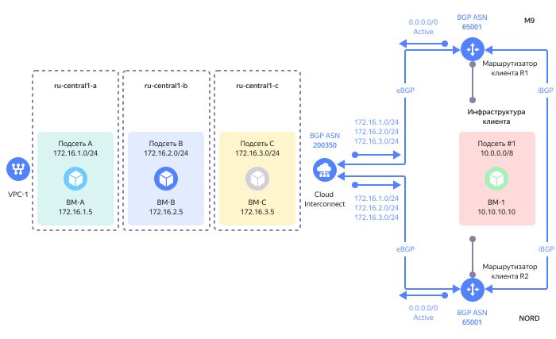

# Равномерное распределение трафика для маршрута 0.0.0.0/0

В отдельных случаях, например, для связи облачных ресурсов с интернетом через инфраструктуру клиента, необходимо настроить на клиентских маршрутизаторах анонс маршрута `0.0.0.0/0` по протоколу BGP в направлении {{ yandex-cloud }}.

На схеме представлен вариант, когда трафик из облачных подсетей, подключенных к {{ interconnect-name }}, будет безусловно маршрутизироваться в направлении маршрутизаторов клиента через обе точки присутствия.

[Группы безопасности](../../vpc/concepts/security-groups.md) не могут быть назначены на ресурсы вне {{ yandex-cloud }}, поэтому корректным способом фильтрации трафика будет использование IPv4-префиксов, а не ссылок на другие группы безопасности.

В данном случае клиент имеет возможность настроить на клиентских маршрутизаторах правила фильтрации трафика перед отправкой его в интернет через собственный NAT-шлюз, не используя при этом инфраструктуру {{ yandex-cloud }}.

