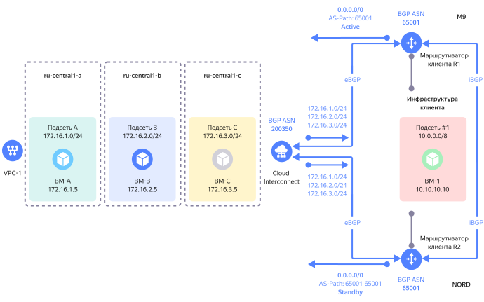

# Приоритизация трафика по направлению для маршрута 0.0.0.0/0

Для приоритизации трафика по направлению в рамках услуги {{ interconnect-name }} можно использовать методы:

* [Longest Prefix Match (LPM)](#lpm1)
* [BGP AS-Path Prepend](#prepend1) (будет доступен с 03.07.2023)

Метод Longest Prefix Match имеет больший приоритет в алгоритме выбора лучшего маршрута на маршрутизаторах по сравнению с методом BGP AS-Path Prepend. Рекомендуется выбрать только один из предложенных методов и не применять оба метода одновременно.

## Метод Longest Prefix Match (LPM) {#lpm2}

Ниже представлен пример схемы с приоритизацией трафика через два приватных соединения, организованных через две точки присутствия.

Маршрут по умолчанию из инфраструктуры клиента `0.0.0.0/0` анонсируется по протоколу BGP клиентским маршрутизатором через точку присутствия `NORD` в направлении {{ yandex-cloud }}.

Два длинных (более специфичных) префикса из инфраструктуры клиента `0.0.0.0/1` и `128.0.0.0/1` анонсируются по протоколу BGP клиентским маршрутизатором через точку присутствия `M9` в направлении {{ yandex-cloud }}.

Анонсы через точку присутствия `M9` будут восприниматься в {{ yandex-cloud }} как более специфичные (приоритетные).

Таким образом, для всего трафика из облачных подсетей будет выбираться приватное соединение в направлении точки присутствия `M9`. В случае отказа данного соединения трафик будет автоматически перемаршрутизирован через приватное соединение в направлении точки присутствия `NORD`.

## Метод BGP AS-Path Prepend {#prepend2}

Ниже представлен пример схемы с приоритизацией трафика через два приватных соединения, организованных через две точки присутствия, с помощью метода BGP AS-Path Prepend.

Идея метода BGP AS-Path Prepend описана [в этом документе](https://datatracker.ietf.org/doc/html/rfc4271#section-5.1.2).

Маршрут по умолчанию из инфраструктуры клиента (`0.0.0.0/0`) анонсируется по протоколу BGP клиентским маршрутизатором через точку присутствия `M9` в направлении {{ yandex-cloud }}. По умолчанию значение атрибута BGP AS-Path будет равно `65001`, а длина пути AS-Path (количество значений номеров автономных систем) будет равна 1.

Этот же префикс `0.0.0.0/0` анонсируется из инфраструктуры клиента по протоколу BGP другим клиентским маршрутизатором R2 через точку присутствия `NORD` в направлении {{ yandex-cloud }}.

Перед тем как анонсировать префикс, политика BGP-маршрутизации на маршрутизаторе R2 добавляет номер автономной системы клиента (BGP ASN) в значение BGP-атрибута AS-Path, и оно станет равным `65001 65001`, а длина пути AS-Path станет равна 2. Такое изменение делает префикс с такой длиной AS-Path менее предпочтительным для внешних BGP-маршрутизаторов.

Таким образом, со стороны {{ yandex-cloud }} для префикса `0.0.0.0/0` будет выбран наилучший маршрут через точку присутствия `M9`, а маршрут через точку присутствия `NORD` будет резервным, поскольку длина пути AS-Path у него будет больше.

Для всего трафика из облачных подсетей в направлении инфраструктуры клиента будет выбираться приватное подключение в направлении точки присутствия `M9`. В случае отказа данного подключения трафик будет автоматически переключен на приватное подключение в направлении точки присутствия `NORD`.

