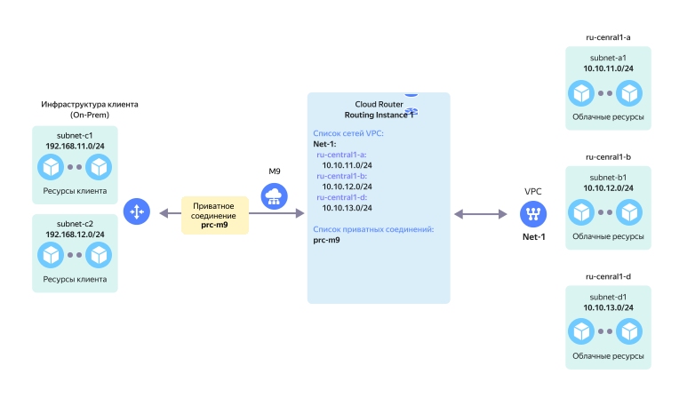

# On-Prem без резервирования и 1 VPC

Нерезервируемое подключение On-Prem через одно [приватное соединение](../../interconnect/concepts/priv-con.md) {{ interconnect-name }} к одному `RI` с одной [облачной сетью VPC](../../vpc/concepts/network.md).

На схеме выше представлена сетевая топология в следующей конфигурации:

* `On-Prem` клиента с двумя локальными подсетями — `subnet-c1` и `subnet-c2`.
* Сетевое оборудование On-Prem подключается через сервис [{{ interconnect-name }}](../../interconnect/concepts/index.md) к сетевому оборудованию {{ yandex-cloud }}.
* [Приватное соединение](../../interconnect/concepts/priv-con.md) `prc-m9`, организованное через [точку присутствия](../../interconnect/concepts/pops.md) `M9`, подключается к `RI` в {{ yandex-cloud }}.
* Со стороны {{ yandex-cloud }} к `RI` подключается виртуальная сеть `Net-1` в составе трех подсетей — `subnet-a1`, `subnet-b1` и `subnet-d1`.

Данная топология обеспечивает сетевую связность между подсетями в `On-Prem` и подсетями в VPC `Net-1`.

