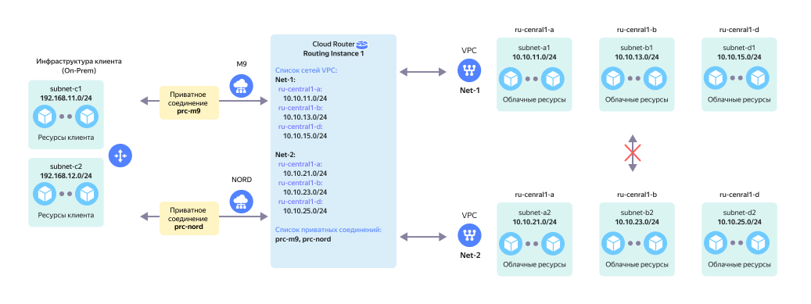

# On-Prem с резервированием и несколько VPC

Резервируемое подключение On-Prem через два [приватных соединения](../../interconnect/concepts/priv-con.md) {{ interconnect-name }} к одному `RI` с двумя (и более) [облачными сетями](../../vpc/concepts/network.md) без сетевой связности между ними.

На схеме выше представлена сетевая топология в следующей конфигурации:

* `On-Prem` клиента с двумя локальными подсетями — `subnet-c1` и `subnet-c2`.
* Сетевое оборудование On-Prem подключается через сервис [Cloud Interconnect](../../interconnect/concepts/index.md) к сетевому оборудованию {{ yandex-cloud }}.
* Два [приватных соединения](../../interconnect/concepts/priv-con.md) `prc-m9` и `prc-nord`, организованные через две [точки присутствия](../../interconnect/concepts/pops.md) `M9` и `NORD`, подключаются к `RI` в {{ yandex-cloud }}.
* Со стороны {{ yandex-cloud }} к `RI` подключаются две виртуальные сети:
  * виртуальная сеть `Net-1` в составе трех подсетей — `subnet-a1`, `subnet-b1` и `subnet-d1`.
  * виртуальная сеть `Net-2` в составе трех подсетей — `subnet-a2`, `subnet-b2` и `subnet-d2`.

Данная топология обеспечивает сетевую связность между:

* Подсетями в `On-Prem` и подсетями `subnet-a1`, `subnet-b1` и `subnet-d1` в VPC `Net-1`.
* Подсетями в `On-Prem` и подсетями `subnet-a2`, `subnet-b2` и `subnet-d2` в VPC `Net-2`.

В случае выхода из строя любого из вышеуказанных приватных соединений весь сетевой трафик будет автоматически перемаршрутизирован на оставшееся в работе приватное соединение.

Данная топология не обеспечивает сетевую связность между подсетями виртуальных сетей `Net-1` и `Net-2`.

