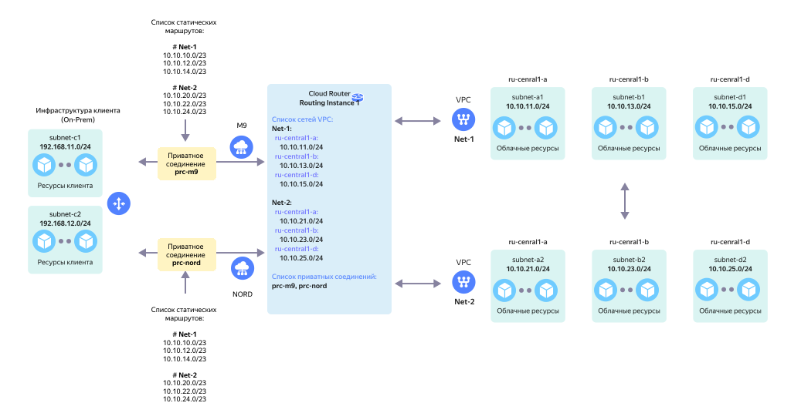

# Организация сетевой связности между двумя и более облачными сетями и On-Prem ресурсами (VPC Stitching)



Резервируемое подключение On-Prem через два приватных соединения Cloud Interconnect к одному RI с двумя *(и более)* облачными сетями и сетевой связностью облачных сетей между собой. Такая полносвязная топология называется `Full Mesh`.

В данном сценарии используются следуюшие компоненты:

* `On-Prem` клиента с двумя локальными подсетями - `subnet-c1` и `subnet-c2`.

* Сетевое оборудование `On-Prem` подключается через сервис [Cloud Interconnect](../../interconnect/concepts/index.md) к сетевому оборудованию Yandex Cloud.

* Два приватных соединения `prc-m9` и `prc-nord`, организованные через две [точки присутствия](../../interconnect/concepts/pops.md) `M9`и `NORD` подключается к `Routing Instance` в Yandex Cloud.

* Со стороны Yandex Cloud к `Routing Instance` подключаются две виртуальных сети:

  * виртуальная сеть `Net-1` в составе трех подсетей - `subnet-a1`, `subnet-b1` и `subnet-d1`.
  * виртуальная сеть `Net-2` в составе трех подсетей - `subnet-a2`, `subnet-b2` и `subnet-d2`.

* Для организации сетевой связности между виртуальными сетями `Net-1` и `Net-2` для приватных соединений `prc-m9` и `prc-nord` должны быть настроены [склеивающие анонсы](../concepts/vpc-stitching.md) для CIDR соответствующих подсетей виртуальных сетей `Net-1` и `Net-2`.



Использовать в качестве склеивающих анонсов собственные префиксы подсетей виртуальных сетей не допускается.



Данная топология обеспечивает сетевую связность между:

* Подсетями в `On-Prem` и подсетями в VPC `Net-1`.
* Подсетями в `On-Prem` и подсетями в VPC `Net-2`.
* Подсетями в VPC `Net-1` и `Net-2`.



В случае выхода из строя любого из вышеуказанных приватных соединений, весь сетевой трафик будет автоматически перемаршрутизирован на оставшееся в работе приватное соединение.



