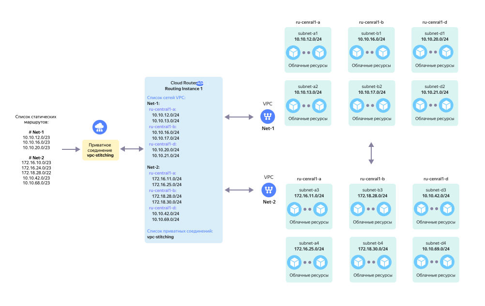

# Организация сетевой связности между двумя и более облачными сетями (VPC Stitching)



На схеме выше представлена сетевая топология в следующей конфигурации:

* Со стороны Yandex Cloud к `Routing Instance` подключается виртуальная сеть `Net-1` в составе 6 подсетей - `subnet-a1`, `subnet-a2`, `subnet-b1`, `subnet-b2`, `subnet-d1` и `subnet-d2`. Информация о IP-префиксах подсетей добавляется в `RI`.

* Со стороны Yandex Cloud к `Routing Instance` подключается виртуальная сеть `Net-2` в составе 6 подсетей - `subnet-a3`, `subnet-a4`, `subnet-b3`, `subnet-b4`, `subnet-d3` и `subnet-d4`. Информация о IP-префиксах подсетей добавляется в `RI`.

* Для организации сетевой связности между виртуальными сетями `Net-1` и `Net-2` в `Routing Instance` создается специальное приватное соединение `vpc-stitching`. Это приватное соединение замыкается на сетевом оборудовании Yandex Cloud.

* Для организации сетевой связности между виртуальными сетями `Net-1` и `Net-2` для приватного соединения `vpc-stitching` должны быть настроены [склеивающие анонсы](../concepts/vpc-stitching.md) для CIDR соответствующих подсетей виртуальных сетей `Net-1` и `Net-2`.



Использовать в качестве склеивающих анонсов собственные префиксы подсетей виртуальных сетей не допускается.



