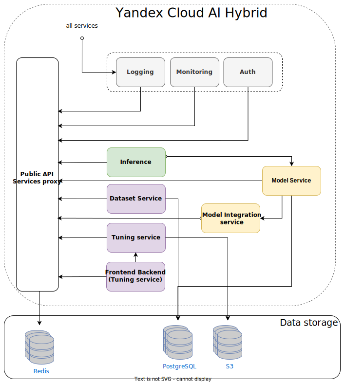

# Функциональные характеристики и архитектура {{ cloudml-full-name }}

{{ cloudml-full-name }} — это набор программных компонентов для управления, обучения, дообучения, использования моделей машинного обучения, а также программных продуктов на основе моделей машинного обучения.

## Функциональные характеристики ПО {#functionalities}

{{ cloudml-name }} позволяет:

* Использовать готовые модели машинного обучения, включенные в состав {{ cloudml-name }}.
* Создавать новые модели машинного обучения, в том числе на основе готовых моделей машинного обучения.
* Работать с различными модальностями, включающими, но не ограничивающимися, текстовыми данными, аудио и видеоданными, временными рядами и произвольными сочетаниями из разных модальностей.
* Администрировать ПО и модели, исследовать качество их работы.
* Организовывать программное взаимодействие моделей и ПО с внешними источниками данных и программными системами.
* Разрабатывать и внедрять прикладные продукты, основанные на моделях машинного обучения.

Сервис {{ cloudml-name }} может быть развернут на физическом оборудовании клиента.

## Архитектура ПО {#architecture}

{{ cloudml-name }} состоит из исполняемых программных компонентов, компонентов слоя хранения данных и моделей машинного обучения. Модели машинного обучения предназначены для решения различных прикладных задач. Программные компоненты обеспечивают работу этих моделей, позволяют проводить дообучение и создавать новые модели с нуля. Компоненты слоя хранения данных предназначены для хранения информации пользователей.

Исполняемые программные компоненты необходимы для различных задач:

1. Компоненты System обеспечивают функционирование сервиса (на рисунке — желтые и белые).
1. Компоненты Inference позволяют поддерживать инференс моделей (на рисунке — зеленые).
1. Компоненты Tuning необходимы для дообучения моделей (на рисунке — фиолетовые).

## Форма распространения {{ cloudml-name }} {#distribution}

{{ cloudml-name }} поставляется в виде набора программных компонентов и конфигурационных данных моделей. Компоненты слоя хранения данных не входят в поставку, их клиент должен обеспечить самостоятельно. 

Программные компоненты упакованы в Docker-образы, которые выгружаются в репозиторий образов в облаке клиента после заключения договора. Конфигурации моделей представляют собой файлы, позволяющие развернуть модели заданной конфигурации с помощью сервера инференсов. Файлы загружаются в объектное хранилище клиента в его облаке. Состав программных компонентов и конфигураций моделей в каждом случае определяется отдельно, поскольку зависит от оборудования клиента и решаемых задач.

