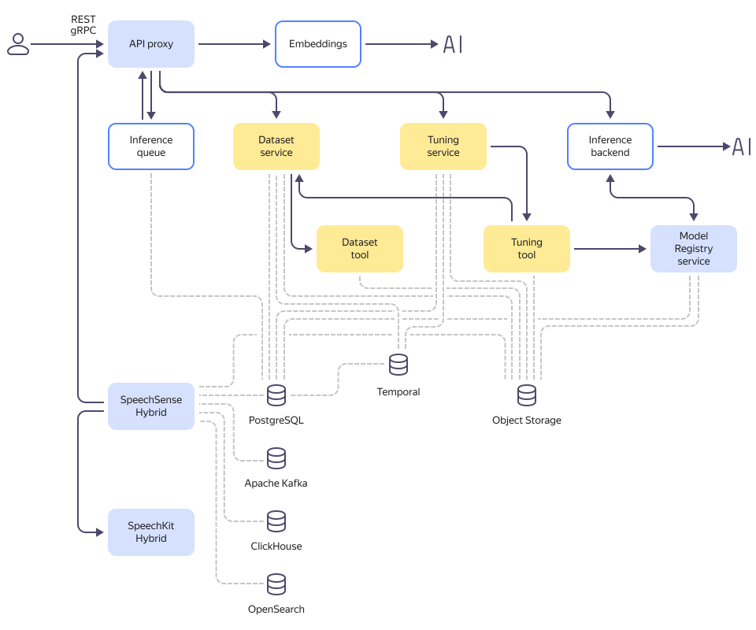

# Функциональные характеристики и архитектура {{ speechsense-hybrid-name }}

Модуль {{ speechsense-hybrid-name }} — это сервис, который поможет вашему бизнесу организовать аналитику контактных центров. В основе {{ speechsense-hybrid-name }} лежат ML-технологии {{ yandex-cloud }}. {{ sk-hybrid-name }} распознает речь, соберет статистику диалога и определит ключевые слова, а {{ cloudml-name }} проведет глубокий анализ диалогов, расставит теги и составит резюме.

Модуль {{ speechsense-hybrid-name }} является расширением ПО {{ cloudml-full-name }}.

{{ cloudml-full-name }} — это набор программных компонентов для управления, обучения, дообучения, использования моделей машинного обучения, а также программных продуктов на основе моделей машинного обучения.

С помощью модуля {{ speechsense-hybrid-name }} вы можете:

* Анализировать каналы коммуникации вашего бизнеса на основе записей разговоров или текстовых сообщений из чатов и интегрироваться с вашими АТС и CRM-системами.
* Использовать голосовые технологии {{ sk-hybrid-name }} для расшифровки, статистического и качественного анализа аудиозаписей диалогов.
* Анализировать аудиозаписи (двухканальное и одноканальное аудио) и текстовые диалоги на русском и казахском языках.

Модуль {{ speechsense-hybrid-name }} может быть развернут на физическом оборудовании клиента.

## Общая архитектура ПО {#architecture}

{{ cloudml-name }} состоит из исполняемых программных компонентов, компонентов слоя хранения данных и моделей машинного обучения. Модели машинного обучения предназначены для решения различных прикладных задач. Программные компоненты обеспечивают работу этих моделей, позволяют проводить дообучение и создавать новые модели с нуля. Компоненты слоя хранения данных предназначены для хранения информации пользователей.

Исполняемые программные компоненты необходимы для различных задач:

1. Компоненты System обеспечивают функционирование сервиса (на рисунке — голубые).
1. Компоненты Inference позволяют поддерживать инференс моделей (на рисунке — белые).
1. Компоненты Tuning необходимы для дообучения моделей (на рисунке — желтые).
