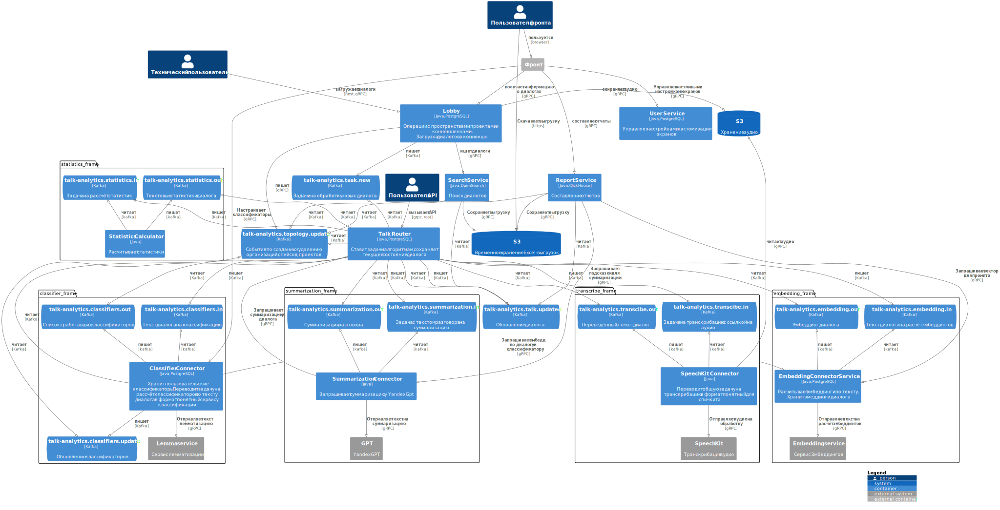

# Установка программного обеспечения {{ speechsense-hybrid-name }}

Модуль {{ speechsense-hybrid-name }} разворачивается с помощью Helm-чарта, который устанавливает верхнеуровневые компоненты и микросервисы.

* [Микросервисы](#microservices)
* [Архитектура микросервисов](#architecture)
* [Helm-чарт микросервисов](#helm-chart)
* [Переменные среды для запуска сервисов](#parameters)
* [Дополнительные компоненты](#additional-components)


## Микросервисы {#microservices}

1. `classifiersConnector` — хранит пользовательские классификаторы. Переводит задачу на расчет классификаторов по тексту диалога в формат, понятный сервису классификации.
1. `lobby` — операции с пространствами, проектами и подключениями.
1. `talkRouter` — ставит задачи алгоритмам, сохраняет текущее состояние диалога.
1. `speechkitConnector` — переводит общую задачу на транскрибацию в формат, понятный для {{ sk-hybrid-name }}.
1. `userCustomization`.
1. `talkStatistics` — рассчитывает статистики диалогов.
1. `summarizationConnector` — запрашивает суммаризацию у YandexGPT.
1. `embeddingConnector` — рассчитывает эмбеддинги по тексту. Хранит эмбеддинги диалога.
1. `talkSearch` — поиск диалогов.
1. `talkReports` — составление отчетов.
1. `gptConnector`.
1. `iamAgent`.
1. `keycloak`.
1. `dataUI`.

## Архитектура микросервисов {#architecture}

Архитектура микросервисов и их взаимодействие изображены на следующей диаграмме.



## Helm-чарт микросервисов {#helm-chart}

Данный helm-чарт устанавливает верхнеуровневые компоненты из поставки модуля {{ speechsense-hybrid-name }}.

### Пререквизиты к установке микросервисов {#prerequisites}

Для установки helm-чарта должны быть выполнены следующие условия:

1. Развернут **YandexGPT** (входит в поставку). Есть сетевая доступность с использованием TLS до эндпоинта прокси-сервиса для маршрутизации запросов к моделям.
1. Развернут **{{ sk-hybrid-name }}** (входит в поставку). Есть сетевая доступность с использованием TLS до эндпоинта прокси-сервиса для маршрутизации запросов к STT-бэкенду.
1. Развернут кластер **{{ PG }}** 15 с объемом свободного места 256 ГБ SSD, процессорными мощностями 12 vCPU, оперативной памятью 48 ГБ RAM.
   
   Рекомендуется сделать отказоустойчивую децентрализованную конфигурацию кластера в трех разных сетевых зонах. В кластере созданы базы данных `talk-analytics`, `talk-classifiers`, `user-customizations`, `talk-speechkit` и `gpt-db`. Создан пользователь `pg-admin`. Пользователю выделены права владельца пяти созданных баз данных.

1. Развернут кластер **{{ PG }}** 16.2 с объемом свободного места 10 ТБ SSD, процессорными мощностями 12 vCPU, оперативной памятью 48 ГБ RAM.
   
   Рекомендуется сделать отказоустойчивую децентрализованную конфигурацию кластера в трех разных сетевых зонах. В кластере созданы базы данных `talk-db`, `summarization-db` и `embedding-db`. Создан пользователь `talk-db-user`. Пользователю выделены права владельца пяти созданных баз данных.

1. Развернуто **s3-совместимое хранилище**. В хранилище созданы бакеты `talks-s3-bucket` с ограничением занятого места 30 ТБ и неограниченным временем жизни объектов и `export-talks-s3-bucket` с ограничением занятого места 1 ТБ и ограничением времени жизни объекта `1 день`. Для сетевого хранилища заданы CORS-правила:

   ```
   {
         allowed_headers = ["*"]
         allowed_methods = ["PUT"]
         allowed_origins = ["<URL портала SpeechSense>"]
         expose_headers  = []
         max_age_seconds = 0
   }
   ```

1. Развернут кластер **{{ KF }}** версии не ниже 3.3 из 6 рабочих нод с тремя нодами {{ ZK }}.

   Конфигурация:
   * Рабочие ноды: процессорные мощности 12 vCPU, 48 ГБ RAM, 360 ГБ SSD.
   * Ноды {{ ZK }}: процессорные мощности 2 vCPU, 8 ГБ RAM, 360 ГБ SSD.
   * Фактор репликации — `3`, число партиций топиков по умолчанию — `15`.
   
   В {{ KF }} должны быть предварительно созданы следующие топики:

   * `talk-analytics.task.new`
   * `talk-analytics.transcribe.in`
   * `talk-analytics.transcribe.out`
   * `talk-analytics.simple-audio-analyser.in`
   * `talk-analytics.simple-audio-analyser.out`
   * `talk-analytics.points.in`
   * `talk-analytics.points.out`
   * `talk-analytics.summarization.in`
   * `talk-analytics.summarization.out`
   * `talk-analytics.classifiers.in`
   * `talk-analytics.classifiers.out`
   * `talk-analytics.talk.updated`
   * `talk-analytics.topology.events`
   * `talk-analytics.classifiers.update`
   * `talk-analytics.embedding.in`
   * `talk-analytics.embedding.out`
   * `talk-analytics.statistics.in`
   * `talk-analytics.statistics.out`
   * `talk-analytics.translate.in`
   * `talk-analytics.translate.out`

   Данные топики можно создать с помощью утилит командной строки для работы с {{ KF }}. Например, с использованием следующего bash-скрипта:

   ```bash
   #!/bin/bash
   
   set -e
   set -u
   
   if ${KAFKA_HOME}/bin/kafka-cluster.sh cluster-id --bootstrap-server "${BOOTSTRAP_SERVER}"; then
       ${KAFKA_HOME}/bin/kafka-topics.sh --create --topic 'talk-analytics.task.new' --bootstrap-server "${BOOTSTRAP_SERVER}" --partitions 15 --replication-factor 3
       ${KAFKA_HOME}/bin/kafka-topics.sh --create --topic 'talk-analytics.transcribe.in' --bootstrap-server "${BOOTSTRAP_SERVER}" --partitions 15 --replication-factor 3
       ${KAFKA_HOME}/bin/kafka-topics.sh --create --topic 'talk-analytics.transcribe.out' --bootstrap-server "${BOOTSTRAP_SERVER}" --partitions 15 --replication-factor 3
       ${KAFKA_HOME}/bin/kafka-topics.sh --create --topic 'talk-analytics.simple-audio-analyser.in' --bootstrap-server "${BOOTSTRAP_SERVER}" --partitions 15 --replication-factor 3
       ${KAFKA_HOME}/bin/kafka-topics.sh --create --topic 'talk-analytics.simple-audio-analyser.out' --bootstrap-server "${BOOTSTRAP_SERVER}" --partitions 15 --replication-factor 3
       ${KAFKA_HOME}/bin/kafka-topics.sh --create --topic 'talk-analytics.points.in' --bootstrap-server "${BOOTSTRAP_SERVER}" --partitions 15 --replication-factor 3
       ${KAFKA_HOME}/bin/kafka-topics.sh --create --topic 'talk-analytics.points.out' --bootstrap-server "${BOOTSTRAP_SERVER}" --partitions 15 --replication-factor 3
       ${KAFKA_HOME}/bin/kafka-topics.sh --create --topic 'talk-analytics.summarization.in' --bootstrap-server "${BOOTSTRAP_SERVER}" --partitions 15 --replication-factor 3
       ${KAFKA_HOME}/bin/kafka-topics.sh --create --topic 'talk-analytics.summarization.out' --bootstrap-server "${BOOTSTRAP_SERVER}" --partitions 15 --replication-factor 3
       ${KAFKA_HOME}/bin/kafka-topics.sh --create --topic 'talk-analytics.classifiers.in' --bootstrap-server "${BOOTSTRAP_SERVER}" --partitions 15 --replication-factor 3
       ${KAFKA_HOME}/bin/kafka-topics.sh --create --topic 'talk-analytics.classifiers.out' --bootstrap-server "${BOOTSTRAP_SERVER}" --partitions 15 --replication-factor 3
       ${KAFKA_HOME}/bin/kafka-topics.sh --create --topic 'talk-analytics.talk.updated' --bootstrap-server "${BOOTSTRAP_SERVER}" --partitions 15 --replication-factor 3
       ${KAFKA_HOME}/bin/kafka-topics.sh --create --topic 'talk-analytics.topology.events' --bootstrap-server "${BOOTSTRAP_SERVER}" --partitions 15 --replication-factor 3
       ${KAFKA_HOME}/bin/kafka-topics.sh --create --topic 'talk-analytics.classifiers.update' --bootstrap-server "${BOOTSTRAP_SERVER}" --partitions 15 --replication-factor 3
       ${KAFKA_HOME}/bin/kafka-topics.sh --create --topic 'talk-analytics.embedding.in' --bootstrap-server "${BOOTSTRAP_SERVER}" --partitions 15 --replication-factor 3
       ${KAFKA_HOME}/bin/kafka-topics.sh --create --topic 'talk-analytics.embedding.out' --bootstrap-server "${BOOTSTRAP_SERVER}" --partitions 15 --replication-factor 3
       ${KAFKA_HOME}/bin/kafka-topics.sh --create --topic 'talk-analytics.statistics.in' --bootstrap-server "${BOOTSTRAP_SERVER}" --partitions 15 --replication-factor 3
       ${KAFKA_HOME}/bin/kafka-topics.sh --create --topic 'talk-analytics.statistics.out' --bootstrap-server "${BOOTSTRAP_SERVER}" --partitions 15 --replication-factor 3
       ${KAFKA_HOME}/bin/kafka-topics.sh --create --topic 'talk-analytics.translate.in' --bootstrap-server "${BOOTSTRAP_SERVER}" --partitions 15 --replication-factor 3
       ${KAFKA_HOME}/bin/kafka-topics.sh --create --topic 'talk-analytics.translate.out' --bootstrap-server "${BOOTSTRAP_SERVER}" --partitions 15 --replication-factor 3
   else
     exit 1
   fi
   
   ```
1. Развернут кластер **{{ OS }}** версии не ниже 2.12 из 3 data-нод, 3 нод с ролью `manager` и одной ноды с ролью `dashboard`.

   Рекомендуется сделать отказоустойчивую децентрализованную конфигурацию кластера с data-нодами и manager-нодами в трех разных сетевых зонах.

   Конфигурация:
   * Data-ноды: 24 vCPU, 96 ГБ RAM и 1 ТБ SSD.
   * Manager-ноды: 4 vCPU, 16 ГБ RAM, 16 ГБ SSD.
   * Dashboard-ноды: 4 vCPU, 16 ГБ RAM, 16 ГБ SSD.

1. Развернут кластер **{{ CH }}** версии не ниже 25.3 из 3 шардов и 3 нод {{ ZK }}. 

   Рекомендуется сделать отказоустойчивую децентрализованную конфигурацию кластера в трех разных сетевых зонах.

   Конфигурация:
   * Шарды: 64 vCPU, 256 ГБ RAM, 1 ТБ SSD.
   * Ноды {{ ZK }}: 8 vCPU, 32 ГБ RAM, 16 ГБ SSD.

1. Развернут кластер **{{ k8s }}** с версией мастер-узла и рабочих узлов не ниже 1.32.

   Рекомендуется сделать отказоустойчивую децентрализованную конфигурацию кластера в трех разных сетевых зонах. Требуется создать 24 рабочих узла.

   Конфигурация:
   * Мастер-узел: 2 vCPU и 8 ГБ RAM.
   * Группа узлов: 28 vCPU, 56 ГБ RAM, 64 ГБ HDD. 
   * CIDR кластера задать как `10.20.0.0/16`, CIDR сервисов — как `10.21.0.0/16`.

   Требуется наличие сетевого доступа между всеми ресурсами и кластером {{ k8s }}. При использовании TLS-соединения требуется наличие клиентского сертификата для доступа к ресурсу.
   
   Требуется доступ от кластера {{ k8s }} до {{ container-registry-name }} с образами микросервисов.

### Порядок установки Helm-чарта {#install-helm-chart}

Кластер {{ k8s }} может находиться в закрытом контуре сети, но должен иметь публичный IP-адрес в данном контуре. Кроме того, предполагается наличие возможности задать DNS-имена для публичных IP-адресов в данном контуре. Например, с помощью локального DNS-сервера в закрытой подсети.

Установка выполняется с компьютера с настроенной утилитой `kubectl`, утилитой `helm` и сетевым доступом к кластеру {{ k8s }}.

1. Установите helm-чарт ProjectContour: 

   ```bash
   helm repo add projectcontour https://projectcontour.io/helm-chart
   helm repo update
   ```

   ```bash
   helm install contour projectcontour/contour -n projectcontour --create-namespace
   ```

   Проверка корректной установки: 

   ```bash
   kubectl get svc -n projectcontour
   ```

   * сервис `envoy` должен быть доступен через LoadBalancer.

1. Актуализируйте секреты в файле `values.sample.yaml` в секции `global.secrets`:

   | Название секрета                  | Описание                          |
   |-----------------------------------|-----------------------------------|
   | PG_USERNAME                       | Имя пользователя {{ PG }}         |
   | PG_PASSWORD                       | Пароль пользователя {{ PG }}      |
   | KAFKA_USERNAME                    | Имя пользователя {{ KF }}            |
   | KAFKA_PASSWORD                    | Пароль пользователя {{ KF }}         |
   | S3_ACCESS_KEY                     | Ключ доступа к S3                   |
   | S3_SECRET_KEY                     | Приватный ключ доступа к S3         |
   | CLICKHOUSE_USERNAME               | Имя пользователя {{ CH }}       |
   | CLICKHOUSE_PASSWORD               | Пароль пользователя {{ CH }}    |
   | OPENSEARCH_USERNAME               | Имя пользователя {{ OS }}       |
   | OPENSEARCH_PASSWORD               | Пароль пользователя {{ OS }}    |
   | KC_BOOTSTRAP_ADMIN_USERNAME       | Имя администратора Keycloak       |
   | KC_BOOTSTRAP_ADMIN_PASSWORD       | Пароль администратора Keycloak    |
   | keycloak_service_client-id        | Имя клиента Keycloak              |
   | keycloak_service_client-secret    | Секрет клиента Keycloak           |
   | KEYCLOAK_OIDC_SECRET              | Секрет OIDC Keycloak              |
   | API_KEY                           | API-ключ сервисного аккаунта      |

1. Заполните параметры в файле `values.sample.yaml`:

   | Полный путь к параметру                                     | Описание                                                    | Пример значения                                                                                                                                                                                |
   |-------------------------------------------------------------|-------------------------------------------------------------|------------------------------------------------------------------------------------------------------------------------------------------------------------------------------------------------|
   | global.crLink                                               | ссылка на {{ container-registry-name }}                                | `cr.yandex/crp838mmkhvh5r1ajfeo`                                                                                                                                                               |
   | global.env.spring_cloud_stream_kafka_binder_brokers         | строка подключения к брокерам {{ KF }}                         | `kafka-0.kafka-headless-srv.ta-resources.svc.cluster.local:9092,kafka-1.kafka-headless-srv.ta-resources.svc.cluster.local:9092,kafka-2.kafka-headless-srv.ta-resources.svc.cluster.local:9092` |
   | global.env.spring_cloud_stream_kafka_binder_configuration_security_protocol | протокол подключения к брокерам {{ KF }}                       | `PLAINTEXT`                                                                                                                                                                                    |
   | global.env.spring_datasource_hikari_data-source-properties_ssl | использовать ли SSL-подключение к {{ PG }}                | `true`                                                                                                                                                                                         |
   | global.env.spring_datasource_hikari_data-source-properties_sslmode | уровень SSL-подключения к {{ PG }}                        | `require`                                                                                                                                                                                      |
   | global.env.s3_storage_endpoint                              | эндпоинт S3                                                 | `https://s3.example.com`                                                                                                                                                                       |
   | global.env.security_serviceAccountToken                     | api-ключ сервисного аккаунта                                | `YT*****************************************Q==`                                                                                                                                               |
   | services.classifiersConnector.env.classifiers_host          | хост API-метода лемматизации YandexGPT                        | `lemmatization-backend.speechkit.svc.cluster.local`                                                                                                                                            |
   | services.classifiersConnector.env.classifiers_port          | порт API-метода лемматизации YandexGPT                        | `17004`                                                                                                                                                                                        |
   | services.classifiersConnector.env.spring_datasource_url     | jdbc-строка подключения к БД talk-classifiers               | `jdbc:postgresql://postgres-srv.ta-resources.svc.cluster.local:5432/talk-classifiers`                                                                                                          |
   | services.lobby.env.spring_datasource_url                    | jdbc-строка подключения к БД talk-analytics {{ PG }}      | `jdbc:postgresql://postgres-srv.ta-resources.svc.cluster.local:5432/talk-analytics`                                                                                                            |
   | services.talkRouter.env.spring_datasource_url               | jdbc-строка подключения к БД talk-db {{ PG }}             | `jdbc:postgresql://postgres-srv.ta-resources.svc.cluster.local:5432/talk-db`                                                                                                                   |
   | services.speechkitConnector.env.speechkit_stt_host          | Хост эндпоинта прокси {{ sk-hybrid-name }}                      | `api-proxy-stt.speechkit.svc.cluster.local`                                                                                                                                                    |
   | services.speechkitConnector.env.speechkit_stt_port          | Порт эндпоинта прокси {{ sk-hybrid-name }}                      | `8443`                                                                                                                                                                                         |
   | services.speechkitConnector.env.operation_host              | Хост эндпоинта прокси {{ sk-hybrid-name }}                      | `api-proxy-stt.speechkit.svc.cluster.local`                                                                                                                                                    |
   | services.speechkitConnector.env.operation_port              | Порт эндпоинта прокси {{ sk-hybrid-name }}                      | `8443`                                                                                                                                                                                         |
   | services.speechkitConnector.env.spring_datasource_url       | jdbc-строка подключения к БД talk-speechkit {{ PG }}      | `jdbc:postgresql://postgres-srv.ta-resources.svc.cluster.local:5432/talk-speechkit`                                                                                                            |
   | services.userCustomization.env.spring_datasource_url        | jdbc-строка подключения к БД user-customizations {{ PG }} | `jdbc:postgresql://postgres-srv.ta-resources.svc.cluster.local:5432/user-customizations`                                                                                                       |
   | services.summarizationConnector.env.operation_host          | Хост эндпоинта прокси YandexGPT                          | `fm-api-proxy.yagpt.svc.cluster.local`                                                                                                                                                         |
   | services.summarizationConnector.env.operation_port          | Порт эндпоинта прокси YandexGPT                          | `8443`                                                                                                                                                                                         |
   | services.summarizationConnector.env.gpt_host                | Хост эндпоинта прокси YandexGPT                           | `fm-api-proxy.yagpt.svc.cluster.local`                                                                                                                                                         |
   | services.summarizationConnector.env.gpt_port                | Порт эндпоинта прокси YandexGPT                          | `8443`                                                                                                                                                                                         |
   | services.summarizationConnector.env.spring_datasource_url   | jdbc-строка подключения к БД summarization-db {{ PG }}    | `jdbc:postgresql://postgres-srv.ta-resources.svc.cluster.local:5432/summarization-db`                                                                                                          |
   | services.embeddingConnector.env.spring_datasource_url       | jdbc-строка подключения к БД embedding-db {{ PG }}        | `jdbc:postgresql://postgres-srv.ta-resources.svc.cluster.local:5432/embedding-db`                                                                                                              |
   | services.embeddingConnector.env.gpt_host                    | Хост эндпоинта прокси YandexGPT                          | `fm-api-proxy.yagpt.svc.cluster.local`                                                                                                                                                         |
   | services.embeddingConnector.env.gpt_port                    | Порт эндпоинта прокси YandexGPT                          | `8443`                                                                                                                                                                                         |
   | services.talkSearch.env.opensearch_hosts                    | Эндпоинт кластера {{ OS }}                                | `opensearch-cluster.opensearch.svc.cluster.local:9200`                                                                                                                                         |
   | services.talkSearch.env.OPENSEARCH_ENDPOINT                 | Эндпоинт кластера {{ OS }}                                | `opensearch-cluster.opensearch.svc.cluster.local:9200`                                                                                                                                         |
   | services.talkReports.env.clickhouse_url                     | jdbc-строка подключения к кластеру {{ CH }}               | `jdbc:clickhouse://clickhouse-service.clickhouse.svc.cluster.local:8123/?distributed_directory_monitor_batch_inserts=1`                                                                        |
   | iamAgentKeycloak.env.keycloak_server-url                    | URL Keycloak                                                | `https://keycloak.example.com`                                                                                                                                                                 |
   | keycloak.env.KC_HOSTNAME                                    | URL Keycloak                                                | `keycloak.example.com`                                                                                                                                                                         |
   | keycloak.env.KC_DB_URL                                      | jdbc-строка подключения к БД Keycloak {{ PG }}            | `jdbc:postgresql://postgres-srv.ta-resources.svc.cluster.local:5432/keycloak?targetServerType=master`                                                                                          |
   | dataUI.env.BACKEND_PATH                                     | URL сетевого балансировщика ProjectContour                  | `envoy.example.com`                                                                                                                                                                            |
   | dataUI.env.KEYCLOAK_OIDC_BASE_URL                           | URL UI {{ speechsense-hybrid-name }}                                   | `https://speechsense.example.com`                                                                                                                                                              |
   | dataUI.env.KEYCLOAK_OIDC_ISSUER_BASE_URL                    | URL настроек получения опций от Keycloak                    | `https://keycloak.example.com/realms/speechsense`                                                                                                                                              |

1. Сохраните файл `values.sample.yaml` под именем `values.yaml` и установите helm-чарт микросервисов {{ speechsense-hybrid-name }}:

   ```bash
   cp ./services-helm/values.sample.yaml ./services-helm/values.yaml
   helm upgrade --install talk-analytics-services ./services-helm --namespace ta-services --create-namespace
   ```

## Переменные среды для запуска сервисов {#parameters}

### Общие переменные среды {#common-parameters}

Данные переменные пробрасываются во все микросервисы {{ speechsense-hybrid-name }}.

#|
|| **Параметр** | **Значение** | **Комментарий** ||
|| `spring_profiles_active` | `onprem` | Профиль для Spring Boot. ||
|| `spring_cloud_stream_kafka_binder_brokers` |
```
kafka-0.kafka-headless-srv.ta-resources.svc.cluster.local:9092,kafka-1.kafka-headless-srv.ta-resources.svc.cluster.local:9092,kafka-2.kafka-headless-srv.ta-resources.svc.cluster.local:9092
```
| Адреса брокеров Kafka. ||
|| `spring_cloud_stream_kafka_binder_configuration_security_protocol` | `PLAINTEXT` | Протокол подключения к брокерам Kafka — PLAINTEXT/SSL. ||
|| `SSL_TRUSTSTORE_PASSWORD` | `changeit` | Пароль хранилища сертификатов, у нас он зашит в константу `changeit`. В хранилище помещен Yandex Internal CA. ||
|| `grpc_security_cert-chain` | `**file:**/etc/secret-volume/tls.crt` | Путь к файлу с цепочкой сертификатов для grpc-метода микросервиса. Одинаковый для всех микросервисов {{ speechsense-hybrid-name }}. ||
|| `grpc_security_private-key` | `**file:**/etc/secret-volume/tls.key` | Путь к файлу с приватным ключом сертификата для grpc-метода микросервиса. Одинаковый для всех микросервисов {{ speechsense-hybrid-name }}. ||
|| `security_host` | `iam-agent-keycloak-srv.ta-services.svc.cluster.local` | Имя хоста с IAM-агентом, определяется через внутренний DNS кластера k8s. ||
|| `security_port` | `9000` | Порт входящих соединений к IAM-агенту. ||
|| `spring_datasource_hikari_data-source-properties_ssl` | `true` | Используется ли SSL при подключении к БД {{ PG }}. ||
|| `spring_datasource_hikari_data-source-properties_sslmode` | `require` | Режим подключения SSL для БД {{ PG }}. ||
|| `BP_EMBED_CERTS` | `true` | Использовать ли механизм подкладывания сертификатов. ||
|| `SERVICE_BINDING_ROOT` | `/bindings` | Механизм подкладывания сертификатов: путь, по которому выкладываются директории с сертификатами и их типом в файле `type`. ||
|| `s3_storage_endpoint` | `https://s3.samswordnix.ru` | URL s3-эндпоинта, содержащего бакет для загрузки файлов и бакет для выгрузки отчетов. ||
|| `RESOURCES_SERVICE_ENDPOINT` | `lobby-srv.ta-services.svc.cluster.local:9000` | Хост и порт сервиса lobby. Большинство микросервисов перенаправляют запросы на lobby. ||
|#

### Параметры сервисов по умолчанию {#default-parameters}

Ряд параметров имеет значение по умолчанию, заданное в настройках микросервиса. Значение по умолчанию можно переопределить, задав его явным образом через переменную среды контейнера сервиса.

В таблице ниже приведены параметры по умолчанию для всех микросервисов. Параметры по умолчанию для индивидуальных сервисов приведены в соответствующих им разделах.

#|
|| **Параметр** | **Значение по умолчанию** | **Комментарий** ||
|| `management_endpoints_web_exposure_include` | `health,prometheus,metrics,bindings,loggers` | Опция `spring boot` для включения эндпоинтов с метриками микросервиса. ||
|| `management_endpoints_web_base-path` | `/` | `root-path` эндпоинтов `spring boot` для включения эндпоинтов с метриками микросервиса. ||
|| `grpc_enable-reflection` | `false` | Отключение `reflection` в gRPC-сервисах для безопасности. ||
|| `security_enabled` | `true` | Включение аутентификации и авторизации. ||
|| `security_tlsEnabled` | `true` | Межсервисное взаимодействие системы по gRPC будет защищенным по TLS. ||
|| `security_speechsense_enabled` | `true` | Включена ли безопасность проверки иерархии сущностей системы **организация-пространство-проект**. ||
|#

### Секреты микросервисов {#secrets}

В кластере k8s создается один секрет `global-secrets` со всеми секретами из файла values.yaml. В микросервисы передаются требуемые секреты как переменные среды. Полный список секретов:

#|
|| **Секрет** | **Описание** | **В каких микросервисах используется** ||
|| `PG_USERNAME` | Имя пользователя БД {{ PG }}. | `classifiersConnector`, `lobby`, `talkRouter`, `speechkitConnector`, `userCustomization`, `summarizationConnector`, `embeddingConnector`, `talkSearch`, `talkReports`, `gptConnector`, `keycloak`. ||
|| `PG_PASSWORD` | Пароль пользователя БД {{ PG }}. | `classifiersConnector`, `lobby`, `talkRouter`, `speechkitConnector`, `userCustomization`, `summarizationConnector`, `embeddingConnector`, `talkSearch`, `talkReports`, `gptConnector`, `keycloak`. ||
|| `KAFKA_USERNAME` | Имя пользователя {{ KF }}. | `classifiersConnector`, `lobby`, `talkRouter`, `speechkitConnector`, `userCustomization`, `talkStatistics`, `summarizationConnector`, `embeddingConnector`, `talkSearch`, `talkReports`, `gptConnector`. ||
|| `KAFKA_PASSWORD` | Пароль пользователя {{ KF }}. | `classifiersConnector`, `lobby`, `talkRouter`, `speechkitConnector`, `userCustomization`, `talkStatistics`, `summarizationConnector`, `embeddingConnector`, `talkSearch`, `talkReports`, `gptConnector`. ||
|| `S3_ACCESS_KEY` | Ключ доступа к S3. | `lobby`, `speechkitConnector`, `talkSearch`, `talkReports`. ||
|| `S3_SECRET_KEY` | Секретный ключ доступа к S3. | `lobby`, `speechkitConnector`, `talkSearch`, `talkReports`. ||
|| `CLICKHOUSE_USERNAME` | Имя пользователя {{ CH }}. | `talkReports`. ||
|| `CLICKHOUSE_PASSWORD` | Пароль пользователя {{ CH }}. | `talkReports`. ||
|| `OPENSEARCH_USERNAME` | Имя пользователя {{ OS }}. | `talkSearch`. ||
|| `OPENSEARCH_PASSWORD` | Пароль пользователя {{ OS }}. | `talkSearch`. ||
|| `KC_BOOTSTRAP_ADMIN_USERNAME` | Логин администратора keycloak. | `iamAgent`, `keycloak`. ||
|| `KC_BOOTSTRAP_ADMIN_PASSWORD` | Пароль администратора keycloak. | `iamAgent`, `keycloak`. ||
|| `keycloak_service_client-id` | Уникальное имя приложения в keycloak, в нашем случае `speechsense`. | `iamAgent`, `dataUI`. ||
|| `keycloak_service_client-secret` | Секрет приложения в keycloak. | `iamAgent`, `dataUI`. ||
|| `KEYCLOAK_OIDC_SECRET` | Секрет от oidc client. | `dataUI`. ||
|| `API_KEY` | API-ключ сервисного аккаунта {{ speechsense-hybrid-name }}. |
* Переменная среды **API_KEY**: lobby.
* Переменная среды **security_serviceAccountToken**: все остальные микросервисы. ||
|#

### classifiersConnector {#classifiersConnector}

#### Переменные среды для запуска

#|
|| **Параметр** | **Значение** | **Комментарий** ||
|| `classifiers_host` | `lemmatization-backend.speechkit.svc.cluster.local` | Хост метода лемматизации {{ sk-hybrid-name }}. ||
|| `classifiers_port` | `17004` | Порт метода лемматизации {{ sk-hybrid-name }}. ||
|| `EMBEDDING_SERVICE_HOST` | `embedding-connector-srv.ta-services.svc.cluster.local` | Адрес сервиса над микросервисом эмбеддинг-коннектора, разрешается через DNS кластера k8s. ||
|| `EMBEDDING_SERVICE_PORT` | `9000` | Порт сервиса над микросервисом эмбеддинг-коннектора. ||
|| `REPORTS_SERVICE_HOST` | `talk-reports-srv.ta-services.svc.cluster.local` | Адрес сервиса над микросервисом отчетов, разрешается через DNS кластера k8s. ||
|| `REPORTS_SERVICE_PORT` | `9000` | Порт сервиса над микросервисом отчетов. ||
|| `spring_datasource_url` | `jdbc:postgresql://postgres-srv.ta-resources.svc.cluster.local:5432/talk-classifiers` | Jdbc-строка подключения к выделенной базе данных в БД {{ PG }}. ||
|| `JAVA_TOOL_OPTIONS` | `-XX:MaxDirectMemorySize=512m -Dfile.encoding=UTF-8` | Параметры запуска JVM-микросервиса. ||
|#

#### Переменные по умолчанию

#|
|| **Параметр** | **Значение** | **Комментарий** ||
|| `PROCESS_CLASSIFIERS_PARTITIONS_COUNT` | `15` | Количество партиций топика `talk-analytics.classifiers.out`. ||
|| `UPDATE_CLASSIFIERS_PARTITIONS_COUNT` | `15` | Количество партиций топика `talk-analytics.classifiers.update`. ||
|#

### lobby {#lobby}

#### Переменные среды для запуска

#|
|| **Параметр** | **Значение** | **Комментарий** ||
|| `auth_host` | `iam-agent-keycloak-srv.ta-services.svc.cluster.local` | Имя хоста с IAM-агентом, определяется через внутренний DNS кластера k8s. ||
|| `auth_port` | `9000` | Порт хоста с IAM-агентом. ||
|| `accessBindingClient_host` | `iam-agent-keycloak-srv.ta-services.svc.cluster.local` | Имя сервиса для управления правами пользователей. ||
|| `accessBindingClient_port` | `9000` | Номер порта сервиса для управления правами пользователей. ||
|| `spring_datasource_url` | `jdbc:postgresql://postgres-srv.ta-resources.svc.cluster.local:5432/talk-analytics` | Jdbc-строка подключения к выделенной базе данных в БД {{ PG }}. ||
|| `JAVA_TOOL_OPTIONS` | `-XX:MaxDirectMemorySize=1g -Dfile.encoding=UTF-8` | Параметры запуска JVM-микросервиса. ||
|| `s3_bucket_name` | `talks-s3-bucket` | Имя выделенного бакета с диалогами в S3. ||
|| `CLASSIFIERS_SERVICE_ENDPOINT` | `classifiers-connector-srv.ta-services.svc.cluster.local:9000` | Эндпоинт сервиса над микросервисом классификаторов, разрешается через DNS кластера k8s. ||
|| `ROUTER_SERVICE_ENDPOINT` | `talk-router-srv.ta-services.svc.cluster.local:9000` | Эндпоинт сервиса над микросервисом роутера, разрешается через DNS кластера k8s. ||
|#

#### Переменные по умолчанию

#|
|| **Параметр** | **Значение** | **Комментарий** ||
|| `auth_cloudAuthorizationEnabled` | `true` | Включение авторизации с использованием IAM. ||
|| `auth_enabled` | `true` | Включение безопасности микросервиса. ||
|| `auth_tlsEnabled` | `true` | Межсервисное взаимодействие системы по gRPC будет защищенным по TLS. ||
|| `accessBindingClient_auth_tlsEnable` | `true` | Взаимодействие с сервисом управления правами пользователей с использованием TLS. ||
|| `accessBindingClient_enabled` | `true` | Включение механизма управления правами пользователей. ||
|| `grpc_netty-server_max-inbound-message-size` | `134217728` | Максимальный размер входящего сообщения в байтах для gRPC-сервиса. ||
|| `grpc_netty-server_max-concurrent-calls-per-connection` | `10` | Максимальное число одновременных соединений к gRPC-сервису. ||
|| `connection_field_type_string_max_length` | `1024` | Максимальный размер метаданного типа `String` в `connection`. ||
|| `NEW_TASK_PARTITIONS_COUNT` | `15` | Число партиций в топике. ||
|#

### talkRouter {#talkRouter}

#### Переменные среды для запуска

#|
|| **Параметр** | **Значение** | **Комментарий** ||
|| `resources_endpoint` | `lobby-srv.ta-services.svc.cluster.local:9000` | Эндпоинт сервиса над микросервисом лобби, разрешается через DNS кластера k8s. ||
|| `QUOTA_SERVICE_ENDPOINT` | `localhost:0` | Эндпоинт сервиса квот. ||
|| `spring_datasource_url` | `jdbc:postgresql://postgres-srv.ta-resources.svc.cluster.local:5432/talk-db` | Jdbc-строка подключения к выделенной базе данных в БД {{PG }}. ||
|| `JAVA_TOOL_OPTIONS` | `-XX:MaxDirectMemorySize=1g -Dfile.encoding=UTF-8` | Параметры запуска JVM-микросервиса. ||
|#

#### Переменные по умолчанию

#|
|| **Параметр** | **Значение** | **Комментарий** ||
|| `spring_cloud_stream_kafka_binder_consumer-properties_max_poll_records` | `200` | Опция микросервиса по работе с {{ KF }} — максимальное число записей, возвращаемых методом `poll()`. ||
|| `spring_cloud_stream_kafka_binder_consumer-properties_max_poll_interval_ms` | `600000` | Опция микросервиса по работе с {{KF }} — максимальный промежуток времени в миллисекундах между вызовами метода `poll()`. ||
|| `spring_cloud_stream_kafka_binder_consumer-properties_auto_offset_reset` | `latest` | Опция микросервиса по работе с {{KF }} — получать только актуальные записи при вызове метода `poll()`. ||
|| `reprocess_period` | `P62D` | Временной интервал пересчета необработанных диалогов. ||
|| `reprocess_maxTalksCount` | `1400000` | Максимальное число диалогов, по превышению которых не запускается пересчет. ||
|| `PROCESS_SUMMARIZATION_PARTITIONS_COUNT` | `15` | Количество партиций топика `talk-analytics.summarization.in`. ||
|| `PROCESS_CLASSIFIERS_PARTITIONS_COUNT` | `15` | Количество партиций топика `talk-analytics.classifiers.in`. ||
|| `PROCESS_EMBEDDING_PARTITIONS_COUNT` | `15` | Количество партиций топика `talk-analytics.embedding.in`. ||
|| `PROCESS_STATISTICS_PARTITIONS_COUNT` | `15` | Количество партиций топика `talk-analytics.statistics.in`. ||
|| `PROCESS_TRANSLATE_PARTITIONS_COUNT` | `15` | Количество партиций топика `talk-analytics.translate.in`. ||
|| `PROCESS_TRANSCRIBE_PARTITIONS_COUNT` | `15` | Количество партиций топика `talk-analytics.transcribe.in`. ||
|| `NEW_TASK_PARTITIONS_COUNT` | `15` | Количество партиций топика `talk-analytics.task.new`. ||
|| `UPDATED_PARTITIONS_COUNT` | `15` | Количество партиций топика `talk-analytics.talk.updated`. ||
|| `UPDATE_CLASSIFIERS_PARTITIONS_COUNT` | `15` | Количество партиций топика. ||
|| `PROCESS_POINTS_PARTITIONS_COUNT` | `15` | Количество партиций топика. ||
|#

### speechkitConnector {#speechkitConnector}

#### Переменные среды для запуска

#|
|| **Параметр** | **Значение** | **Комментарий** ||
|| `speechkit_stt_host` | `api-proxy-stt.speechkit.svc.cluster.local` | Хост сервиса {{ sk-hybrid-name }}. ||
|| `speechkit_stt_port` | `8443` | Порт сервиса {{ sk-hybrid-name }}. ||
|| `speechkit_stt_model` | `general` | Имя модели {{ sk-hybrid-name }}. ||
|| `operation_host` | `api-proxy-stt.speechkit.svc.cluster.local` | Хост сервиса операций {{ sk-hybrid-name }}. ||
|| `operation_port` | `8443` | Порт сервиса операций {{ sk-hybrid-name }}. ||
|| `classification_port` | `0` | Порт для ручки сервиса классификации. ||
|| `spring_datasource_url` | `jdbc:postgresql://postgres-srv.ta-resources.svc.cluster.local:5432/talk-speechkit` | Jdbc-строка подключения к выделенной базе данных в БД {{PG }}. ||
|| `s3_bucket_name` | `talks-s3-bucket` | Имя выделенного бакета с диалогами в S3. ||
|| `JAVA_TOOL_OPTIONS` | `-XX:MaxDirectMemorySize=512m -Dfile.encoding=UTF-8` | Параметры запуска JVM-микросервиса. ||
|| `resources_endpoint` | `lobby-srv.ta-services.svc.cluster.local:9000` | Эндпоинт сервиса над микросервисом lobby, разрешается через DNS кластера k8s. ||
|#

#### Переменные по умолчанию

#|
|| **Параметр** | **Значение** | **Комментарий** ||
|| `CONCURRENT_BATCH_SIZE` | `50` | Количество сообщений, считываемое за один раз из {{ KF }}. ||
|| `spring_cloud_stream_kafka_binder_consumer-properties_max_poll_interval_ms` | `1200000` | Опция микросервиса по работе с {{ KF }} — максимальный промежуток времени в миллисекундах между вызовами метода `poll()`. ||
|| `shedlock_maxLockPeriod` | `PT2M` | Опции библиотеки `shedlock`. ||
|| `shedlock_minLockPeriod` | `PT1S` | Опции библиотеки `shedlock`. ||
|| `shedlock_batchSize` | `20` | Опции библиотеки `shedlock`. ||
|| `shedlock_fixedDelay` | `PT1S` | Опции библиотеки `shedlock`. ||
|| `PROCESS_TRANSCRIBE_PARTITIONS_COUNT` | `15` | Количество партиций топика `talk-analytics.transcribe.in`. ||
|#

### userCustomization {#userCustomization}

#### Переменные среды для запуска

#|
|| **Параметр** | **Значение** | **Комментарий** ||
|| `spring_datasource_url` | `jdbc:postgresql://postgres-srv.ta-resources.svc.cluster.local:5432/user-customizations` | Jdbc-строка подключения к выделенной базе данных в БД {{PG }}. ||
|| `JAVA_TOOL_OPTIONS` | `-Dfile.encoding=UTF-8` | Параметры запуска JVM-микросервиса. ||
|#

#### Переменные по умолчанию

#|
|| **Параметр** | **Значение** | **Комментарий** ||
|| `cloud_id_generator_prefix` | `f3f` | Префиксы идентификаторов для создаваемых настроек отображения интерфейса пользователя. ||
|#

### talkStatistics {#talkStatistics}

#### Переменные среды для запуска

#|
|| **Параметр** | **Значение** | **Комментарий** ||
|| `JAVA_TOOL_OPTIONS` | `-Dfile.encoding=UTF-8` | Параметры запуска JVM-микросервиса. ||
|#

#### Переменные по умолчанию

#|
|| **Параметр** | **Значение** | **Комментарий** ||
|| `PROCESS_STATISTICS_PARTITIONS_COUNT` | `15` | Число партиций в топике. ||
|#

### summarizationConnector {#summarizationConnector}

#### Переменные среды для запуска

#|
|| **Параметр** | **Значение** | **Комментарий** ||
|| `gpt_host` | `fm-api-proxy-grpc.yagpt.svc.cluster.local` | Хост сервиса YandexGPT. ||
|| `gpt_port` | `8443` | Порт сервиса YandexGPT. ||
|| `operation_host` | `fm-api-proxy-grpc.yagpt.svc.cluster.local` | Хост сервиса операций YandexGPT. ||
|| `operation_port` | `8443` | Порт сервиса операций YandexGPT. ||
|| `gpt_model` | `gpt://0/yandexgpt/latest` | Строка с адресом используемой модели. ||
|| `JAVA_TOOL_OPTIONS`` | `-XX:MaxDirectMemorySize=512m -Dfile.encoding=UTF-8` | Параметры запуска JVM-микросервиса. ||
|| `spring_datasource_url`` | `jdbc:postgresql://postgres-srv.ta-resources.svc.cluster.local:5432/summarization-db` | Jdbc-строка подключения к выделенной базе данных в БД {{ PG }}. ||
|#

#### Переменные по умолчанию

#|
|| **Параметр** | **Значение** | **Комментарий** ||
|| `gpt_max-tokens` | `7400` | Максимальный размер сообщения для суммаризации. ||
|| `gpt_temperature` | `0` | Желаемая "температура" запроса. ||
|| `CONCURRENT_BATCH_SIZE` | `8` | Размер батча, считываемого из {{ KF }}. ||
|| `spring_cloud_stream_kafka_binder_consumer-properties_max_poll_interval_ms` | `600000` | Опция микросервиса по работе с {{KF }} — максимальный промежуток времени в миллисекундах между вызовами метода `poll()`. ||
|| `shedlock_maxLockPeriod` | `PT15M` | Опции библиотеки `shedlock`. ||
|| `shedlock_batchSize` | `5000` | Опции библиотеки `shedlock`. ||
|| `PROCESS_SUMMARIZATION_PARTITIONS_COUNT` | `15` | Число партиций в топике. ||
|#

### embeddingConnector {#embeddingConnector}

#### Переменные среды для запуска

#|
|| **Параметр** | **Значение** | **Комментарий** ||
|| `spring_datasource_url` | `jdbc:postgresql://postgres-srv.ta-resources.svc.cluster.local:5432/embedding-db` | Jdbc-строка подключения к выделенной базе данных в БД {{ PG }}. ||
|| `gpt_host` | `emb.samswordnix.ru` | Хост сервиса эмбеддингов. ||
|| `gpt_port` | `8443` | Порт сервиса эмбеддингов. ||
|| `gpt_versions_version_5_model` | `emb://0/neurotags-document/06.06.2025` | Строка с адресом используемой модели YandexGPT5. ||
|| `gpt_versions_version_5_statement-model` | `emb://0/neurotags-query/06.06.2025` | Строка с адресом используемой модели YandexGPT5. ||
|| `JAVA_TOOL_OPTIONS` | `-Dfile.encoding=UTF-8` | Параметры запуска JVM-микросервиса. ||
|#

#### Переменные по умолчанию

#|
|| **Параметр** | **Значение** | **Комментарий** ||
|| `gpt_max-tokens` | `7400` | Максимальный размер сообщения для суммаризации. ||
|| `gpt_temperature` | `0` | Желаемая "температура" запроса. ||
|| `CONCURRENT_BATCH_SIZE` | `8` | Размер батча, считываемого из {{ KF }}.

Детали внутренней реализации. ||
|| `spring_cloud_stream_kafka_binder_consumer-properties_max_poll_interval_ms` | `600000` | Опция микросервиса по работе с {{ KF }} — максимальный промежуток времени в миллисекундах между вызовами метода `poll()`. ||
|| `shedlock_maxLockPeriod` | `PT15M` | Опции библиотеки `shedlock`. ||
|| `shedlock_batchSize` | `5000` | Опции библиотеки `shedlock`. ||
|| `process-message_timeout_ms` | `1140000` | Таймаут времени обработки сообщений. ||
|| `PROCESS_EMBEDDING_PARTITIONS_COUNT` | `15` | Число партиций в топике. ||
|#

### talkSearch {#talkSearch}

#### Переменные среды для запуска

#|
|| **Параметр** | **Значение** | **Комментарий** ||
|| `opensearch_hosts` | `opensearch-cluster.opensearch.svc.cluster.local:9200` | Адрес сервиса {{ OS }}. ||
|| `OPENSEARCH_ENDPOINT` | `opensearch-cluster.opensearch.svc.cluster.local:9200` | Адрес сервиса {{ OS }}. ||
|| `JAVA_TOOL_OPTIONS` | `-XX:MaxDirectMemorySize=1g -Dfile.encoding=UTF-8` | Параметры запуска JVM-микросервиса. ||
|| `s3_bucket_name` | `export-talks-s3-bucket` | Имя бакета в S3 для экспорта отчетов. ||
|#

#### Переменные по умолчанию

#|
|| **Параметр** | **Значение** | **Комментарий** ||
|| `spring_cloud_stream_kafka_binder_consumer-properties_max_poll_records` | `500` | Опция микросервиса по работе с {{ KF }} — максимальное число записей, возвращаемых методом `poll()`. ||
|| `spring_cloud_stream_kafka_binder_consumer-properties_max_poll_interval_ms` | `600000` | Опция микросервиса по работе с {{ KF }} — максимальный промежуток времени в миллисекундах между вызовами метода `poll()`. ||
|| `grpc_netty-server_max-inbound-message-size` | `134217728` | Максимальный размер входящего сообщения в байтах для gRPC-сервиса. ||
|#

### talkReports {#talkReports}

#### Переменные среды для запуска

#|
|| **Параметр** | **Значение** | **Комментарий** ||
|| `JAVA_TOOL_OPTIONS` | `-Dfile.encoding=UTF-8` | Параметры запуска JVM-микросервиса. ||
|| `clickhouse_url` | `jdbc:clickhouse://clickhouse-service.clickhouse.svc.cluster.local:8123/?distributed_directory_monitor_batch_inserts=1` | Jdbc-строка подключения к выделенной базе данных в БД {{ CH }}. ||
|| `EMBEDDING_SERVICE_HOST` | `embedding-connector-srv.ta-services.svc.cluster.local` | Хост сервиса над микросервисом эмбеддинг-коннектора, разрешается через DNS кластера k8s. ||
|| `EMBEDDING_SERVICE_PORT` | `9000` | Порт сервиса над микросервисом эмбеддинг-коннектора. ||
|| `SUMMARIZATION_SERVICE_HOST` | `summarization-connector-srv.ta-services.svc.cluster.local` | Хост сервиса над микросервисом суммаризации, разрешается через DNS кластера k8s. ||
|| `SUMMARIZATION_SERVICE_PORT` | `9000` | Порт сервиса над микросервисом суммаризации. ||
|#

### iamAgent {#iamAgent}

#### Переменные среды для запуска

#|
|| **Параметр** | **Значение** | **Комментарий** ||
|| `grpc_port` | `9000` | Порт grpc-сервиса iam-агента. ||
|| `keycloak_server-url` | `https://keycloak.samswordnix.ru` | URL сервиса keycloak. ||
|| `keycloak_ssl-required` | `none` | Требуется ли SSL при подключении к keycloak. ||
|| `keycloak_service_realm` | `speechsense` | Имя realm keycloak выделенного для {{ speechsense-hybrid-name }}. ||
|| `resource-ids_organization-id` | `default-organization` | ID корневой организации SpeechSense. ||
|| `grpc_security_cert-chain` | `file:/etc/secret-volume/tls.crt` | Сертификат gRPC-сервиса IAM-агента. ||
|| `grpc_security_private-key` | `file:/etc/secret-volume/tls.key` | Приватный ключ gRPC-сервиса IAM-агента. ||
|| `grpc_enable-reflection` | `true` | Включать ли reflection на gRPC-сервисе IAM-агента. ||
|| `JAVA_TOOL_OPTIONS` | `-XX:MaxDirectMemorySize=512M -Dfile.encoding=UTF-8` | Параметры запуска JVM-микросервиса. ||
|| `logging_level_talkanalytics` | `debug` | Уровень логирования приложения — DEBUG. ||
|#

### keycloak {#keycloak}

#### Переменные среды для запуска

#|
|| **Параметр** | **Значение** | **Комментарий** ||
|| `KC_PROXY_HEADERS` | `xforwarded` | Какой заголовок ставит балансер при проксировании. Подробнее в [документации](https://www.keycloak.org/server/all-config#category-proxy). ||
|| `KC_HEALTH_ENABLED` | `true` | Включить отдачу health-чеков. ||
|| `KC_HTTP_ENABLED` | `true` | Включить HTTP (по умолчанию работает только HTTPS). ||
|| `KC_HOSTNAME` | `http://keycloak.samswordnix.ru` | Имя хоста keycloak (например, `keycloak.private-api.speechsense.cloud-preprod.yandex.net`). ||
|| `KC_DB` | `postgres` | Вендор СУБД. Подробнее в [документации](https://www.keycloak.org/server/all-config#category-database). ||
|| `KC_DB_URL` | `jdbc:postgresql://postgres-srv.ta-resources.svc.cluster.local:5432/keycloak?targetServerType=master` | JDBC URL. ||
|| `KC_CACHE_STACK` | `kubernetes` | Какой стек использовать для взаимодействия узлов кластера и обнаружения узлов. ||
|| `KC_LOG` | `console` | Куда будут писаться логи. Подробнее в [документации](https://www.keycloak.org/server/all-config#category-logging). ||
|| `KC_LOG_LEVEL` | `debug` | Уровень логирования. `Debug` и ниже будут генерировать большой объем логов. ||
|| `JAVA_OPTS_APPEND` | `-Djgroups.dns.query=keycloak-discovery-service.ta-services.svc.cluster.local` | Дополнительные параметры JVM для keycloak. ||
|#

### dataUI

#### Переменные среды для запуска

#|
|| **Параметр** | **Значение** | **Комментарий** ||
|| `BACKEND_PATH` | `http://envoy.samswordnix.ru'` | Путь к бэкенду. ||
|| `SA_CERTIFICATE_ABSOLUTE_PATH` | `/etc/secret-volume/ca.crt` | Путь к CA-сертификату HTTP Proxy envoy. ||
|| `COOKIE_SECRET` | `secret_string_cookie_secret` | Длинная строка для генерации cookie. ||
|| `CSRF_SECRET_KEY` | `secret_string_csrf_secret_key` | Длинная строка для генерации csrf-токена. ||
|| `NODE_EXTRA_CA_CERTS` | `/etc/secret-volume/for_dataui.crt` | Путь к файлу с дополнительными сертификатами keycloak, бэкенда и S3 для NodeJS. Несколько сертификатов конкатенируются в одном файле. ||
|| `KEYCLOAK_OIDC_BASE_URL` | `https://keycloak.samswordnix.ru/realms/speechsense` | Адрес развернутого KeyCloak. ||
|| `BASE_URL` | `https://speechsense.samswordnix.ru` | Адрес развернутого фронтенда. ||
|| `KEYCLOAK_OIDC_CLIENT_SECRET` | `keycloak_client_client_secret` | Секрет из KeyCloak, находится в [realm>clients>credentials](https://keycloak.samswordnix.ru/admin/master/console/#/speechsense/clients/456a1357-d974-44dd-992c-5e7f4410a6ef/credentials). ||
|| `KEYCLOAK_OIDC_CLIENT_ID` | `speechsense` | `ClientId` KeyCloak. ||
|| `KEYCLOAK_OIDC_REALM` | `speechsense` | Realm KeyCloak, конкатенируется с KEYCLOAK\_OIDC\_BASE\_URL ||
|| `KEYCLOAK_OIDC_SECRET` | `secret_string_cookie_secret` | Длинная строка для генерации cookie. ||
|| `KEYCLOAK_ADMIN_USERNAME` | `yc-service-account-yc-talk-analytics-frontend-admin` | Сервисный аккаунт с правами администратора, от имени которого будет происходить листинг пользователей KeyCloak. ||
|| `KEYCLOAK_ADMIN_PASSWORD` | | Пароль от сервисного аккаунта с правами администратора, связан с `KEYCLOAK_ADMIN_USERNAME`. ||
|| `KEYCLOAK_ADMIN_CLIENT_ID` | `admin-cli` | ID клиента с которым будет заходить сервисный аккаунт. ||
|#

## Дополнительные компоненты {#additional-components}

Помимо helm-чарта в составе модуля {{ speechsense-hybrid-name }} поставляются специальные версии компонентов **YandexGPT** и **{{ sk-hybrid-name }}**, необходимые для работы ПО. В ходе развертывания они устанавливаются в кластере {{ k8s }}.


