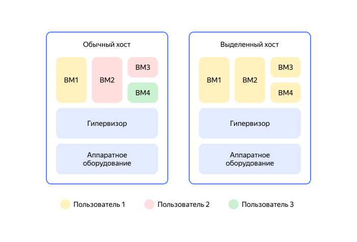
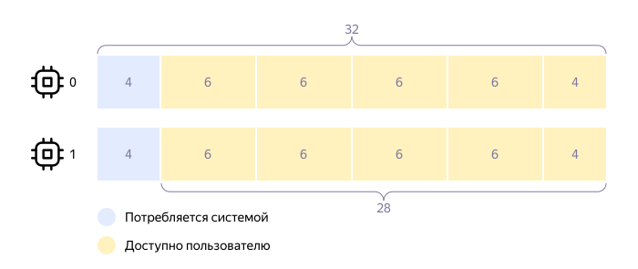

# Выделенный хост

_Выделенный хост_ — физический сервер, предназначенный для размещения исключительно ваших виртуальных машин в {{ yandex-cloud }}. ВМ на выделенных хостах обладают всеми возможностями обычных ВМ и дополнительно получают физическую изоляцию от ВМ других пользователей. Вы также можете разделить свои ВМ для разных проектов:



Вы можете создать группу, состоящую из одного или нескольких однотипных выделенных хостов. На каждом выделенном хосте вы можете разместить несколько [ВМ разных конфигураций](vm-platforms.md), что позволит оптимально использовать ресурсы.

Преимущества работы на выделенных хостах:
* Безопасность работы и соответствие требованиям.
  Вы можете использовать выделенный хост для физической изоляции ВМ в публичном облаке, если этого требуют служба информационной безопасности вашей организации или отраслевые стандарты (например, медицинские или финансовые).
* Использование собственных лицензий.
  Если в вашей организации уже есть лицензии Microsoft или других производителей, требующих привязки к физическим ресурсам, вы можете использовать их в {{ yandex-cloud }} по модели <q>Bring your own license</q> (BYOL).
* Управление размещением ВМ.
  Вы можете самостоятельно выбрать, на каком выделенном хосте запустить ВМ, или разрешить {{ compute-name }} сделать это автоматически.



Чтобы вы могли обеспечить отказоустойчивость своей инфраструктуры, размещаемой на выделенных хостах, рекомендуется использовать для нее хотя бы два хоста.


## Типы выделенных хостов {#host-types}

Конфигурация выделенного хоста определяется его _типом_. Типы хостов различаются моделью и количеством доступных ядер процессора, объемом RAM, а также количеством и размером локальных SSD-дисков.

Тип выделенного хоста указывается при создании группы хостов. Все хосты в группе будут иметь этот тип, изменить его нельзя.

Количество незанятых выделенных хостов разных типов в каждой [зоне доступности](../../overview/concepts/geo-scope.md) ограничено и меняется со временем. При создании группы хостов или изменении ее размера {{ compute-name }} проверяет, хватает ли имеющихся хостов указанного типа. Если хостов не хватает, вы увидите соответствующую ошибку.


### Список типов {#host-types-list}

Действующий тип — на платформе Intel<sup>®</sup> Ice Lake

: Тип и процессор<br>(платформа Ice Lake) | Процессоры | Ядра | vCPU^1^ | RAM, ГБ | Диски | Размер диска
  --- | --- | --- | --- | --- | --- | ---
  `intel-6338-c108-m704-n3200x6`<br>[Intel<sup>®</sup> Xeon<sup>®</sup> Gold 6338](https://ark.intel.com/content/www/ru/ru/ark/products/212285/intel-xeon-gold-6338-processor-48m-cache-2-00-ghz.html) | 2 | 64 | 108 | 704 | 6 | 3200 × 10^9^ Б <br>(~ 2,91 ТБ)

  

  Хосты этого типа можно создавать только в зонах доступности `{{ region-id }}-a` и `{{ region-id }}-b`. Подробнее см. в разделе [{#T}](../../overview/concepts/ru-central1-c-deprecation.md).
  
  





Не создавайте выделенные хосты архивных типов. Используйте только действующий тип (см. выше).



Тип и процессор<br>(платформа Cascade Lake) | Процессоры | Ядра | vCPU^1^ | RAM, ГБ | Диски | Размер диска
--- | --- | --- | --- | --- | --- | ---
`intel-6230-c66-m454`<br>[Intel Xeon Gold 6230](https://ark.intel.com/content/www/ru/ru/ark/products/192437/intel-xeon-gold-6230-processor-27-5m-cache-2-10-ghz.html) | 2 | 40 | 66 | 454 | 4 | 1600 × 10^9^ Б <br>(~ 1,46 ТБ)
`intel-6230-c66-m704-n1600x4`<br>Intel Xeon Gold 6230 | 2 | 40 | 66 | 704 | 4 | 1600 × 10^9^ Б <br>(~ 1,46 ТБ)
`intel-6230r-c84-m328-n3200x4`<br>[Intel Xeon Gold 6230R](https://ark.intel.com/content/www/ru/ru/ark/products/199346/intel-xeon-gold-6230r-processor-35-75m-cache-2-10-ghz.html) | 2 | 52 | 84 | 328 | 4 | 3200 × 10^9^ Б <br>(~ 2,91 ТБ)
`intel-6230r-c84-m454-n3200x4`<br>Intel Xeon Gold 6230R | 2 | 52 | 84 | 454 | 4 | 3200 × 10^9^ Б <br>(~ 2,91 ТБ)



Списки действующих и архивных типов выше — примерные и могут меняться. Получить актуальный список типов (без деления на действующие и архивные) можно:

* в [консоли управления]({{ link-console-main }}), на странице создания группы выделенных хостов в {{ compute-name }};
* или через CLI, выполнив команду `yc compute host-type list` (подробнее см. в [инструкции по созданию группы](../operations/dedicated-host/create-host-group.md)).

^1^ Указано количество vCPU, на которых вы можете запускать ВМ. Остальные vCPU хоста выделены для системного потребления (подробнее см. [ниже](#resource-fragmentation)): на процессорах Intel Xeon Gold 6230 — 14 vCPU, на процессорах Intel Xeon Gold 6230R и Intel Xeon Gold 6338 — 20 vCPU.

## Использование физических ресурсов хоста {#resource}

### Фрагментация процессоров {#resource-fragmentation}

На физическом сервере установлено два процессора. Однако не все ядра процессоров доступны для запуска ВМ. Часть ядер выделены для системного потребления.

Например, у выделенного хоста с двумя процессорами Intel Xeon Gold 6230 для запуска ВМ доступны 66 vCPU (34 на первом процессоре и 32 на втором). Оставшиеся 14 vCPU (6 + 8) используются системой.

При создании ВМ на выделенном хосте вы можете столкнуться с фрагментацией ресурсов: при наличии необходимого количества свободных vCPU невозможно запустить ВМ. Например, на выделенном хосте с 66 vCPU вы можете запустить только 10 ВМ по 6 vCPU.



В этом случае для полной утилизации vCPU выделенного хоста можно запустить две ВМ с 2 и 4 vCPU.


### Локальные и сетевые диски {#resource-disks}

На каждом выделенном хосте доступно несколько локальных дисков. Их количество и объем зависят от выбранной конфигурации хоста (см. [выше](#host-types)).

К ВМ на выделенных хостах можно подключать сетевые и локальные диски. Конфигурация должна отвечать следующим требованиям:

* Загрузочным диском ВМ должен быть сетевой диск. Локальные диски могут быть только дополнительными.
* Все сетевые диски должны находиться в той же зоне доступности, что и группа выделенных хостов.
* Локальный диск можно подключить к ВМ только целиком. Например, при подключении диска к ВМ на хосте типа `intel-6338-c108-m704-n3200x6` нужно указать точный размер диска — `3200000000000`.
* Один диск может быть подключен только к одной ВМ.

Локальные диски можно подключать к ВМ только при ее создании. Подробнее о подключении дисков см. в [инструкциях](../operations/index.md#dedicated-host). Чтобы изменить состав дисков, подключенных к существующей ВМ, ее понадобится пересоздать.


## Политика масштабирования {#scale-policy}

При создании группы хостов необходимо указать количество выделенных хостов. При изменении группы вы можете уменьшить или увеличить количество хостов в группе. Политика масштабирования определяется параметром `ScalePolicy`:

```
yc compute host-group create \
  --fixed-size <количество хостов> \
  ...
```

Где `fixed-size` – количество выделенных хостов в группе.

## Политика обслуживания {#maintenance-policy}

{{ compute-name }} останавливает ВМ во время технического обслуживания, и не перемещает их на другие хосты. Дальнейшее поведение ВМ зависит от состояния физического сервера.

Если физический сервер перезагружен, работающие на нем ВМ тоже будут автоматически перезапущены с привязкой:
* К той же группе хостов, если ВМ была привязана к группе. При этом возможна привязка к другому хосту группы.
* К выделенному хосту, если ВМ была привязана к конкретному хосту.
 
Политика обслуживания задается при создании группы выделенных хостов и определяется параметром `MaintenancePolicy`:

```
yc compute host-group create \
  --maintenance-policy restart \
...
```

Где `maintenance-policy` – политика обслуживания. Возможное значение: `restart` — остановка ВМ на время обслуживания и последующий перезапуск.

Если физический сервер полностью остановлен, {{ compute-name }}:
1. Закрывает доступ к вашему выделенному хосту.
1. Удаляет физический сервер и его уникальный идентификатор (`server-id`). Идентификаторы группы хостов (`host-group-id`) и каждого выделенного хоста (`host-id`) при этом сохраняются.
1. Заменяет вышедшее из строя оборудование и присваивает новый идентификатор.
1. Перемещает ВМ с неисправного оборудования на новое по правилам [привязки ВМ](#bind-vm).

## Привязка виртуальной машины к группе или хосту {#bind-vm}

Чтобы однозначно сопоставить ВМ и физический сервер, вы можете создать ВМ с привязкой:
* К группе выделенных хостов.
  При остановке ВМ она будет недоступна на хостах группы, а при последующем перезапуске может быть привязана к другому хосту из группы.
* К выбранному хосту из группы.
  При остановке ВМ она будет недоступна на хосте, а при последующем перезапуске будет привязана к этому же хосту из группы.

Привязка ВМ гарантирует, что ВМ будет запущена на одном и том же физическом сервере или группе серверов даже после плановых перерывов в работе.

Чтобы переместить ВМ между выделенными хостами, необходимо:
1. [Остановить ВМ](../operations/vm-control/vm-stop-and-start).
1. Привязать ВМ к другому хосту из группы.
1. Перезапустить ВМ.

При создании ВМ вы можете указать несколько групп хостов или конкретных хостов, к которым она может быть привязана. Пример привязки к одной из групп хостов:

```
yc compute instance create \
  --host-group-id 1 \
  --network-interface subnet-name=default-{{ region-id }}-a \
  --zone {{ region-id }}-a
```

В этом случае ВМ будет привязана к одной из указанных групп хостов:

```
done (33s)
id: abcdefghigklm12no3pq
folder_id: a1b23cd45efg6higklmn
created_at: "2020-09-08T20:19:41Z"
zone_id: {{ region-id }}-a
platform_id: standard-v2
resources:
  memory: "2147483648"
  cores: "2"
  core_fraction: "100"
host-group-id: 2
...
```

## Тарификация {#billing}

Тарифы на использование выделенных хостов описаны на странице [{#T}](../pricing.md#prices-dedicated-host).


_Intel и Xeon являются товарными знаками корпорации Intel или ее подразделений._