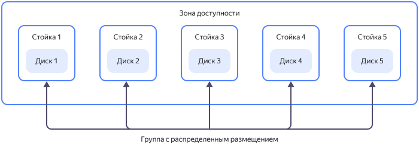
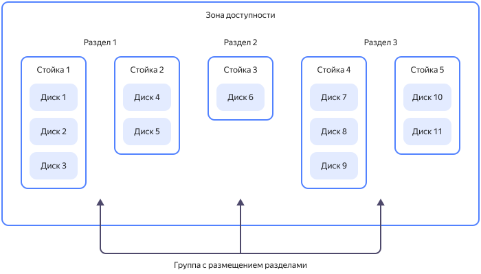

# Группы размещения нереплицируемых дисков

При создании [нереплицируемых дисков](disk.md#disks_types) ресурсы автоматически распределяются по физическому оборудованию {{ yandex-cloud }}. Возможно, созданные вами диски будут расположены на одном физическом носителе. Чтобы уменьшить вероятность одновременного выхода из строя нескольких дисков, их можно объединять в _группы размещения_.

Объединение нереплицируемых дисков в группу снижает риск их одновременного выхода из строя. Однако из-за жестких требований к размещению вероятность нехватки физических ресурсов для нереплицируемых дисков, объединенных в группу размещения, выше, чем для того же количества дисков, не объединенных в группу. Возможно, создать нереплицируемый диск в группе размещения не удастся, хотя вне группы диск будет создан без проблем.

Нереплицируемый диск может быть размещен только в одной группе и должен находится с ней в одной [зоне доступности](../../overview/concepts/geo-scope.md).

Об организационных и технических ограничениях групп размещения читайте в разделе [{#T}](../concepts/limits.md).

Нереплицируемые диски в группе размещения располагаются в серверных стойках дата-центра выбранной зоны доступности согласно одной из стратегий размещения.

## Распределенное размещение {#spread}

_Распределенное размещение_ (`spread`) — стратегия размещения нереплицируемых дисков таким образом, чтобы каждый из дисков был гарантированно расположен на отдельной серверной стойке в дата-центре выбранной зоны доступности. Если одна из стоек с дисками группы выйдет из строя, это отразится на работе только одного диска.

## Размещение разделами {#partition}

_Размещение разделами_ (`partition`) — стратегия размещения нереплицируемых дисков таким образом, чтобы разделы (partitions) c дисками были гарантированно расположены в разных серверных стойках в дата-центре выбранной зоны доступности. Если одна из стоек с разделами группы выйдет из строя, это отразится на работе только одного раздела. В одном разделе можно разместить несколько дисков. В одной группе размещения может быть не более 5 разделов.

### Смотрите также {#see-also}

* [Как создать группу размещения дисков](../operations/disk-placement-groups/create.md).
* [Как создать нереплицируемый диск в группе размещения](../operations/disk-create/nonreplicated.md#nr-disk-in-group).
* [Как добавить диск в группу размещения](../operations/disk-placement-groups/add-disk.md).