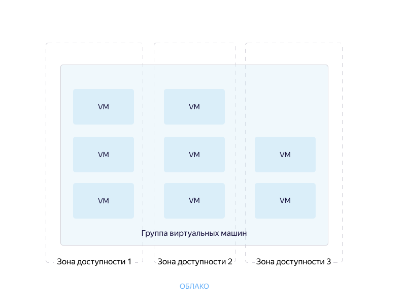

# Концепции {{ ig-name }}

{{ ig-name }} — компонент сервиса {{ compute-name }}, который позволяет создавать группы виртуальных машин и управлять ими.
{{ ig-name }} автоматически идентифицирует и корректирует неработоспособные виртуальные машины в группе для обеспечения их оптимальной работы.



Все операции в {{ ig-name }} необходимо выполнять от имени сервисного аккаунта. Подробную информацию см. в разделе [{#T}](access.md).



Каждая группа состоит из одной или нескольких однотипных виртуальных машин. Виртуальные машины группы могут находиться в разных зонах доступности. Подробнее о [географии {{ yandex-cloud }}](../../../overview/concepts/geo-scope.md).

Виртуальные машины группы также могут входить в [группу размещения ВМ](../placement-groups.md). Для этого необходимо при [создании группы ВМ](../../operations/placement-groups/create-ig-in-pg.md) описать в [шаблоне виртуальной машины](instance-template.md#instance-template) параметры группы размещения. Создание группы ВМ в группе размещения доступно с помощью [CLI](../../../cli/quickstart.md) и [API](../../api-ref/).

С помощью {{ ig-name }} вы можете:

- Одновременно [обновлять](deploy/index.md) все виртуальные машины в группе.

- Интегрироваться с сервисами [{{ network-load-balancer-full-name }}](../../../network-load-balancer/concepts/index.md) и [{{ alb-full-name }}](../../../application-load-balancer/concepts/index.md) и равномерно распределять нагрузку между виртуальными машинами.

- Создавать [автоматически масштабируемые группы](scale.md#auto-scale) виртуальных машин.

- Автоматически [восстанавливать](autohealing.md) виртуальные машины в случае сбоя приложения.

- Поддерживать работу служб приложений в надежной среде с многозональными функциями вместо выделения ресурсов для каждой зоны.

- [Работать со Stateful- и Stateless-нагрузкой приложений](./stateful-workload.md).

При создании группы необходимо описать:

- [Шаблон](instance-template.md), по которому будут развертываться виртуальные машины группы.

- [{#T}](policies/index.md) масштабирования, развертывания и распределения.

Созданная в каталоге группа ВМ доступна по сети для всех виртуальных машин, подключенных к этой же облачной сети. Подробнее о работе сети см. в [документации {{ vpc-name }}](../../../vpc/).

## Примеры использования {#examples}

* [{#T}](../../tutorials/vm-autoscale/index.md)

