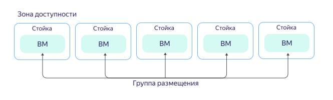

---

__system: {"dislikeVariants":["Нет ответа на мой вопрос","Рекомендации не помогли","Содержание не соответствует заголовку","Другое"]}
---
# Группы размещения виртуальных машин

При создании виртуальные машины автоматически распределяются по физическому оборудованию {{ yandex-cloud }}. Чтобы контролировать уровень отказоустойчивости оборудования, виртуальные машины можно объединять в группы размещения.

_Группа размещения ВМ_ — группа виртуальных машин, каждая из которых расположена на физическом оборудовании согласно определенной стратегии. {{ compute-full-name }} использует стратегию распределенного размещения.

_Распределенное размещение_ (`spread`) — стратегия размещения виртуальных машин таким образом, чтобы каждая из виртуальных машин была гарантированно расположена на отдельной серверной стойке в одной из зон доступности. Если одна из стоек выйдет из строя, другие продолжат работу в обычном режиме.

Объединение ВМ в группу по стратегии распределенного размещения обеспечивает высокий уровень отказоустойчивости и снижает риск одновременного выхода из строя виртуальных машин, расположенных на одной серверной стойке. Однако из-за жестких требований к размещению вероятность нехватки физических ресурсов для виртуальных машин, объединенных в группу размещения, выше, в сравнении с тем же количеством машин, не объединенных в группу.

Об организационных и технических ограничениях групп размещения читайте в разделе  [{#T}](../concepts/limits.md).

## Смотрите также {#see-also}

* [Как создать группу размещения](../operations/placement-groups/create.md).
* [Как добавить виртуальную машину в группу размещения](../operations/placement-groups/add-vm.md).
* [Как создать виртуальную машину в группе размещения](../operations/placement-groups/create-vm-in-pg.md).