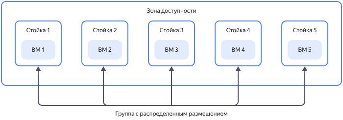
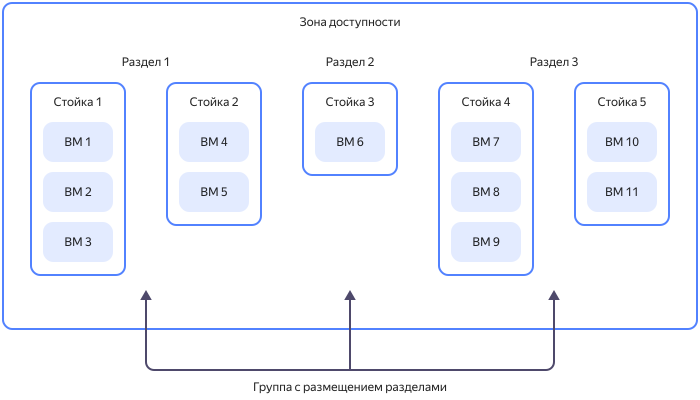

# Группы размещения виртуальных машин

При создании виртуальные машины автоматически распределяются по физическому оборудованию {{ yandex-cloud }}. Чтобы контролировать уровень отказоустойчивости оборудования, виртуальные машины можно объединять в группы размещения.

_Группа размещения ВМ_ — группа виртуальных машин, каждая из которых расположена на физическом оборудовании согласно определенной стратегии. {{ compute-full-name }} использует стратегии [распределенного размещения](#spread) и [размещения разделами](#partition).

Об ограничениях на количество групп размещения ВМ читайте в подразделе [Квоты](../concepts/limits.md#compute-quotas).

## Распределенное размещение {#spread}

_Распределенное размещение_ (`spread`) — стратегия размещения виртуальных машин таким образом, чтобы каждая из виртуальных машин была гарантированно расположена на отдельной серверной стойке в одной из [зон доступности](../../overview/concepts/geo-scope.md). Если одна из стоек выйдет из строя, другие продолжат работу в обычном режиме.

Объединение ВМ в группу по стратегии распределенного размещения обеспечивает высокий уровень отказоустойчивости и снижает риск одновременного выхода из строя виртуальных машин, расположенных на одной серверной стойке. Однако из-за жестких требований к размещению вероятность нехватки физических ресурсов для виртуальных машин, объединенных в группу размещения, выше, в сравнении с тем же количеством машин, не объединенных в группу.

Об ограничениях на количество ВМ в группе с распределенным размещением читайте в подразделе [{#T}](../concepts/limits.md#compute-limits-vm).

Управление группами ВМ со стратегией распределенного размещения доступно с помощью [консоли управления](../../console/), [CLI](../../cli/quickstart.md), [{{ TF }}](../../tutorials/infrastructure-management/terraform-quickstart.md) или [API](../api-ref/).

## Размещение разделами {#partition}

_Размещение разделами_ (`partition`) — стратегия размещения виртуальных машин таким образом, чтобы виртуальные машины из разных разделов (partitions) были гарантированно расположены в разных серверных стойках в дата-центре одной из зон доступности. Если одна из стоек с разделами группы выйдет из строя, это отразится на работе только одного раздела.

Количество разделов в одной группе размещения — не более 5. Об ограничениях на количество ВМ в разделе читайте в подразделе [Квоты](../concepts/limits.md#compute-quotas).

Управление группами со стратегией размещения разделами доступно с помощью [CLI](../../cli/quickstart.md) и [API](../api-ref/).

## Смотрите также {#see-also}

* [Как создать группу размещения](../operations/placement-groups/create.md).
* [Как добавить виртуальную машину в группу размещения](../operations/placement-groups/add-vm.md).
* [Как создать виртуальную машину в группе размещения](../operations/placement-groups/create-vm-in-pg.md).