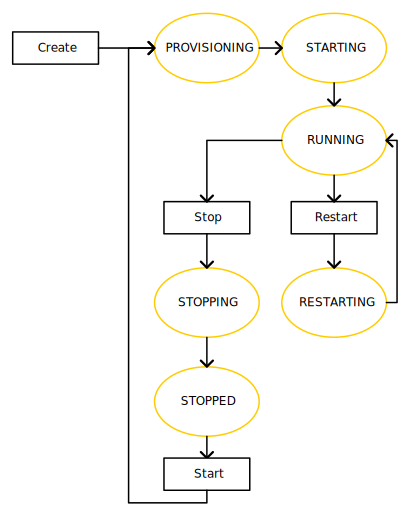

# Статусы виртуальной машины

## Список статусов

Виртуальная машина может находиться в одном из следующих статусов:

- `PROVISIONING` — Яндекс.Облако выделяет ресурсы виртуальной машине.
- `STARTING` — запускается.
- `RUNNING` — запущена и работает.
- `STOPPING` — останавливается.
- `STOPPED` — остановлена.
- `RESTARTING` – перезагружается.
- `UPDATING` — обновляется.
- `CRASHED` — виртуальная машина аварийно завершила работу и будет перезапущена автоматически.
- `ERROR` — произошла фатальная ошибка и виртуальная машина не может быть восстановлена.
- `DELETING` — удаляется.

## Операции с виртуальной машиной

Диаграмма ниже отображает только переходы между статусами при штатной работе во время следующих действий:

- [создание](#create) виртуальной машины;
- [остановка и запуск](#stop-and-start) виртуальной машины;
- [перезапуск](#restart) виртуальной машины.

На диаграмме не показаны статусы, в которые виртуальная машина может перейти почти из любого другого статуса:

- `UPDATING` ([обновление](#update));
- `DELETING` ([удаление](#delete));
- `CRASHED` и `ERROR` ([возникновение ошибки](#error));

### Создание {#create}

[При создании](../operations/vm-create/create-linux-vm.md) виртуальная машина находится в статусе `PROVISIONING`. В это время виртуальной машине выделяются ресурсы: виртуальные ядра и память, IP-адрес, создаются диски.

После этого виртуальная машина будет автоматически запущена и перейдет в статус `STARTING`.

Если запуск произошел успешно, машина перейдет в статус `RUNNING` и начнется загрузка операционной системы. Когда операционная система будет загружена, вы сможете подключиться к виртуальной машине.

### Остановка и запуск {#stop-and-start}

Если вы [остановите](../operations/vm-control/vm-stop-and-start.md#stop) виртуальную машину, она перейдет в статус `STOPPED` и будет ожидать команды запуска.

Когда вы снова [запустите](../operations/vm-control/vm-stop-and-start.md#start) виртуальную машину, она пройдет те же статусы, что и при создании: `PROVISIONING → STARTING → RUNNING`

### Перезапуск {#restart}

Если вы [перезапустите](../operations/vm-control/vm-stop-and-start.md#restart) виртуальную машину, то она перейдет в статус `RESTARTING`. Так как все необходимые ресурсы виртуальной машине уже выделены, она сразу вернется в статус `RUNNING`.

### Обновление {#update}

Вы можете обновить параметры виртуальной машины независимо от того, в каком статусе она находится, например изменить ее имя. После статуса `UPDATING` виртуальная машина вернется в тот статус, в котором была до обновления.

Если вы обновите [метаданные](vm-metadata.md), они станут доступны из виртуальной машины сразу после обновления. Останавливать или перезагружать виртуальную машину не требуется.

### Удаление {#delete}

Когда вы [удаляете](../operations/vm-control/vm-delete.md) виртуальную машину, сначала отменяются и завершаются все текущие операции с виртуальной машиной, а потом она переходит в статус `DELETING`.

Когда удаление завершится, виртуальная машина исчезнет из списка ресурсов.

## Возникновение ошибки {#error}

Есть два статуса, означающих ошибку:

- `CRASHED` — произошла ошибка и виртуальная машина не может продолжать работу. Если виртуальная машина перешла в этот статус, Яндекс.Облако попытается перезапустить ее. Это будет происходить до дех пор, пока виртуальная машина не будет успешно запущена или не перейдет в статус `ERROR`.
- `ERROR` — произошла фатальная ошибка и виртуальная машина не может быть восстановлена.

Если машина перешла в статус `ERROR` или постоянно переходит в статус `CRASHED`, обратитесь в [техническую поддержку](../../support/overview.md) или создайте виртуальную машину заново.
