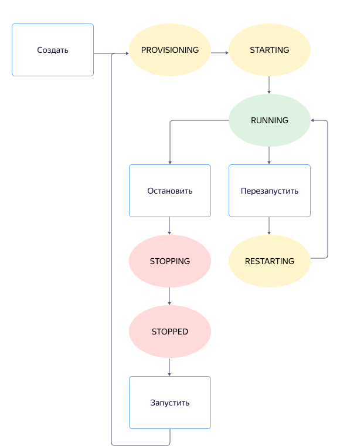

# Статусы виртуальной машины

## Список статусов {#list-of-statuses}

Виртуальная машина может находиться в одном из следующих статусов:

- `PROVISIONING` — {{ yandex-cloud }} выделяет ресурсы виртуальной машине.
- `STARTING` — запускается.
- `RUNNING` — запущена и работает.
- `STOPPING` — останавливается.
- `STOPPED` — остановлена.
- `RESTARTING` – перезагружается.
- `UPDATING` — обновляется.
- `CRASHED` — аварийно завершила работу и будет автоматически перезапущена.
- `ERROR` — произошла фатальная ошибка и виртуальная машина не может быть восстановлена.
- `DELETING` — удаляется.

## Операции с виртуальной машиной {#operations-on-VM}

Диаграмма ниже отображает только переходы между статусами при штатной работе во время следующих действий:

- [создание](#create) виртуальной машины;
- [остановка и запуск](#stop-and-start) виртуальной машины;
- [перезапуск](#restart) виртуальной машины.

На диаграмме не показаны следующие промежуточные статусы:

- `UPDATING` ([обновление](#update));
- `DELETING` ([удаление](#delete));
- `CRASHED` и `ERROR` ([возникновение ошибки](#error)).

### Создание {#create}

При [создании](../operations/vm-create/create-linux-vm.md) виртуальная машина получает статус `PROVISIONING`. На данном этапе машине выделяются вычислительные ресурсы: количество и производительность ядер процессора (vCPU), количество памяти (RAM). Назначается IP-адрес и создаются диски.

После этого виртуальная машина автоматически запустится и перейдет в статус `STARTING`.

Если запуск произошел успешно, машина перейдет в статус `RUNNING` и начнется загрузка операционной системы. После этого вы сможете подключиться к виртуальной машине.

### Остановка и запуск {#stop-and-start}

При [остановке](../operations/vm-control/vm-stop-and-start.md#stop) виртуальная машина переходит в статус `STOPPED`.

При следующем [запуске](../operations/vm-control/vm-stop-and-start.md#start) виртуальная машина пройдет те же статусы, что и при создании: `PROVISIONING` → `STARTING` → `RUNNING`.

### Перезапуск {#restart}

При [перезапуске](../operations/vm-control/vm-stop-and-start.md#restart) виртуальная машина переходит в статус `RESTARTING`. Так как все вычислительные ресурсы выделены, после перезагрузки машина вернется в статус `RUNNING`.

### Обновление {#update}

Вы можете обновить параметры виртуальной машины независимо от того, в каком статусе она находится, например изменить ее имя. После обновления (статус `UPDATING`) виртуальная машина вернется в предыдущий статус.

Если вы обновите [метаданные](vm-metadata.md), они станут доступны изнутри виртуальной машины сразу после обновления. Останавливать или перезапускать виртуальную машину не требуется.

### Удаление {#delete}

Когда вы [удаляете](../operations/vm-control/vm-delete.md) виртуальную машину, сначала отменяются и завершаются все текущие операции, после чего машина переходит в статус `DELETING`.

Когда удаление завершится, виртуальная машина исчезнет из списка доступных ресурсов.

## Возникновение ошибки {#error}

Существует два статуса возникновения ошибки:

- `CRASHED` — произошла ошибка и виртуальная машина не может продолжать работу.

    Если виртуальная машина перешла в этот статус, {{ yandex-cloud }} попытается выполнить перезапуск. Перезапуск будет повторяться до тех пор, пока виртуальная машина не перейдет в статус `RUNNING` или `ERROR`.

- `ERROR` — произошла фатальная ошибка и виртуальная машина не может быть восстановлена.

    Если виртуальная машина перешла в этот статус или постоянно переходит в статус `CRASHED`, обратитесь в [техническую поддержку](../../support/overview.md) или создайте новую виртуальную машину.

