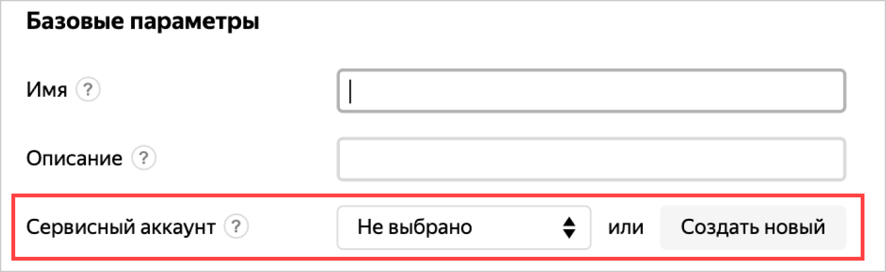

# Работа с {{ yandex-cloud }} изнутри виртуальной машины

В этом разделе описано, как работать с {{ yandex-cloud }} изнутри виртуальной машины через API или CLI.

Для автоматизации работы с {{ yandex-cloud }} изнутри виртуальной машины рекомендуется использовать [сервисные аккаунты](../../../iam/concepts/users/service-accounts.md). Это безопаснее — вам не надо сохранять свой OAuth-токен на виртуальной машине и вы можете ограничить права доступа для сервисного аккаунта.

Для сервисного аккаунта сделана упрощенная аутентификация через API и CLI изнутри виртуальной машины. Чтобы пройти аутентификацию:

1. Если у вас еще нет сервисного аккаунта, [создайте его](../../../iam/operations/sa/create.md) и [настройте права доступа для него](../../../iam/operations/sa/assign-role-for-sa.md).
1. [Привяжите сервисный аккаунт](#link-sa-with-instance) к виртуальной машине.
1. [Аутентифицируйтесь изнутри виртуальной машины](#auth-inside-vm).


## Привяжите сервисный аккаунт {#link-sa-with-instance}

Привяжите сервисный аккаунт к существующей или к создаваемой виртуальной машине. Привязать можно только один сервисный аккаунт.

Чтобы привязать сервисный аккаунт к виртуальной машине, необходимо иметь разрешение на использование этого аккаунта. Это разрешение входит в роли [iam.serviceAccounts.user](../../../iam/concepts/access-control/roles.md#sa-user), [editor](../../../iam/concepts/access-control/roles.md#editor) и выше.

### К существующей виртуальной машине {#link-with-exist-instance}



- CLI

  

  

  Обновите параметры виртуальной машины, указав сервисный аккаунт с помощью опции `--service-account-name` или `--service-account-id`:

  ```
  yc compute instance update my-instance --service-account-name test
  ```

- API

  Воспользуйтесь методом [update](../../api-ref/Instance/update.md) для ресурса [Instance](../../api-ref/Instance/). В свойстве `serviceAccountId` укажите идентификатор сервисного аккаунта.



### К создаваемой виртуальной машине {#link-with-new-instance}



- Консоль управления

  В консоли можно привязать сервисный аккаунт из того же каталога, где создается виртуальная машина. Если сервисный аккаунт лежит в другом каталоге, воспользуйтесь CLI или API.

  Чтобы привязать сервисный аккаунт, укажите его при [создании виртуальной машины](../index.md#vm-create). Вы можете выбрать один из существующих сервисных аккаунтов или создать новый:

  

- CLI

  

  

  Создайте виртуальную машину, указав сервисный аккаунт с помощью опции `--service-account-name` или `--service-account-id`:

  ```bash
  yc compute instance create \
    --name my-instance \
    --network-interface subnet-name=default,nat-ip-version=ipv4 \
    --ssh-key ~/.ssh/id_rsa.pub \
    --service-account-name my-robot
  ```

- API

  Воспользуйтесь методом [create](../../api-ref/Instance/create.md) для ресурса [Instance](../../api-ref/Instance/). В свойстве `serviceAccountId` укажите идентификатор сервисного аккаунта.



## Аутентификация изнутри виртуальной машины {#auth-inside-vm}

Чтобы аутентифицироваться изнутри виртуальной машины от имени привязанного сервисного аккаунта:



- CLI

  1. Подключитесь к виртуальной машине [по SSH](../vm-connect/ssh.md) или [по RDP](../vm-connect/rdp.md).
  1. 

  1. Создайте новый профиль:

      ```
      yc config profile create my-robot-profile
      ```

  
  1. Добавьте в профиль CLI доменное имя и порт для запросов к {{ yandex-cloud }}:
  
     ```
     yc config set endpoint {{ api-host }}:443
     ```   
  
  
  1. Настройте профиль для запуска команд. 
  
      

      Вы также можете получить IAM-токен, например, чтобы аутентифицироваться в API:

      ```
      yc iam create-token
      ```

      [Время жизни IAM-токена](../../../iam/concepts/authorization/iam-token.md#lifetime) в этом случае будет меньше чем {{ iam-token-lifetime }}. Запрашивайте IAM-токен чаще, например каждый час или при каждой операции. Чтобы узнать оставшееся время жизни токена, воспользуйтесь инструкцией для API.
- API

  1. Подключитесь к виртуальной машине [по SSH](../vm-connect/ssh.md) или [по RDP](../vm-connect/rdp.md).
  1. Получите IAM-токен из метаданных в формате Google Compute Engine:

      ```bash
      curl -H Metadata-Flavor:Google http://169.254.169.254/computeMetadata/v1/instance/service-accounts/default/token

      {"access_token":"CggVAgAAA...","expires_in":39944,"token_type":"Bearer"}
      ```

      IAM-токен будет указан в ответе в поле `access_token`. Оставшееся время жизни IAM-токена указано в поле `expires_in`.
       
  1. 

    Учитывайте время жизни IAM-токена или запрашивайте токен чаще, например каждый час или при каждой операции.


