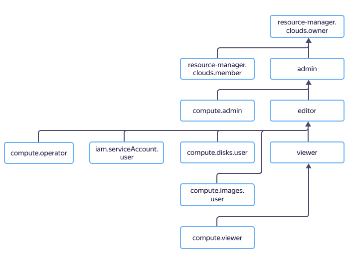

# Управление доступом в {{ compute-name }}

В этом разделе вы узнаете:

* [на какие ресурсы можно назначить роль](#resources);
* [какие роли действуют в сервисе](#roles-list).



Назначать роли на ресурс могут пользователи, у которых на этот ресурс есть роль `compute.admin` или одна из следующих ролей:



## На какие ресурсы можно назначать роли {#resources}



Вы также можете назначать роли на отдельные ресурсы сервиса:



- Консоль управления {#console}

  Через [консоль управления]({{ link-console-main }}) вы можете назначить роли на следующие ресурсы:

  

- CLI {#cli}

  Через [{{ yandex-cloud }} CLI](../../cli/cli-ref/compute/cli-ref/index.md) вы можете назначить роли на следующие ресурсы:

  

- {{ TF }} {#tf}

  Через [{{ TF }}]({{ tf-provider-link }}) вы можете назначить роли на следующие ресурсы:

  

- API {#api}

  Через [API {{ yandex-cloud }}](../api-ref/authentication.md) вы можете назначить роли на следующие ресурсы:

  



## Какие роли действуют в сервисе {#roles-list}



### Сервисные роли {#service-roles}

#### compute.auditor {#compute-auditor}



#### compute.viewer {#compute-viewer}



#### compute.editor {#compute-editor}



#### compute.admin {#compute-admin}



#### compute.osLogin {#compute-oslogin}



#### compute.osAdminLogin {#compute-osadminlogin}



#### compute.disks.user {#compute-disks-user}



#### compute.images.user {#compute-images-user}



#### compute.operator {#compute-operator}



#### compute.snapshotSchedules.viewer {#compute-snapshotSchedules-viewer}



#### compute.snapshotSchedules.editor {#compute-snapshotSchedules-editor}



#### iam.serviceAccounts.user {#iam-serviceAccounts-user}



Более подробную информацию о сервисных ролях читайте на странице [{#T}](../../iam/concepts/access-control/roles.md) в документации сервиса {{ iam-full-name }}.

### Примитивные роли {#primitive-roles}





#### Что дальше {#what-is-next}

* [Как назначить роль](../../iam/operations/roles/grant.md).
* [Как отозвать роль](../../iam/operations/roles/revoke.md).
* [Подробнее об управлении доступом в {{ yandex-cloud }}](../../iam/concepts/access-control/index.md).
* [Подробнее о наследовании ролей](../../resource-manager/concepts/resources-hierarchy.md#access-rights-inheritance).
