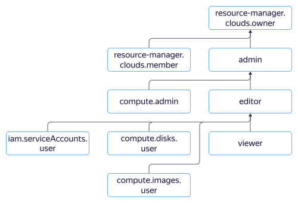

# Управление доступом в {{ compute-name }}

В этом разделе вы узнаете:
* [на какие ресурсы можно назначить роль](#resources);
* [какие роли действуют в сервисе](#roles-list).



## На какие ресурсы можно назначить роль {#resources}



## Какие роли действуют в сервисе {#roles-list}



### Сервисные роли

Роль | Разрешения
----- | -----
`compute.admin` | Дает права на управление виртуальными машинами и [группами виртуальных машин](../../compute/concepts/instance-groups/index.md).
`compute.disks.user` | Позволяет использовать диски для создания новых ресурсов, например виртуальных машин.
`compute.images.user` | Позволяет использовать образы для создания новых ресурсов, например виртуальных машин.
`iam.serviceAccounts.user` | Подтверждает права на использование сервисного аккаунта. Эта роль необходима для выполнения операций с группами ВМ. Если вы указали сервисный аккаунт в запросе, {{ iam-short-name }} проверит, есть ли у вас права на использование этого аккаунта.
`resource-manager.clouds.member` | Роль, необходимая для доступа к ресурсам в облаке всем, кроме [владельцев облака](../../resource-manager/concepts/resources-hierarchy.md#owner) и [сервисных аккаунтов](../../iam/concepts/users/service-accounts.md).
`resource-manager.clouds.owner` | Дает полный доступ к облаку и ресурсам в нем. Можно назначить только на облако.

Более подробную информацию о сервисных ролях читайте на странице [{#T}](../../iam/concepts/access-control/roles.md) в документации сервиса {{ iam-full-name }}.

### Примитивные роли



#### Что дальше {#what-is-next}

* [Как назначить роль](../../iam/operations/roles/grant.md).
* [Как отозвать роль](../../iam/operations/roles/revoke.md).
* [Подробнее об управлении доступом в {{ yandex-cloud }}](../../iam/concepts/access-control/index.md).
* [Подробнее о наследовании ролей](../../resource-manager/concepts/resources-hierarchy.md#access-rights-inheritance).
