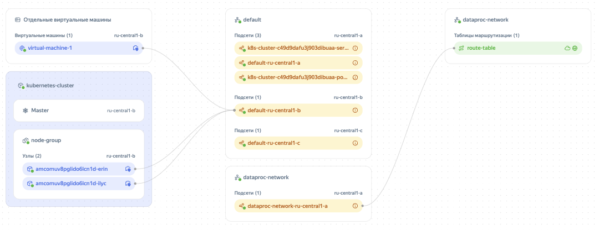

# Карта инфраструктуры

Карта инфраструктуры отображает взаимосвязи между облачными ресурсами, а также [сетями](*network) и [подсетями](*subnet) в каталоге, в котором расположены эти ресурсы.

Пример карты инфраструктуры:

Карту инфраструктуры можно использовать, чтобы получить визуальное представление о сетях. Например, с помощью карты можно узнать, какие подсети наиболее нагружены или для каких подсетей настроены таблицы маршрутизации.

## Ресурсы, отображаемые на карте инфраструктуры {#resources}

* [группы виртуальных машин](../../compute/concepts/instance-groups/index.md);
* [виртуальные машины](../../compute/concepts/vm.md);
* [кластеры {{ managed-k8s-full-name }}](../../managed-kubernetes/concepts/index.md#kubernetes-cluster);
* [узлы и группы узлов {{ managed-k8s-name }}](../../managed-kubernetes/concepts/index.md#node-group);
* [кластеры {{ mpg-full-name }}](../../managed-postgresql/concepts/index.md);
* [кластеры {{ mch-full-name }}](../../managed-clickhouse/concepts/index.md);
* [облачные сети](../../vpc/concepts/network.md#network);
* [подсети](../../vpc/concepts/network.md#subnet);
* [таблицы маршрутизации](../../vpc/concepts/routing.md#rt-vpc).

На карте можно отобразить взаимосвязи с сетями только нужных ресурсов. Это удобно, если настроена обширная сеть с множеством ресурсов. Также из карты в один клик можно перейти на страницу ресурса. Подробнее о работе с картой в [инструкции](../operations/view-infrastructure-map.md).

#### Полезные ссылки {#see-also}

* [{#T}](../operations/view-infrastructure-map.md)

[*network]: Облачная сеть — это аналог традиционной локальной сети в дата-центре. Облачные сети создаются в каталогах и используются для передачи информации между облачными ресурсами и связи ресурсов с интернетом. Подробнее читайте в разделе [{#T}](../../vpc/concepts/network.md#network).

[*subnet]: Подсеть — это диапазон IP-адресов в облачной сети. Адреса из этого диапазона могут назначаться облачным ресурсам, например виртуальным машинам и кластерам баз данных. Подробнее читайте в разделе [{#T}](../../vpc/concepts/network.md#subnet).
