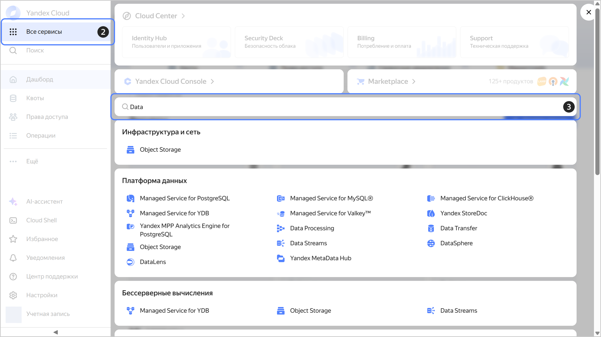
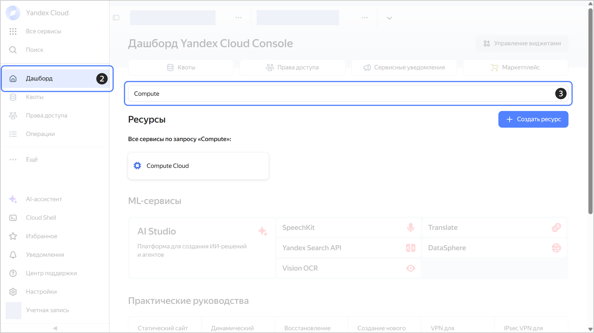
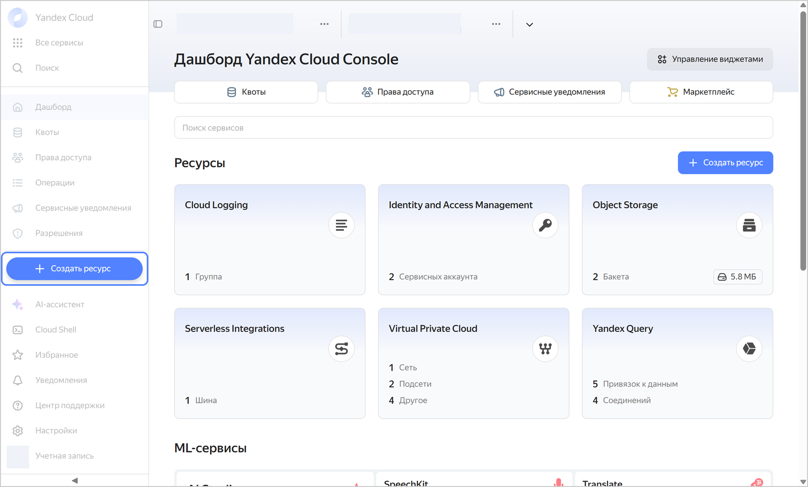
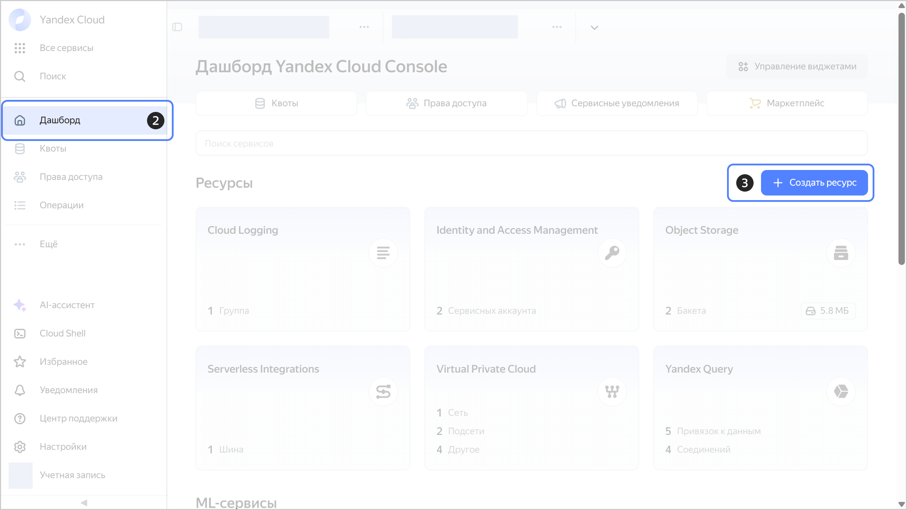

# Как начать работу с сервисами и создавать ресурсы

В консоли управления {{ yandex-cloud }} можно перейти к нужному сервису и создавать ресурсы через дашборд или панель слева.



## Как открыть страницу сервиса {#select-service}

### Перейти в сервис с панели слева {#select-service-panel}

  1. В [консоли управления]({{ link-console-main }}) выберите каталог.
  1. На панели слева нажмите  **{{ ui-key.yacloud.components.AsideNavigation.label_all-services_6sGQy }}**.
  1. В строке **{{ ui-key.yacloud.dashboard.DashboardPage.CreateResourceDialog.search_kV4c1 }}** введите название сервиса.
  1. Выберите нужный сервис.

  

### Перейти в сервис с дашборда {#select-service-dashboard}

  1. В [консоли управления]({{ link-console-main }}) выберите каталог.
  1. На панели слева нажмите  **{{ ui-key.yacloud.dashboard.dashboard_j9z5M }}**.
  1. В строке **{{ ui-key.yacloud.dashboard.DashboardPage.ResourceSearch.placeholder_3my5Y }}** введите название сервиса.
  1. В разделе **{{ ui-key.yacloud.dashboard.DashboardPage.ResourcesSection.title_7kYbU }}** выберите нужный сервис.

  

## Как создать ресурс {#create-resource}

### Создать ресурс на панели слева {#create-resource-panel}

  1. В [консоли управления]({{ link-console-main }}) выберите каталог.
  1. На панели слева нажмите  **{{ ui-key.yacloud.dashboard.label_create-resource_4KN3M }}**.
  1. Выберите нужный ресурс.

  

### Создать ресурс на дашборде {#create-resource-dashboard}

  1. В [консоли управления]({{ link-console-main }}) выберите каталог.
  1. На панели слева нажмите  **{{ ui-key.yacloud.dashboard.dashboard_j9z5M }}**.
  1. Справа нажмите  **{{ ui-key.yacloud.dashboard.DashboardPage.ResourcesSection.create-resources_rGA1t }}**.
  1. Выберите нужный ресурс.

  

#### См. также {#see-also}

* [{#T}](search.md)
* [{#T}](ai-assistant.md)