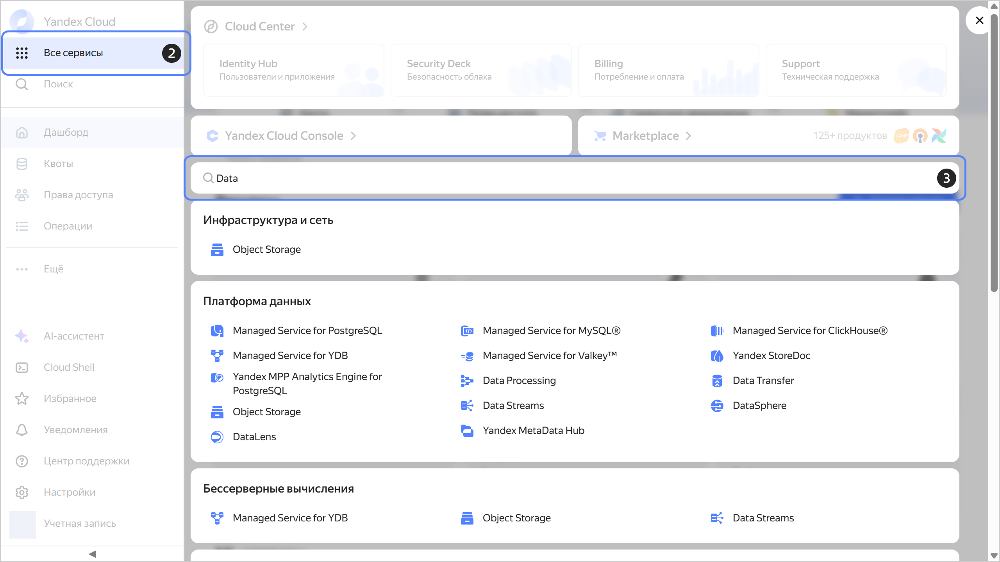
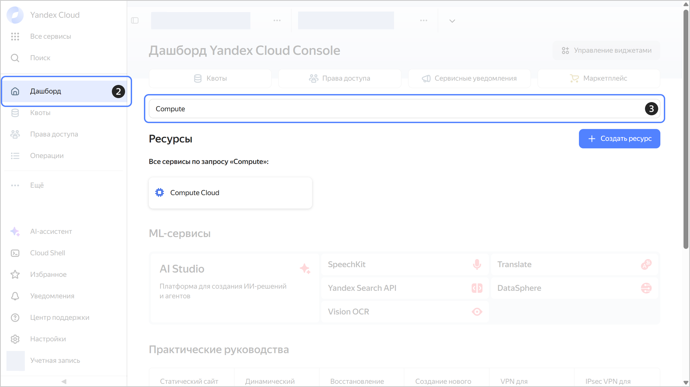
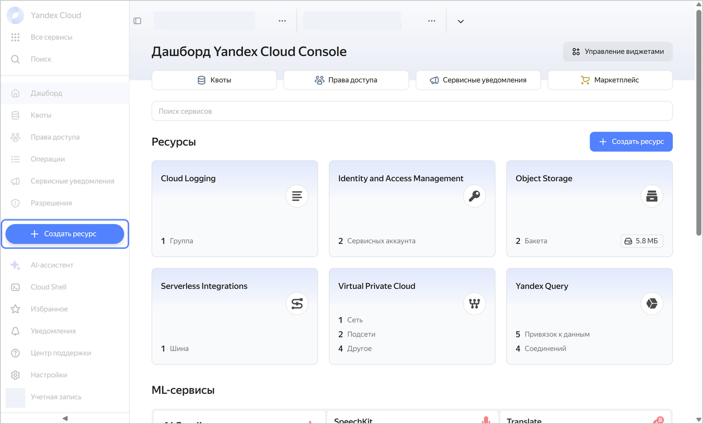
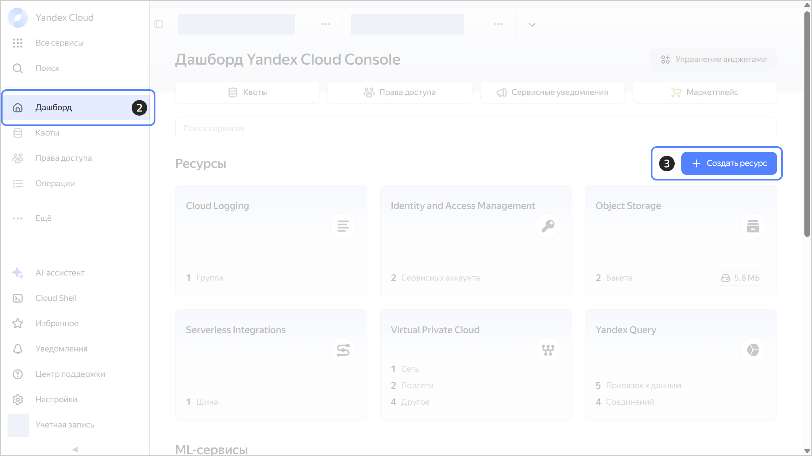

# Как начать работу с сервисами и создавать ресурсы

В консоли управления {{ yandex-cloud }} можно перейти к нужному сервису и создавать ресурсы через дашборд или панель слева.



## Как открыть страницу сервиса {#select-service}

### Перейти в сервис с панели слева {#select-service-panel}

  1. В [консоли управления]({{ link-console-main }}) выберите каталог.
  1. На панели слева нажмите  **{{ ui-key.yacloud.components.AsideNavigation.label_all-services_6sGQy }}**.
  1. В строке **{{ ui-key.yacloud.dashboard.DashboardPage.CreateResourceDialog.search_kV4c1 }}** введите название сервиса.
  1. Выберите нужный сервис.

  

### Перейти в сервис с дашборда {#select-service-dashboard}

  1. В [консоли управления]({{ link-console-main }}) выберите каталог.
  1. На панели слева нажмите  **{{ ui-key.yacloud.dashboard.dashboard_j9z5M }}**.
  1. В строке **{{ ui-key.yacloud.dashboard.DashboardPage.ResourceSearch.placeholder_3my5Y }}** введите название сервиса.
  1. В разделе **{{ ui-key.yacloud.dashboard.DashboardPage.ResourcesSection.title_7kYbU }}** выберите нужный сервис.

  

## Как создать ресурс {#create-resource}

### Создать ресурс на панели слева {#create-resource-panel}

  1. В [консоли управления]({{ link-console-main }}) выберите каталог.
  1. На панели слева нажмите  **{{ ui-key.yacloud.dashboard.label_create-resource_4KN3M }}**.
  1. Выберите нужный ресурс.

  

### Создать ресурс на дашборде {#create-resource-dashboard}

  1. В [консоли управления]({{ link-console-main }}) выберите каталог.
  1. На панели слева нажмите  **{{ ui-key.yacloud.dashboard.dashboard_j9z5M }}**.
  1. Справа нажмите  **{{ ui-key.yacloud.dashboard.DashboardPage.ResourcesSection.create-resources_rGA1t }}**.
  1. Выберите нужный ресурс.

  

### Генерация кода для создания ресурса {#generate-resource-code}

При создании ресурса через консоль управления вы можете сгенерировать код для {{ TF }}, CLI или API. Код генерируется автоматически на основе параметров, выбранных в консоли управления. Ручной ввод параметров не потребуется.

Чтобы сгенерировать код для создания ресурса:

1. В [консоли управления]({{ link-console-main }}) перейдите к [созданию ресурса](#create-resource).
1. Заполните необходимые поля и нажмите кнопку  **{{ ui-key.yacloud.components.Terraform.button.TerraformButton.button_terraform_ozL8u }}**.
1. В открывшемся окне выберите одну из доступных вкладок:

    

    Набор вкладок зависит от возможности создания данного типа ресурса в соответствующем инструменте.

    

   

   - {{ TF }} {#tf}

        Выберите `{{ ui-key.yacloud.components.Terraform.TerraformDialog.button_code-terraform }}` и скопируйте команду для создания ресурса.

        Для получения информации о ресурсе провайдера [{{ TF }}](../../tutorials/infrastructure-management/terraform-quickstart) нажмите `{{ ui-key.yacloud.components.Terraform.TerraformDialog.button_documentation }}`.

   - {{ yandex-cloud }} CLI {#cli}

        Выберите `{{ ui-key.yacloud.components.Terraform.TerraformDialog.button_code_cli }}` и скопируйте команду для создания ресурса.

        Для получения информации о команде [CLI](../../cli/quickstart.md) нажмите `{{ ui-key.yacloud.components.Terraform.TerraformDialog.button_documentation_cli }}`.

        

   - API(gRPC) {#api}

        Выберите `{{ ui-key.yacloud.components.Terraform.TerraformDialog.button_code_api_grpc }}` и скопируйте запрос на создание ресурса.

        Для получения информации о запросе к [API](../../api-design-guide/concepts/general.md) {{ yandex-cloud }} нажмите `{{ ui-key.yacloud.components.Terraform.TerraformDialog.button_documentation_api_grpc }}`.

        

   

#### Полезные ссылки {#see-also}

* [{#T}](search.md)
* [{#T}](ai-assistant.md)
* [{#T}](cloud-shell-options.md)
