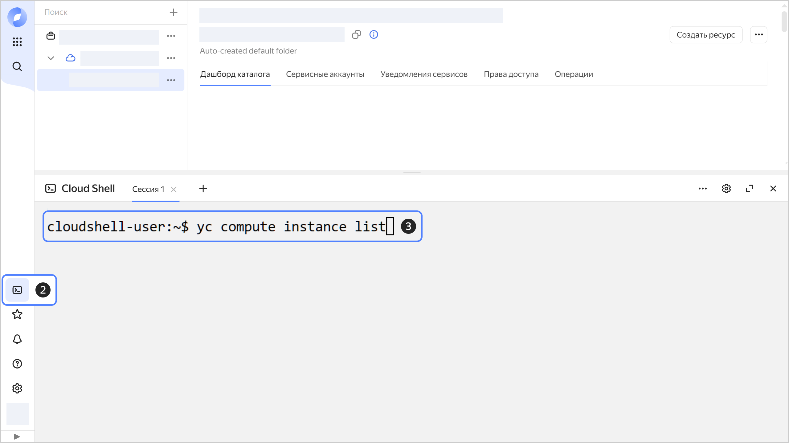

# Начало работы с {{ cloud-shell-full-name }}

С помощью {{ cloud-shell-name }} вы можете пользоваться [CLI {{ yandex-cloud }}](../../cli/) и другими терминальными инструментами без предварительной настройки прямо в браузере. Среда окружения {{ cloud-shell-name }} содержит основные инструменты для работы с облаком и популярные SDK для языков программирования.

Чтобы начать работать с {{ cloud-shell-name }}:

1. Перейдите в [консоль управления]({{ link-console-main }}), затем войдите в {{ yandex-cloud }} или зарегистрируйтесь, если вы еще не зарегистрированы.

1. В меню слева нажмите кнопку  **{{ ui-key.yacloud.cloud-shell.label_service }}**.

    Откроется окно терминала — дождитесь, когда сессия запустится и будет создана среда разработки.

1. Воспользуйтесь командами CLI {{ yandex-cloud }}, чтобы управлять облачными ресурсами через терминал. Например, чтобы посмотреть список ВМ в облаке, выполните команду:

    ```bash
    yc compute instance list
    ```

   

    Примеры других команд см. в разделе [Начало работы с CLI](../../cli/quickstart.md#example). Чтобы посмотреть полный список доступных команд, выполните команду `yc --help` или откройте [справочник CLI](../../cli/cli-ref/).

    

    Вы можете запустить до 4 параллельных сессий в терминале. Чтобы запустить новую сессию, нажмите кнопку . После запуска сессия может быть активна в течение 12 часов. Неактивные сессии автоматически прерываются после 30 минут бездействия. Подробнее об ограничениях в {{ cloud-shell-name }} см. в разделе [Лимиты](../concepts/cloud-shell/limits.md).

    
   
1. Установите необходимые приложения с помощью инструмента `apt`. Например, чтобы установить `postgresql-client` для [подключения к кластеру {{ mpg-full-name }}](../../managed-postgresql/operations/connect.md), выполните команду:

    ```bash
    sudo apt update && sudo apt install --yes postgresql-client
    ```

    

    Виртуальная машина {{ cloud-shell-name }} будет автоматически остановлена и удалена по прошествии 15 минут после завершения последней активной сессии. Любые системные изменения, включая установленные приложения и пакеты, будут сброшены.

    


## См. также {#see-also}

* [Управление {{ cloud-shell-name }}](../operations/cloud-shell-options.md)
* [Лимиты {{ cloud-shell-name }}](../concepts/cloud-shell/limits.md)
* [Справочник CLI](../../cli/cli-ref/)
