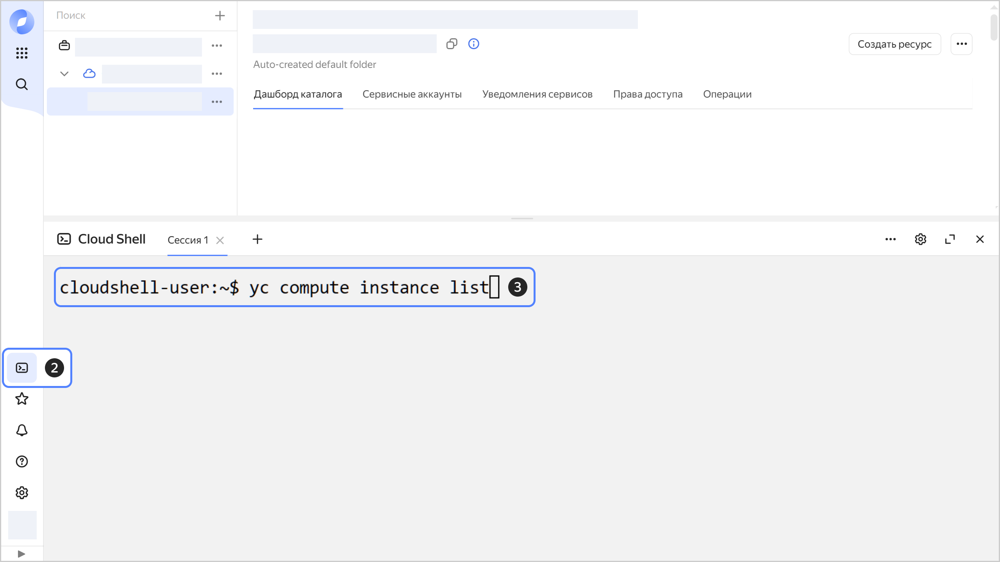

# Как начать работать с {{ cloud-shell-full-name }}

С помощью {{ cloud-shell-name }} вы можете пользоваться [CLI {{ yandex-cloud }}](../../cli/) и другими терминальными инструментами без предварительной настройки прямо в браузере. Среда окружения {{ cloud-shell-name }} содержит основные инструменты для работы с облаком и популярные SDK для языков программирования.

Чтобы начать работать с {{ cloud-shell-name }}:

1. Перейдите в [консоль управления]({{ link-console-main }}), затем войдите в {{ yandex-cloud }} или зарегистрируйтесь, если вы еще не зарегистрированы.

1. На странице **[{{ ui-key.yacloud_billing.billing.label_service }}]({{ link-console-billing }})** убедитесь, что у вас подключен платежный аккаунт, и он находится в [статусе](../../billing/concepts/billing-account-statuses.md) `ACTIVE` или `TRIAL_ACTIVE`. Если платежного аккаунта нет, [создайте его](../../billing/quickstart/index.md) и [привяжите](../../billing/operations/pin-cloud.md) к нему облако.

1. В [консоли управления]({{ link-console-main }}) на панели слева выберите  **{{ ui-key.yacloud.cloud-shell.label_service }}**.

    Откроется окно терминала — дождитесь, когда сессия запустится и будет создана среда разработки.

1. Воспользуйтесь командами CLI {{ yandex-cloud }}, чтобы управлять облачными ресурсами через терминал. Например, чтобы посмотреть список ВМ в облаке, выполните команду:

    ```bash
    yc compute instance list
    ```

   

    Примеры других команд смотрите в разделе [Начало работы с CLI](../../cli/quickstart.md#example). Чтобы посмотреть полный список доступных команд, выполните команду `yc --help` или откройте [справочник CLI](../../cli/cli-ref/).

    

    Вы можете запустить до 4 параллельных сессий в терминале. Чтобы запустить новую сессию, нажмите кнопку . После запуска сессия может быть активна в течение 12 часов. Неактивные сессии автоматически прерываются после 30 минут бездействия. Подробнее об ограничениях в {{ cloud-shell-name }} смотрите в разделе [Лимиты](../concepts/cloud-shell/limits.md).

    
   
1. Установите необходимые приложения с помощью инструмента `apt`. Например, чтобы установить `postgresql-client` для [подключения к кластеру {{ mpg-full-name }}](../../managed-postgresql/operations/connect/index.md), выполните команду:

    ```bash
    sudo apt update && sudo apt install --yes postgresql-client
    ```

    

    Виртуальная машина {{ cloud-shell-name }} будет автоматически остановлена и удалена по прошествии 15 минут после завершения последней активной сессии. Любые системные изменения, включая установленные приложения и пакеты, будут сброшены.

    


## Решение проблем {#troubleshooting}

### Что делать, если при запуске терминала сессия не создается и загрузка не завершается? {#session-not-starting}

Создайте новую сессию — для этого нажмите на кнопку . Если проблема повторяется, откройте консоль управления в режиме Инкогнито и запустите {{ cloud-shell-name }}.

Если сессия по-прежнему не создается, запишите [HAR-файл](../../support/create-har.md) при воспроизведении проблемы. Начните запись до запуска терминала. Если в ответе сервера есть ошибка `No active billing accounts found`, проверьте [наличие активного платежного аккаунта и права доступа к нему](#no-active-billing-accounts). В остальных случаях создайте обращение и отправьте HAR-файл в [техническую поддержку]({{ link-console-support }}).

### Что делать, если возникает ошибка `No active billing accounts found`? {#no-active-billing-accounts}

Ошибка с кодом `403` может возникать, если нет активного платежного аккаунта или у пользователя нет прав на его просмотр.

На странице [{{ ui-key.yacloud_billing.billing.label_service }}]({{ link-console-billing }}) проверьте наличие платежного аккаунта и его [статус](../../billing/concepts/billing-account-statuses.md). Для работы с {{ cloud-shell-name }} нужен аккаунт в статусе `ACTIVE` или `TRIAL_ACTIVE`. Если платежного аккаунта нет, [создайте его](../../billing/quickstart/index.md) и [привяжите](../../billing/operations/pin-cloud.md) к нему облако, затем повторите попытку создания сессии.

Если платежный аккаунт есть и активен, попросите его администратора [назначить](../../billing/security/index.md#set-role) вам роль `billing.accounts.viewer` непосредственно на платежный аккаунт и повторите попытку создания сессии.

Не удаляйте автоматически назначенную роль `billing.accounts.member`: она нужна, чтобы платежный аккаунт отображался в списке доступных вам аккаунтов.

## Полезные ссылки {#see-also}

* [Управление {{ cloud-shell-name }}](../operations/cloud-shell-options.md)
* [Лимиты {{ cloud-shell-name }}](../concepts/cloud-shell/limits.md)
* [Справочник CLI](../../cli/cli-ref/)
