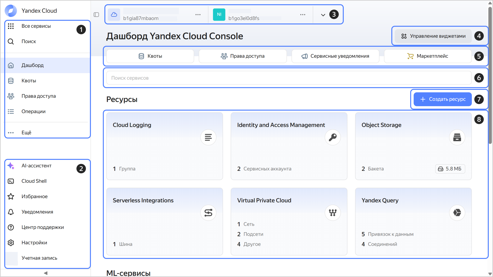

# Как начать работать с {{ console-full-name }}

{{ console-name }} предоставляет интерфейс, в котором вы можете управлять облаком, каталогом и ресурсами сервисов, а также настраивать уведомления и обращаться в службу поддержки.

Чтобы начать работать с консолью управления:

1. Создайте аккаунт [Яндекс ID]({{ link-yandex }}/support/passport/authorization/registration.html).

1. Войдите в [консоль управления]({{ link-console-main }}).

   При первом входе в консоль управления автоматически создаются [облако](../../resource-manager/concepts/resources-hierarchy.md#cloud) `cloud-<Яндекс_ID>`, [каталог](../../resource-manager/concepts/resources-hierarchy.md#folder) `default` и [сеть](../../vpc/concepts/network.md#network) `default`.

1. [Создайте платежный аккаунт](../../billing/operations/create-new-account.md). К нему автоматически привяжется облако `cloud-<Яндекс_ID>`.

    При создании первого платежного аккаунта начисляется [стартовый грант](../../getting-started/usage-grant.md) для знакомства с платформой.

1. Создайте свой первый ресурс, например [виртуальную машину Linux](../../compute/quickstart/quick-create-linux.md).

## Интерфейс консоли управления {#interface}

1. Навигация по сервисам и основным разделам консоли управления.
1. Дополнительные функции и настройки консоли управления:

   * [**AI-ассистент**](../operations/ai-assistant.md) — интеллектуальный помощник для создания и удаления ресурсов {{ yandex-cloud }}.
   
      
   * [**{{ cloud-shell-name }}**](cloud-shell.md) — среда окружения с основными инструментами для работы с ресурсами облака.
   
   
   * **Избранное** — ресурсы, которые будут доступны из любого сервиса.
   * **Уведомления** — уведомления о событиях в облаке.
   * **Центр поддержки** — все, что поможет упростить работу с {{ yandex-cloud }}.
   * **Настройки** — [настройки](../operations/update.md) консоли управления.
   * **Учетная запись** — управление аутентификацией.

1. Навигация по доступным облакам и каталогам.
1. Управление размещением и видимостью виджетов на дашборде.
1. Основные разделы дашборда:

   * **{{ ui-key.yacloud.dashboard.label_quotas_gAtoT }}** — организационные ограничения, которые можно изменить по запросу в техническую поддержку.
   * **{{ ui-key.yacloud.dashboard.label_access_2bch9 }}** — настройка прав доступа на облако и каталог.
   * **{{ ui-key.yacloud.dashboard.label_notifications_uWDue }}** — управление подпиской пользователей облака на получение технических уведомлений от сервисов.
   * **{{ ui-key.yacloud.dashboard.DashboardPage.QuickActions.label_marketplace_1sDGx }}** — переход в [{{ marketplace-full-name }}]({{ link-cloud-marketplace }}).

1. Поиск нужного сервиса.
1. Создание нового ресурса.
1. Ресурсы, созданные в выбранном каталоге.

## Что дальше {#whats-next}

1. Ознакомьтесь со списком всех [сервисов {{ yandex-cloud }}](../../overview/concepts/services.md).

1. Если нужно настроить систему единого входа (SSO) для корпоративных аккаунтов, добавьте федерацию в [{{ org-full-name }}](../../organization/concepts/add-federation.md).

1. [Добавьте](../../organization/operations/add-account.md) в вашу [организацию](../../overview/roles-and-resources.md) пользователей и [предоставьте](../../iam/operations/roles/grant.md) им доступ к ресурсам {{ yandex-cloud }}.
