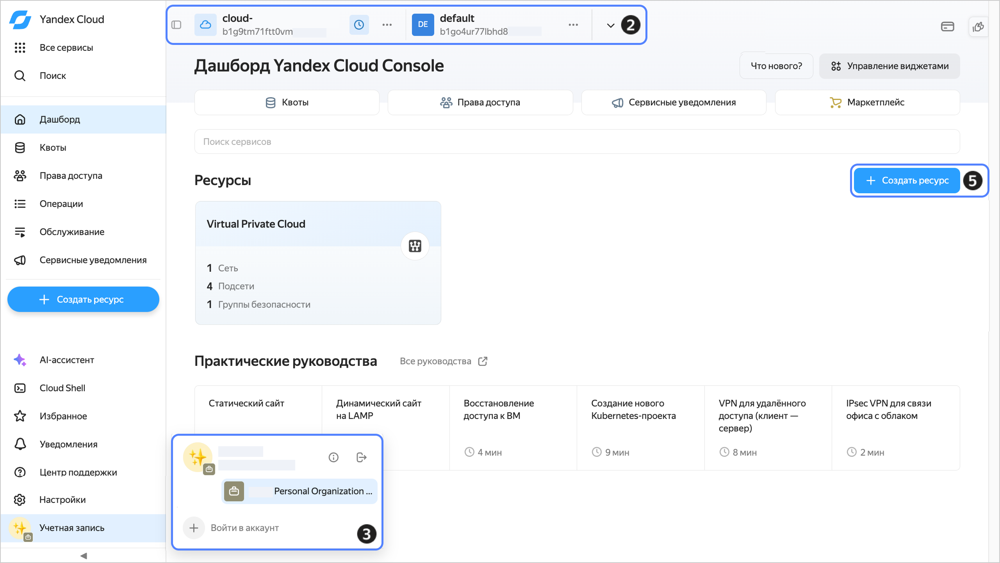
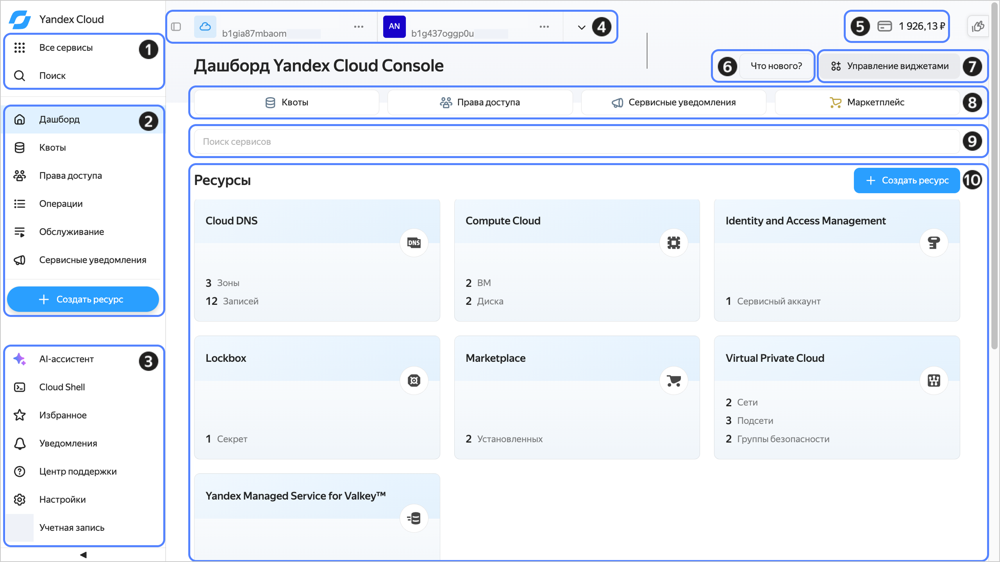

# Как начать работать с {{ console-full-name }}

{{ console-name }} предоставляет интерфейс, в котором вы можете управлять облаком, каталогом и ресурсами сервисов, а также настраивать уведомления и обращаться в службу поддержки.

Чтобы начать работать с консолью управления:

1. Создайте аккаунт [Яндекс ID]({{ link-yandex }}/support/passport/authorization/registration.html).

1. Войдите в [консоль управления]({{ link-console-main }}).

   При первом входе в консоль управления автоматически создаются [облако](../../resource-manager/concepts/resources-hierarchy.md#cloud) `cloud-<Яндекс_ID>`, [каталог](../../resource-manager/concepts/resources-hierarchy.md#folder) `default` и [сеть](../../vpc/concepts/network.md#network) `default`.

1. Для просмотра информации об аккаунте в левом нижнем углу нажмите **Учетная запись**.
1. [Создайте платежный аккаунт](../../billing/operations/create-new-account.md). К нему автоматически привяжется облако `cloud-<Яндекс_ID>`.

    При создании первого платежного аккаунта начисляется [стартовый грант](../../getting-started/usage-grant.md) для знакомства с платформой.

1. Создайте свой первый ресурс, например [виртуальную машину Linux](../../compute/quickstart/quick-create-linux.md).

## Интерфейс консоли управления {#interface}

1. Навигация по всем сервисам {{ yandex-cloud }} и поиск по облачным ресурсам.
1. Основные страницы выбранного сервиса.
1. Дополнительные функции и настройки консоли управления:

   *  [**AI-ассистент**](../operations/ai-assistant.md) — интеллектуальный помощник для управления ресурсами {{ yandex-cloud }}. С его помощью вы можете:
     * Получать консультации по работе с сервисами и ресурсами.
     * Анализировать инфраструктуру в каталоге и получать советы по оптимизации.
     * Создавать и удалять ресурсы в свободной текстовой форме.
     * Развертывать инфраструктуру по описанию.

   
   *  [**{{ cloud-shell-name }}**](cloud-shell.md) — среда окружения с основными инструментами для работы с ресурсами {{ yandex-cloud }}. Доступна прямо в браузере без дополнительной настройки и не требует авторизации. С помощью {{ cloud-shell-name }} вы можете:

      * Выполнять команды для управления всеми ресурсами облака с помощью [CLI {{ yandex-cloud }}](../../cli/quickstart.md) и инструментов [Yandex Cloud Toolbox](/marketplace/products/yc/toolbox).
      * Устанавливать необходимые приложения с помощью `apt`.
      * Создавать и запускать скрипты для автоматизации задач на языках `Node.js`, `Python` и `Go`.

      Подробнее о работе с {{ cloud-shell-name }} в разделе [{#T}](../operations/cloud-shell-options.md).

   *  **Избранное** — быстрый доступ к ресурсам.
   *  **Уведомления** — центр уведомлений пользователя:
     * системные оповещения;
     * ответы от технической поддержки;
     * статусы операций;
     * анонсы.
   *  **Центр поддержки** — помощь в работе с сервисами {{ yandex-cloud }}:
     * документация;
     * история изменений сервисов;
     * техподдержка.
   *  **Настройки** — персональные [настройки](../operations/update.md) консоли управления.
   * **Учетная запись** — управление аутентификацией: смена пользователя и организации.

1. Навигация по доступным облакам и каталогам.
   Для просмотра всех доступных пространств нажмите  или .
1. Виджет сервиса [{{ billing-name }}](../../billing/index.yaml). Содержит информацию о платежном аккаунте, расходах денежных средств, позволяет [пополнять счет](../../billing/operations/pay-the-bill.md) и [активировать промокод](../../billing/operations/activate-promocode.md).
Для доступа к виджету необходима [роль](../../billing/security/index.md#billing-accounts-viewer) с правами на просмотр данных платежного аккаунта.
1. Просмотр последних новостей и анонсов мероприятий.
1. Управление размещением и видимостью виджетов на дашборде.
1. Основные разделы дашборда:

   * **{{ ui-key.yacloud.dashboard.label_quotas_gAtoT }}** — организационные ограничения, которые можно изменить по запросу в техническую поддержку.
   * **{{ ui-key.yacloud.dashboard.label_access_2bch9 }}** — настройка прав доступа на облако и каталог.
   * **{{ ui-key.yacloud.dashboard.label_notifications_uWDue }}** — управление подпиской пользователей облака на получение технических уведомлений от сервисов.
   * **{{ ui-key.yacloud.dashboard.DashboardPage.QuickActions.label_marketplace_1sDGx }}** — переход в [{{ marketplace-full-name }}]({{ link-cloud-marketplace }}).

1. Поиск нужного сервиса.
1. Доступные ресурсы в выбранном каталоге.

## Что дальше {#whats-next}

1. Ознакомьтесь со списком всех [сервисов {{ yandex-cloud }}](../../overview/concepts/services.md).

1. Если нужно настроить систему единого входа (SSO) для корпоративных аккаунтов, добавьте федерацию в [{{ org-full-name }}](../../organization/concepts/add-federation.md).

1. [Добавьте](../../organization/operations/add-account.md) в вашу [организацию](../../overview/roles-and-resources.md) пользователей и [предоставьте](../../iam/operations/roles/grant.md) им доступ к ресурсам {{ yandex-cloud }}.
