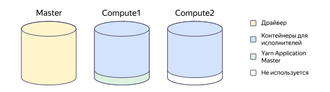
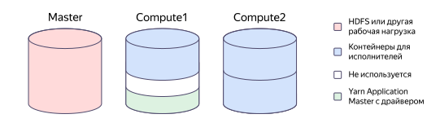

# Задания Spark

{{ dataproc-name }} поддерживает выполнение заданий [Spark](https://spark.apache.org/docs/latest/sql-programming-guide.html) в рамках Spark-_приложений_ (applications). За распределение ресурсов при выполнении заданий отвечает [Apache Hadoop YARN](https://hadoop.apache.org/docs/stable/hadoop-yarn/hadoop-yarn-site/YARN.html).

## Управление приложениями {#applications}

В кластере может быть запущено несколько приложений одновременно. Запущенным приложением управляет специальная программа — _драйвер_ (driver). Подробнее о работе драйвера см. в подразделе [распределение ресурсов](#resource-management).

Приложение может находиться в режиме ожидания, либо выполнять _задания_ (jobs). По умолчанию задания в рамках одного приложения выполняются последовательно (_FIFO_). Этот метод не требует дополнительных настроек.

Чтобы включить параллельное выполнение заданий (_FAIR_), необходимо переключить режим работы планировщика, а также дополнительно настроить систему и конкретные задания. О том, как это сделать, читайте в [документации Apache Spark](https://spark.apache.org/docs/latest/job-scheduling.html#scheduling-within-an-application).



Чтобы реализовать параллельное выполнение заданий, не используя режим FAIR, запустите задания в разных Spark-приложениях в режиме FIFO.



## Управление операциями {#tasks}

Каждое задание Spark состоит из набора _операций_ (tasks), которые выполняются в рамках специальных программ — _исполнителей_ (executors). Каждый исполнитель запускается на одном хосте кластера и занимает определенное количество вычислительных ресурсов (CPU, RAM).

В зависимости от плана выполнения, операции могут выполняться последовательно или параллельно. Параллельно выполняемые операции группируются в _стадии_ (stages). Количество параллельно выполняемых операций зависит от потребностей запросов и от доступных ресурсов кластера.

При использовании стандартных настроек {{ dataproc-name }} вычислительные ресурсы на выполнение заданий Spark выделяются динамически.

## Распределение ресурсов {#resource-management}

Приложение Spark, выполняемое на кластере {{ dataproc-name }}, состоит из набора процессов, выполняемых на узлах кластера. Состав процессов приложения, их размещение и объем резервируемых под процессы вычислительных ресурсов зависят от [свойств компонента](./settings-list.md) Spark.

Для приложений Spark под управлением ресурсного менеджера YARN поддерживаются два возможных режима запуска, устанавливаемых свойством `spark:spark.submit.deployMode`:

* В режиме `deployMode=cluster` драйвер запускается внутри главного процесса приложения, которым управляет YARN (процесс YARN Application Master), и клиент может завершить свою работу после успешного запуска приложения.
* В режиме `deployMode=client` драйвер запускается непосредственно в клиентском процессе, а YARN Application Master используется только для взаимодействия с YARN (например, для получения ресурсов).

В обоих режимах процесс YARN Application Master запускается на одном из вычислительных хостов в рамках `compute` или `data` подкластера.

Если кластер отвечает требованиям для [легковесных кластеров](./index.md#light-weight-clusters), то по умолчанию используется режим `deployMode=client`. В противном случае в качестве режима по умолчанию используется `deployMode=cluster`.

Распределение ресурсов между драйвером и исполнителями зависит от [свойств компонента](./settings-list.md) Spark. В таблицах ниже перечислены ключевые свойства, отвечающие за распределение ресурсов при разных режимах запуска.

В таблицах приняты сокращения:

* `allCPU` — количество ядер хоста. Определяется классом хостов, который выбран на этапе создания подкластера.
* `nmMem` — объем оперативной памяти хоста, доступной для YARN NodeManager. Вычисляется по формуле:

    `общая память хоста` × `доля памяти для YARN NodeManager`.

    * Общая память хоста определяется классом хостов, который выбран на этапе создания подкластера.
    * Доля памяти, резервируемая для YARN NodeManager, задается свойством `dataproc:nodemanager_available_memory_ratio` и по умолчанию составляет `0.8`. Остальная память резервируется для вспомогательной нагрузки (отправка логов, метрик, кеш файловой системы и т. п.).

Результаты арифметических операций в таблицах округляются:

* Для CPU — в меньшую сторону до целой части. Если результат деления оказывается меньше 1, то он округляется до 1.
* Для оперативной памяти — в меньшую сторону до значения, кратного 1 ГБ.



- deployMode=client

    В этом режиме драйвер запускается на хосте-мастере кластера отдельно от YARN Application Master, и ему доступны все ресурсы хоста-мастера. Компонент YARN Application Master запускается в отдельном контейнере YARN на одном из вычислительных хостов, при этом для его работы резервируется лишь необходимый небольшой объем ресурсов.

    #|
    || **Свойство (сокращение)**                    | **Описание**                                                       | **Значение по умолчанию**        ||
    || `dataproc:spark_executors_per_vm` (`numCon`) | Максимальное количество контейнеров на одном вычислительном хосте  | `1`                              ||
    || `spark:spark.yarn.am.cores` (`yamCPU`)       | Количество ядер процессора, выделяемых для YARN Application Master | `1`                              ||
    || `spark:spark.yarn.am.memory` (`yamMem`)      | Объем памяти (МБ), выделяемый для YARN Application Master          | `1024`                           ||
    || `spark:spark.executor.cores` (`exCPU`)       | Количество ядер процессора, выделяемых для каждого исполнителя     | (`allCPU` − `yamCPU`) / `numCon` ||
    || `spark:spark.executor.memory` (`exMem`)      | Объем памяти (МБ), выделяемый на каждого исполнителя               | (`nmMem` − `yamMem`) / `numCon`  ||
    |#

    Поскольку значения `yamCPU` и `yamMem` вычитаются из общего количества CPU и RAM, соответственно, YARN Application Master занимает меньше ресурсов, чем стандартный контейнер, а доля ресурсов для исполнителей увеличивается.

- deployMode=cluster

    Этот режим предполагает, что на хосте-мастере кластера запущена требовательная к ресурсам программа, например, HDFS. Поэтому драйверы запускаются на вычислительных хостах в рамках YARN Application Master, и для них резервируется значительный объем ресурсов.

    #|
    || **Свойство (сокращение)**                          | **Описание**                                                        | **Значение по умолчанию**     ||
    || `dataproc:spark_driver_memory_fraction` (`drMemF`) | Доля памяти вычислительного хоста, резервируемая для драйвера       | `0.25`                        ||
    || `dataproc:spark_executors_per_vm` (`numCon`)       | Максимальное количество контейнеров на одном вычислительном хосте   | `2`                           ||
    || `spark:spark.executor.cores` (`exCPU`)             | Количество ядер процессора, выделяемых для каждого исполнителя      | `allCPU` / `numCon`           ||
    || `spark:spark.executor.memory` (`exMem`)            | Объем памяти (МБ), выделяемый на каждого исполнителя                | `nmMem` / `numCon`            ||
    || `spark:spark.driver.cores` (`drCPU`)               | Количество ядер процессора, выделяемых для YARN Application Master  | `allCPU` / `numCon`           ||
    || `spark:spark.driver.memory` (`drMem`)              | Объем памяти (МБ), выделяемый для YARN Application Master           | `drMemF` × `nmMem` / `numCon` ||
    |#



Значения по умолчанию, установленные в сервисе, оптимальны для запуска одного приложения. Чтобы оптимизировать распределение ресурсов под свои задачи, измените режим размещения драйвера и другие свойства компонентов:

* Для всех новых заданий в кластере:

    * при [создании кластера](../operations/cluster-create.md);
    * при [изменении кластера](../operations/cluster-update.md).

* Для отдельного задания при его [создании](../operations/jobs-spark.md#create).

### Примеры распределения ресурсов {#examples}

На кластере с настройками по умолчанию и двумя вычислительными хостами запущено одно приложение. В этом случае:



- deployMode=client

    * Драйвер может занять все ресурсы хоста-мастера.
    * Количество ресурсов, доступное исполнителям на всех вычислительных хостах, будет снижено на величину, зарезервированную для YARN Application Master.
    * Ресурсы, зарезервированные для YARN Application Master на втором хосте, останутся неиспользованы.

    

- deployMode=cluster

    * На хосте-мастере может быть запущен HDFS или другая требовательная к ресурсам программа.
    * YARN Application Master с драйвером займет существенную часть ресурсов на одном из вычислительных хостов, но не больше, чем размер контейнера для исполнителей. Из-за этого часть ресурсов может остаться неиспользованной.
    * На втором вычислительном хосте оба контейнера достанутся исполнителям.

    




## Автоматическое масштабирование {#autoscaling}

Механизм автоматического масштабирования в кластерах {{ dataproc-name }} позволяет автоматизировать управление вычислительными ресурсами созданного кластера, добавляя в кластер дополнительные узлы при наличии ожидающих операций в очереди выполнения, и освобождая узлы (удаляя соответствующие виртуальные машины) в периоды снижения нагрузки на кластер.

При снижении нагрузки ниже заданного порога функция автоматического масштабирования осуществляет удаление одного или нескольких узлов кластера. На удаляемых узлах могут находиться процессы заданий Spark. Для стабильной работы заданий Apache Spark в кластерах с автоматическим масштабированием необходимо соблюсти следующие условия:

1. Для операций в составе задания Spark должны быть разрешены повторы выполнения.
2. Процессы YARN Application Master и драйверов заданий Spark должны размещаться на хостах, не управляемых механизмом автоматического масштабирования (т.е. не подлежащих автоматической декомиссии).

Для настройки повторов выполнения операций необходимо установить параметр `spark:spark.task.maxFailures` на уровне задания либо кластера в целом. Этот параметр определяет количество ошибок отдельной операции, при достижении которого задание в целом аварийно завершается. Рекомендуется использовать значение по умолчанию, равное `4`, что означает три возможных повтора при последовательно возникающих ошибках выполнения конкретной операции в составе задания.

Принудительное завершение процессов YARN Application Master и драйверов заданий Spark приводит к немедленному аварийному завершению задания в целом, поэтому указанные процессы необходимо разместить на хостах, не находящихся под управлением механизма автоматического масштабирования. В качестве таких узлов могут служить узлы HDFS (подкластер узлов с ролью Data Node), либо дополнительно созданный подкластер вычислительных узлов (роль Compute Node) с выключенным автоматическим масштабированием.

### Настройки YARN для автоматического масштабирования {#autoscaling-yarn}

Размещение контейнеров YARN Application Master на выбранных узлах обеспечивается механизмом меток узлов, устанавливаемых средствами ресурсного менеджера YARN, и использованием [Hadoop Capacity Scheduler](https://hadoop.apache.org/docs/current/hadoop-yarn/hadoop-yarn-site/CapacityScheduler.html). Метки узлов обычно устанавливаются автоматически с помощью скрипта инициализации, анализирующего имя подкластера, и вызывающего необходимые команды YARN для установки метки. Для заданий Spark параметр `spark.yarn.am.nodeLabelExpression` должен содержать имя созданной метки, и в кластере должен существовать как минимум один узел, которому эта метка присвоена.

Пример скрипта инициализации для анализа имени подкластера и установки метки YARN на узлы этого подкластера приведен ниже. Скрипт принимает один аргумент командной строки — имя подкластера, на который необходимо установить метку.

```bash
#! /bin/sh
set -e
set +u
NAME_TO_LABEL="$1"

# Загрузка утилит JQ и YQ для разбора метаданных виртуальной машины.
wget -q -O - https://mycop1.website.yandexcloud.net/utils/jq.gz | gzip -dc >/tmp/jq
wget -q -O - https://mycop1.website.yandexcloud.net/utils/yq.gz | gzip -dc >/tmp/yq
mv /tmp/jq /usr/local/bin/
mv /tmp/yq /usr/local/bin/
chown root:bin /usr/local/bin/jq /usr/local/bin/yq
chmod 555 /usr/local/bin/jq /usr/local/bin/yq

# Проверка на необходимость установки меток.
MUSTLABEL=N
if [ ! -z "$NAME_TO_LABEL" ]; then
  # Получение имени подкластера из метаданных виртуальной машины.
  curl -H Metadata-Flavor:Google 'http://169.254.169.254/computeMetadata/v1/instance/?alt=json&recursive=true' -o /tmp/host-meta.json
  jq -r .attributes.'"user-data"' /tmp/host-meta.json >/tmp/host-userdata.yaml
  subcid=`jq -r '.vendor.labels.subcluster_id' /tmp/host-meta.json`
  subname=`yq -r ".data.topology.subclusters.${subcid}.name" /tmp/host-userdata.yaml`
  if [ "${subname}" = "${NAME_TO_LABEL}" ]; then
    # Имя подкластера совпадает с настроенным.
    MUSTLABEL=Y
  fi
fi

if [ "${MUSTLABEL}" = "Y" ]; then
  MYHOST=`hostname -f`
  while true; do
    # Проверка существования метки в кластере.
    foundya=`sudo -u yarn yarn cluster --list-node-labels 2>/dev/null | grep -E '^Node Labels' | grep '<SPARKAM:' | wc -l | (read x && echo $x)`
    if [ $foundya -gt 0 ]; then
      break
    fi
    # Если метка отсутствует, создание ее на кластерном уровне.
    sudo -u yarn yarn rmadmin -addToClusterNodeLabels 'SPARKAM' || true
    sleep 2
  done
  # Установка метки на текущий узел.
  sudo -u yarn yarn rmadmin -replaceLabelsOnNode "${MYHOST}=SPARKAM"
fi
```

### Настройки Spark для автоматического масштабирования {#autoscaling-spark}

В таблице ниже приведен типовой набор параметров Spark для кластера {{ dataproc-name }} с автоматическим масштабированием.

#|
|| **Параметр=значение**  | **Описание использования** ||
|| `spark:`
`spark.task.maxFailures=`
`4`  | Количество возможных последовательных ошибок при выполнении шага задания Spark ||
|| `spark:`
`spark.yarn.am.nodeLabelExpression=`
`SPARKAM`  | Имя метки для отбора узлов для запуска AM-контейнеров заданий Spark ||
|| `spark:`
`spark.submit.deployMode=`
`cluster` | Используемый по умолчанию режим запуска заданий Spark (применяется при отсутствии соответствующей настройки на уровне задания или конкретного сервиса) ||
|| `livy:`
`livy.spark.deploy-mode=`
`cluster`  | Используемый в сессиях Apache Livy режим запуска заданий Spark ||
|| `yarn:`
`yarn.node-labels.enabled=`
`true` | Включить поддержку меток узлов в YARN ||
|| `yarn:`
`yarn.node-labels.fs-store.root-dir=`
`file:///hadoop/yarn/node-labels` | Каталог для хранения меток узлов в файловой системе мастер-узла кластера ||
|| `yarn:`
`yarn.node-labels.configuration-type=`
`centralized` | Режим управления метками узлов YARN ||
|| `capacity-scheduler:`
`yarn.scheduler.capacity.maximum-am-resource-percent=`
`1.00` | Максимальная доля ресурсов (от `0.0` до `1.0`) на выполнение контейнеров Application Master ||
|| `capacity-scheduler:`
`yarn.scheduler.capacity.root.`
`default.accessible-node-labels=`
`SPARKAM` | Разрешить заданиям в очереди `default` использовать узлы с указанными метками ||
|| `capacity-scheduler:`
`yarn.scheduler.capacity.root.`
`accessible-node-labels.SPARKAM.capacity=`
`100` | Установить допустимую долю использования узлов с меткой `SPARKAM` в 100% ||
|| `capacity-scheduler:`
`yarn.scheduler.capacity.root.`
`default.accessible-node-labels.SPARKAM.capacity=`
`100` | Установить допустимую долю использования заданиями очереди `default` узлов с меткой `SPARKAM` в 100% ||
|#

## Полезные ссылки {#see-also}

В документации Apache Spark приведены подробные сведения:

* [о настройках Spark-приложений](https://spark.apache.org/docs/latest/configuration.html);
* [о режимах работы Spark-драйвера](https://spark.apache.org/docs/latest/running-on-yarn.html#launching-spark-on-yarn);
* [о выделении ресурсов для Spark-приложения](https://spark.apache.org/docs/latest/running-on-yarn.html#resource-allocation-and-configuration-overview).

Кроме того, в документации Apache Hadoop есть информация:

* [по работе с метками узлов YARN](https://hadoop.apache.org/docs/stable/hadoop-yarn/hadoop-yarn-site/NodeLabel.html);
* [по настройке Capacity Scheduler](https://hadoop.apache.org/docs/stable/hadoop-yarn/hadoop-yarn-site/CapacityScheduler.html).

Чтобы проверить работу Spark-приложений в кластере {{ dataproc-name }}, [проведите мониторинг состояния Spark-приложений](../operations/spark-monitoring.md).

Если Spark-приложение работает медленно, [проведите первичную диагностику производительности](../operations/spark-diagnostics.md#diagnostics).
