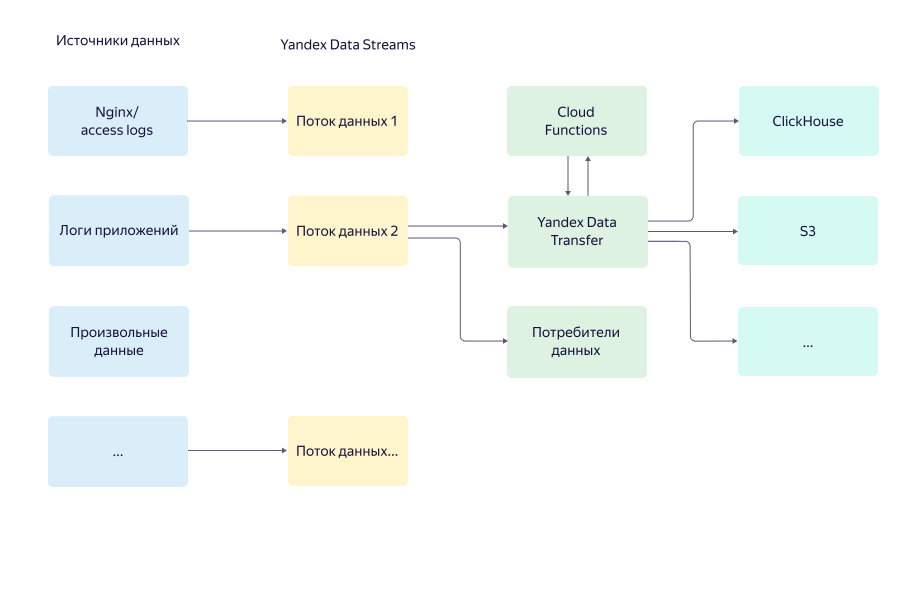

# Обзор сервиса {{ yds-name }}

Приложения генерируют данные, которые нужно сохранять для последующего анализа или обработки. Часть данных требуется долгосрочно хранить в <q>холодных</q> хранилищах с редким доступом, а часть — в аналитических СУБД для оперативной обработки.

{{ yds-full-name }} упрощает процесс переноса данных приложений пользователей в системы хранения {{ yandex-cloud }}.

Данные поступают в {{ yds-name }} как в шину данных, которая отказоустойчиво хранит их во всех зонах доступности и масштабируется по переносимому объему данных. Отправлять данные в шину можно с помощью систем поставки данных Fluentd, Logstash, log4j/log4net и других, а также через HTTP по протоколу, совместимому с Amazon Kinesis Data Streams API.

Данные, которые переносятся через шину, можно с помощью [{{ data-transfer-full-name }}](../../data-transfer/concepts/index.md) сохранять в принимающие системы – [S3](../../glossary/s3.md)S3, {{ CH }} и другие. Настройка параметров переноса производится в консоли управления {{ yandex-cloud }} или через [API](../../glossary/rest-api.md)API.

Если при сохранении требуется изменить сами данные, их формат или произвести любую другую обработку (например, удаление чувствительной информации), это можно сделать с помощью функций [{{ sf-full-name }}](../../functions/concepts/index.md). {{ sf-short-name }} поддерживает различные языки программирования такие, как Python, Java, PHP и другие.

## Преимущества {#advantages}

* Поддержка большого числа приемников данных, широкие возможности кастомизации переносимых данных.
* Решение полностью интегрировано в экосистему {{ yandex-cloud }} и позволяет централизованно управлять потоками данных как из консоли управления {{ yandex-cloud }}, так и через API.
* Все компоненты являются полностью управляемыми, то есть не требуют администрирования или выделенных [DevOps](/blog/posts/2022/03/what-is-devops)DevOps-инженеров.