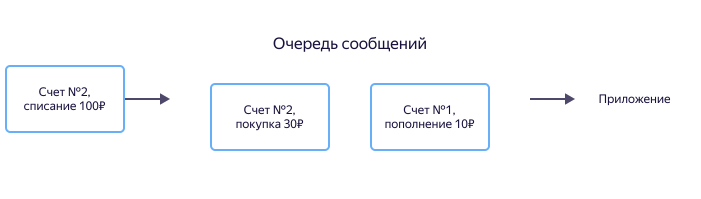
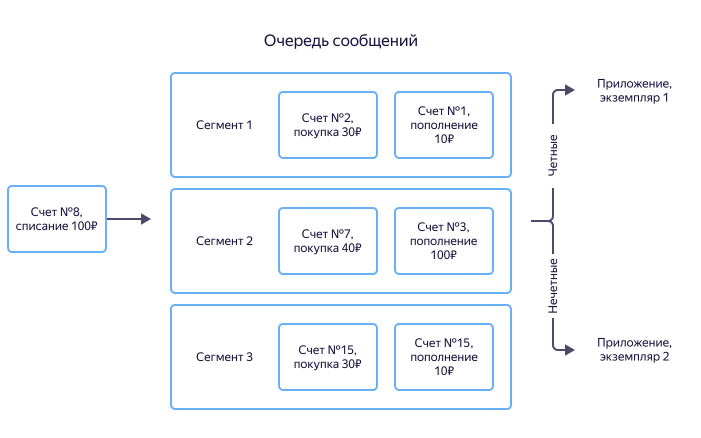

# Сегменты и ключи сегментов

Следующие примеры поясняют понятия [сегментов](glossary.md#hard) (Partitions) и [ключей сегментов](glossary.md#partition-key) (PartitionKey).

## Когда важен порядок обработки сообщений {#order}

Рассмотрим финансовое приложение, задача которого вычислять остаток на счете пользователя и разрешать либо запрещать списание средств.

Для решения подобных задач можно использовать [очередь сообщений](../../message-queue/concepts/queue.md). При пополнении счета, снятии средств или совершении покупки в очередь записывается сообщение с идентификатором счета, суммой и типом операции. Приложение обрабатывает поступающие сообщения и вычисляет баланс.

Для правильного вычисления баланса важен порядок обработки сообщений. Если пользователь сначала пополняет счет, а затем совершает покупку, то и сообщения с информацией об этих операциях должны быть обработаны приложением в такой же последовательности. Иначе может произойти ошибка бизнес-логики, и, например, приложение отклонит покупку из-за нехватки средств. В очередях сообщений есть механизмы гарантированного порядка доставки, но они не могут обеспечить порядок сообщений внутри одной очереди на произвольных объемах данных.

В {{ yds-short-name }} используется следующий подход: вместо того чтобы гарантировать порядок сообщений внутри очереди произвольного размера, создается очередь из независимых сегментов небольшого размера, внутри каждого из которых порядок сообщений гарантирован. Таких сегментов внутри потока данных может быть неограниченное количество. Это позволяет обеспечить строгую последовательность обработки событий при неограниченном масштабировании.

За счет увеличения числа сегментов можно неограниченно наращивать скорость потока данных. Если производительности приложения станет недостаточно для обработки потока, можно дополнительно запустить необходимое количество экземпляров приложения.

Когда сообщения из потока читают несколько экземпляров приложения, сообщение о пополнении счета может получить один, а о списании — другой. В этом случае не существует экземпляра, который гарантированно содержит верную информацию о балансе. Для решения этой проблемы можно сохранять данные в СУБД, обмениваться информацией между экземплярами приложения, строить распределенный кеш и пр.

{{ yds-short-name }} можно так записывать данные, чтобы сообщения от одного источника (например, сообщения о транзакциях по одному счету) приходили в один и тот же экземпляр приложения. Источник сообщения определяется ключом сегмента (PartitionKey). В качестве ключа сегмента можно использовать идентификатор счета, баланс которого изменяется. При записи события {{ yds-short-name }} с помощью [хеширования](https://ru.wikipedia.org/wiki/Хеш-сумма) ключа вычисляет индекс сегмента и записывает в него поступающие данные. Таким образом сообщения о транзакциях по заданному счету будут попадать всегда в один сегмент и обрабатываться экземпляром приложения, который связан с этим сегментом. Каждый из экземпляров обслуживает свое подмножество сегментов и задача синхронизации между экземплярами не возникает.

Ниже приведет пример, когда все транзакции по счетам с четными идентификаторами передаются в первый экземпляр приложения, а с нечетными — во второй.

## Если порядок обработки не важен {#not-order}

Для некоторых задач порядок обработки сообщений не критичен. Например, при [вводе данных в системы хранения](../tutorials/data-ingestion.md) важно доставить данные, а упорядочение выполнит система хранения.

В этом случае в качестве ключа сегмента можно указывать произвольное значение. Так как ключ определяет сегмент, в который будет сохранено сообщение, то одинаковые ключи для всех сообщений приведут к отправке данных в один сегмент и к его перегрузке. Чтобы избежать подобной ситуации, в качестве ключа указывают хеш-сумму данных самого сообщения. Высокая уникальность хеш-суммы позволяет равномерно распределять запись сообщений по всем сегментам. Также в качестве ключа сегмента можно использовать любой уникальный идентификатор.

## Примеры использования {#examples}

* [{#T}](../tutorials/data-ingestion.md).
* [{#T}](../tutorials/yds-to-kafka.md).
* [{#T}](../tutorials/yds-to-ydb.md).