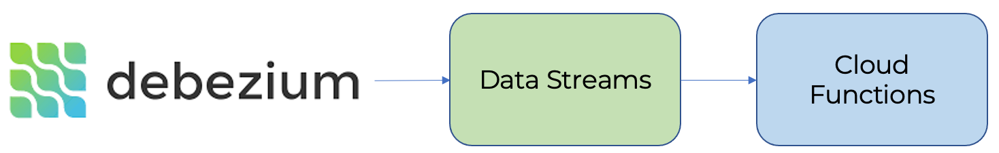

# Обработка потока изменений Debezium

[Debezium](https://debezium.io) — это сервис для захвата изменений в базах данных (Change Data Capture) и отправки их на обработку в другие системы. С помощью {{yds-full-name}} можно захватывать эти изменения и отправлять их в {{sf-name}}.

Ниже приведена архитектура решения:

## Настройка { #setup }
Для получения потока данных необходимо:
1. [Создать поток данных](#create_stream) {{yds-full-name}}.
1. [Настроить реквизиты подключения](#credentials) к {{yds-full-name}}.
1. [Настроить и запустить](#debezium_server) Debezium Server.
1. [Настроить триггер](#sftrigger) в {{sf-name}} для обработки данных.

### Создание потока данных { #create_stream }

Создайте поток данных {{yds-full-name}} с именем `debezium`. Процедура создания потока данных подробно описана в [документации {{yds-full-name}}](../../data-streams/operations/manage-streams.md)

### Настройка реквизитов подключения к {{yds-full-name}} { #credentials }



### Настройка Debezium Server { #debezium_server }



## Настроить триггер в {{sf-name}} { #sftrigger }

Создайте триггер в {{sf-name}} к потоку данных {{yds-full-name}} `debezium`, который был создан выше. 

Процедура создания триггера подробно описана в [документации {{sf-name}}](../../functions/concepts/trigger/data-streams-trigger.md).

В триггер {{sf-name}} будут отправлять нотификации обо всех изменениях в базе данных. В коде триггера вы можете обработать эти изменения, реализовав любую необходимую программную обработку.

