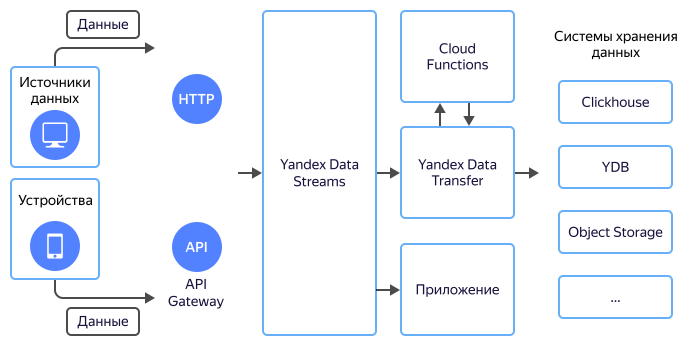

# Ввод данных в системы хранения

Все чаще источниками данных являются не компоненты приложения, а мобильные телефоны, разнообразные «умные» устройства или внешние сервисы.

Данные от таких источников поступают небольшими пакетами, количество пакетов может быть очень велико. Часто для передачи используются медленные каналы связи, а время связи ограничено. В таких условиях важно быстро сохранить принятые данные. Их обработку можно выполнить позднее. Поэтому данные отправляют сначала в шины потоков данных, а уже оттуда забирают их для обработки.

{{ yds-full-name }}, как шина потоков данных, обеспечивает оптимальные режимы работы для источников и приемников:

* принимает входящие данные с высокой частотой и скоростью, не блокируя источники;
* сохраняет принятые данные у себя;
* формирует пакеты данных и отправляет их в принимающие системы , снижая нагрузку на них.

## Преимущества {#advantages}

При работе с внешними устройствами или сервисами важно быстро сохранить полученные данные. Сохраненные данные можно получить из {{ yds-short-name }} прямым чтением, или настроить поставку данных в системы хранения {{ yandex-cloud }} с использованием {{ data-transfer-full-name }}.

### Прием данных {#receiving}

Данные в {{ yds-short-name }} передаются по [HTTP-протоколу](../kinesisapi/api-ref.md). С помощью сервиса [{{ api-gw-full-name}}](https://cloud.yandex.ru/services/api-gateway)(https://cloud.yandex.com/services/api-gateway) можно реализовать любой протокол приема данных. Принятые в {{ api-gw-name }} данные можно уже отправить в {{ yds-short-name }}.

{{ yds-short-name }} хорошо масштабируется и позволяет принимать данные от тысяч источников данных одновременно.

### Надежность {#reliability}

Шина потоков данных — это важный инфраструктурный компонент. Она устойчива ко всем видам отказов {{ yandex-cloud }}. Вводимые в {{ yds-short-name }} данные сохраняются минимум в три зоны доступности {{ yandex-cloud }}.

### Пакетирование {#batching}

Системы хранения и обработки данных наиболее производительны, если данные в них записываются пакетами (batch). Самое эффективное место для создания пакетов данных — единая точка, куда все данные стекаются. Роль такой единой точки обычно выполняют шины данных.

### Перемотка данных {#rewind}

Шины данных, в отличие от очередей сообщений, хранят данные вплоть до истечения времени хранения, не удаляя их после прочтения. Это позволяет в любом направлении перемещаться по хранимым данным: от самых старых к самым новым. Например, если появился новый формат данных и он некорректно записывается в принимающую систему, то можно отмотать хранящиеся данные в шине на начало и заново, уже корректно, их перечитать и записать в принимающую систему.

### Несколько систем хранения {#multiple}

Часто одни и те же данные хранят сразу в нескольких системах хранения: в {{ CH }} для быстрой [аналитики](../../glossary/data-analytics.md)аналитики и в {{ objstorage-name }} для долговременного хранения. С помощью шин данных это легко решается: за счет возможности одновременно читать данные разным приложениям можно настроить отправку одних и тех же данных сразу в обе системы хранения данных: {{ CH }} и {{ objstorage-name }}. Это же решение позволит в любой момент добавить третью систему хранения, например {{ GP }} или {{ ES }}.

Подход с несколькими системами хранения очень удобен для соответствия compliance: ФЗ-152, PCI DSS и других — где нужно хранить данные не менее года. В этом случае данные за последний месяц для оперативного доступа можно отправлять в одну систему хранения, а данные для долгого хранения отправлять в «холодное» хранилище {{ objstorage-name }}.

### Маскирование и обработка логов {#mask}

Не ко всем данным у всех сотрудников есть доступ. Например, в данных может находиться персональная информация пользователей и доступ к ней должен быть ограничен.

Передаваемые данные можно отправить на обработку в {{ sf-name }}, где выполнить маскирование или любую другую обработку.

После обработки данные можно отправить сразу в несколько систем назначения: данные с маскированными персональными данными открыть всем сотрудникам, а полные данные только администраторам.  

### Чтение данных {#read}

Сохраненные в {{ yds-short-name }} данные можно обработать программно. {{ yds-short-name }} совместим с протоколом Amazon Kinesis Data Streams API, что позволяет использовать SDK для различных языков разработки: C++, Java, Go, Python и тд.

## Настройка {#setup}

Чтобы настроить ввод данных в системы хранения:

1. [Создайте поток данных](../quickstart/create-stream.md) {{ yds-short-name }}.
1. [Настройте](../quickstart/index.md) AWS SDK.
1. Настройте {{ data-transfer-full-name }} для передачи данных в выбранную систему хранения.

    Пример настройки поставки данных из {{ yds-short-name }} приведен в [практическом руководстве по сохранению данных в {{ CH }}](send-to-clickhouse.md).
1. Подключите произвольную функцию обработки данных к {{ data-transfer-full-name }}. Код функции приведен в [примере](https://github.com/yandex-cloud/examples/tree/master/ydt/nginx-logs) или используйте SDK для прямого чтения данных из {{ yds-short-name }}:
    * [Go](https://docs.aws.amazon.com/sdk-for-go/api/service/kinesis/).
    * [C++](https://sdk.amazonaws.com/cpp/api/LATEST/class_aws_1_1_kinesis_1_1_kinesis_client.html).
    * [Java](https://docs.aws.amazon.com/AWSJavaSDK/latest/javadoc/com/amazonaws/services/kinesis/AmazonKinesisClient.html).
    * [JavaScript](https://docs.aws.amazon.com/AWSJavaScriptSDK/v3/latest/clients/client-kinesis/index.html).
    * [Python](https://boto3.amazonaws.com/v1/documentation/api/latest/reference/services/kinesis.html).
    * [HTTP Kinesis Data Streams API](../kinesisapi/api-ref.md).
