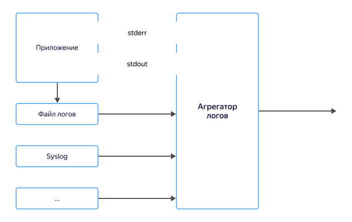

# Умная обработка логов

Для диагностики приложения пишут журналы работы. Но для анализа недостаточно просто иметь такие журналы, их нужно хранить и удобно обрабатывать. Для этого журналы отправляют в системы хранения: [Hadoop](https://cloud.yandex.ru/services/data-proc), [{{ CH }}](https://cloud.yandex.ru/services/managed-clickhouse), [{{ ES }}](https://cloud.yandex.ru/services/managed-elasticsearch) или в специализированные облачные системы типа [{{ cloud-logging-name }}](../../logging/).

Обычно приложения не пишут журналы работы в системы хранения напрямик, вместо этого они их отправляют тем или иным образом в промежуточные приложения-агрегаторы. Приложения-агрегаторы могут получать журналы, перехватывая stdout/stderr, читать файлы журналов с диска, получать их через syslog или по HTTP и еще множеством других способов.

После получения приложения-агрегаторы накапливают журналы работы у себя, а потом с помощью плагинов отправляют их в различные приемники. Такой подход позволяет разработчикам приложений сосредоточиться на написании кода, а поставку журналов переместить в специализированные выделенные системы.

Типовыми системами поставки журналов являются: [fluentd](https://www.fluentd.org), [fluentbit](https://fluentbit.io), [logstash](https://www.elastic.co/logstash/), а также множество других.  

Хотя приложения-агрегаторы могут записывать данные в системы хранения напрямик, для увеличения надежности данные отправляют сначала в промежуточный буфер (шину потоков данных, message broker) — {{ yds-full-name }}, а уже оттуда в системы хранения.

Часто логи содержат слишком много данных, либо данные, доступ к которым должен быть ограничен. Лишнюю или конфиденциальную информацию можно маскировать с помощью дополнительной обработки, например в {{ sf-name }}.

## Преимущества {#advantages}

### Надежность {#reliability}

Для увеличения надежности приложениям достаточно сконфигурировать агрегатор логов на как можно более быструю поставку данных в шину, а шина уже будет гарантировать надежное хранение данных вплоть до момента обработки и записи их в системы хранения.

### Несколько систем хранения {#multiple}

Часто одни и те же журналы работы хранят сразу в нескольких системах хранения: в {{ CH }} для быстрой [аналитики](../../glossary/data-analytics.md) и в {{ objstorage-name }} для долговременного хранения. Для этого приложения-агрегаторы можно настроить, чтобы они отправляли два потока данных: один в {{ CH }}, а второй в {{ objstorage-name }}.

С помощью шин данных это можно решить проще: достаточно отправлять журнал один раз в шину, а уже оттуда внутри {{ yandex-cloud }} запустить два процесса переноса данных. Это же решение позволит в любой момент добавить третью систему хранения, например {{ GP }} или {{ ES }}.

Подход с несколькими системами хранения очень удобен для соответствия compliance: ФЗ-152, PCI DSS и других — где нужно хранить журналы работы не менее года. В этом случае журналы работы за последний месяц для оперативного доступа можно отправлять в одну систему хранения, а данные для долгого хранения отправлять в «холодное» хранилище {{ objstorage-name }}.

### Маскирование и обработка логов {#mask}

Не ко всем журналам у всех сотрудников есть доступ. Например, в журналах может находиться персональная информация пользователей и доступ к ней должен быть ограничен.

Передаваемые журналы можно отправить в {{ sf-name }}, где выполнить маскирование или любую другую обработку передаваемых данных.

После обработки журналы работы можно отправить сразу в несколько систем назначения: журналы с маскированными персональными данными открыть всем сотрудникам, а полные журналы только администраторам.  

## Настройка {#setup}

Чтобы настроить умную обработку логов:

1. [Создайте поток данных](../quickstart/create-stream.md) {{ yds-short-name }}.
1. Настройте агрегатор логов: [fluentd](../quickstart/fluentd.md) или [logstash](../quickstart/logstash.md) или другой агрегатор с поддержкой [Kinesis Data Streams API](../kinesisapi/api-ref.md).
1. Настройте {{ data-transfer-full-name }} для передачи данных в выбранную систему хранения.

    Пример настройки поставки данных из {{ yds-short-name }} приведен в [практическом руководстве по сохранению данных в {{ CH }}](send-to-clickhouse.md).
1. Подключите произвольную функцию обработки данных к {{ data-transfer-full-name }}. Код функции приведен в [примере](https://github.com/yandex-cloud/examples/tree/master/ydt/nginx-logs).
