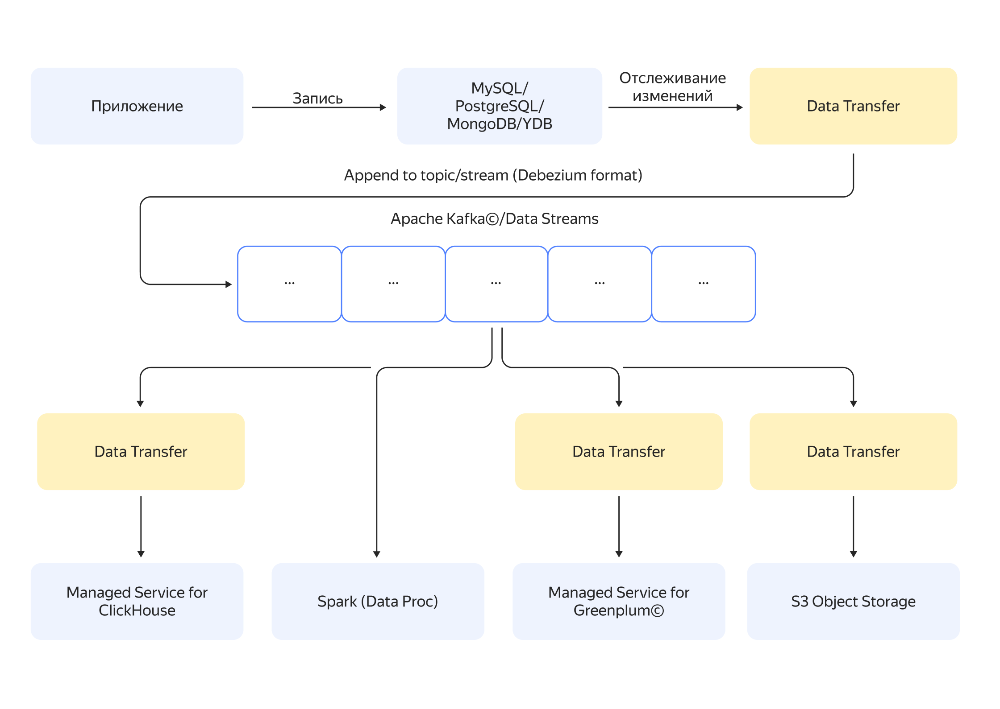

# Взаимосвязь ресурсов в {{ data-transfer-name }}

{{ data-transfer-full-name }} помогает переносить данные между СУБД, объектными хранилищами или брокерами сообщений. Сервис позволяет сократить время на процесс миграции и минимизировать простой при переключении на новую базу данных.

{{ data-transfer-full-name }} настраивается через стандартные интерфейсы {{ yandex-cloud }}.

Сервис подходит для создания постоянной реплики базы. Перенос схемы базы данных из источника на приемник автоматизирован.

## Эндпоинт {#endpoint}

_Эндпоинт_ — это конфигурация для подключения к сервису-_источнику_ или _приемнику_ данных. Кроме настроек подключения, эндпоинт может содержать информацию о том, какие данные будут участвовать в трансфере и как они должны быть обработаны в процессе переноса.

В качестве источника или приемника данных могут выступать:


| Сервис                                                                                                     | Источник                             | Приемник                             |
|------------------------------------------------------------------------------------------------------------|:------------------------------------:|:------------------------------------:|
| Топик {{ KF }} — собственный или в составе [сервиса {{ mkf-short-name }}](../../managed-kafka/)            |  |    |
| Поток сообщений AWS CloudTrail                                                                             |  |    |
| Собственная база данных BigQuery                                                                           |  |    |
| База данных {{ CH }} — собственная или в составе [сервиса {{ mch-short-name }}](../../managed-clickhouse/) |  |  |
| База данных {{ GP }} — собственная или в составе [сервиса {{ mgp-short-name }}](../../managed-greenplum/)  |  |  |
| База данных {{ MG }} — собственная или в составе [сервиса {{ mmg-short-name }}](../../managed-mongodb/)    |  |  |
| База данных {{ MY }} — собственная или в составе [сервиса {{ mmy-short-name }}](../../managed-mysql/)      |  |  |
| Собственная база данных Oracle                                                                             |  |    |
| База данных {{ PG }} — собственная или в составе [сервиса {{ mpg-short-name }}](../../managed-postgresql/) |  |  |
| S3-совместимый бакет                                                                                       |  |    |
| Поток данных [{{ yds-full-name }}](../../data-streams/)                                                    |  |    |
| База данных {{ ydb-name }} — в составе [сервиса {{ ydb-name }}](../../managed-ydb/)                                |    |  |
| Бакет [{{ objstorage-full-name }}](../../storage/)                                                         |    |  |


## Трансфер {#transfer}

_Трансфер_ — это процесс переноса данных между сервисом-источником и сервисом-приемником. Он должен находиться в одном каталоге с используемыми эндпоинтами.

Если для эндпоинтов заданы подсети, то они должны быть размещены в одной [зоне доступности](../../overview/concepts/geo-scope.md). Иначе активация трансфера с такими эндпоинтами завершится с ошибкой.

### Типы трансферов {#transfer-type}

Трансферы бывают следующих типов:

* _{{ dt-type-copy }}_ — переносит снапшот источника на приемник.
* _{{ dt-type-repl }}_ — непрерывно получает изменения из источника и применяет их на приемнике. При этом первоначальная синхронизация данных не выполняется.
* _{{ dt-type-copy-repl }}_ — переносит текущее состояние источника на приемник и поддерживает его актуальность.

Подробнее о различиях между типами трансферов читайте в разделе [{#T}](./transfer-lifecycle.md).

### Совместимость источников и приемников {#connectivity-matrix}



## Особенности работы сервиса с источниками и приемниками {#features}

### {{ CH }} {#clickhouse}

Если на приемнике {{ CH }} включена репликация, то движки для воссоздания таблиц будут выбраны в зависимости от типа источника:

* При переносе данных из строковых СУБД будут использоваться движки [ReplicatedReplacingMergeTree](https://{{ ch-domain }}/docs/ru/engines/table-engines/mergetree-family/replication/) и [ReplacingMergeTree](https://{{ ch-domain }}/docs/ru/engines/table-engines/mergetree-family/replacingmergetree/).
* При переносе данных из {{ CH }} будут использоваться движки семейства [ReplicatedMergeTree](https://{{ ch-domain }}/docs/ru/engines/table-engines/mergetree-family/replication/).

### {{ GP }} {#greenplum}

Трансфер из и в {{ GP }} предоставляется по запросу. Обратитесь в [техническую поддержку]({{ link-console-support }}) или к вашему аккаунт-менеджеру.

### {{ MG }} {#mongodb}

По умолчанию сервис не шардирует коллекции, переносимые в шардированный кластер. Подробнее см. в разделе [Подготовка к трансферу](../operations/prepare.md#target-mg).

Трансфер в {{ MG }} не переносит индексы. Когда трансфер перейдет в статус {{ dt-status-repl }}, создайте индекс для каждой шардируемой коллекции вручную:

```javascript
db.<имя коллекции>.createIndex(<свойства индекса>)
```

Описание функции `createIndex()` см. в [документации {{ MG }}](https://www.mongodb.com/docs/manual/reference/method/db.collection.createIndex/#mongodb-method-db.collection.createIndex).

### {{ PG }} {#postgresql}

* Сервис не переносит материализованные представления (`MATERIALIZED VIEW`). При переносе данных из одного кластера {{ PG }} в другой создайте вручную все необходимые материализованные представления в кластере-приемнике после [деактивации трансфера](../operations/transfer.md#deactivate).

* Сервис не переносит пользовательские типы данных, если в эндпоинте для источника задан список включенных или исключенных таблиц. В этом случае перенесите пользовательские типы данных вручную.

### {{ yds-full-name }} {#yds}

По умолчанию при переносе данных из {{ yds-name }} в {{ CH }} для каждой партиции создается отдельная таблица. Чтобы все данные попадали в одну таблицу, укажите правила конвертации в [дополнительных настройках эндпоинта для источника](../operations/endpoint/source/data-streams.md#additional-settings).

## Захват изменения данных {#cdc}

CDC (change data capture — [захват изменения данных](https://en.wikipedia.org/wiki/Change_data_capture)) — это процесс отслеживания изменений в базе данных и поставка этих изменений к потребителям в режиме почти реального времени. CDC может применяться для:

* создания приложений, которые реагируют на изменение данных в реальном времени;
* поставки данных из централизованного хранилища в микросервисы;
* сбора и поставки данных из продакшен-окружения во внутренние хранилища данных — для обработки и анализа.

В {{ yandex-cloud }} одним из способов реализации CDC-подхода может быть трансфер из базы данных в брокер сообщений. Все обновления в базе отслеживаются трансфером и отправляются в брокер сообщений, а потребители подключаются к брокеру и считывают поступающие собщения.

{{ data-transfer-name }} поддерживает CDC-режим для трансферов из баз данных {{ PG }}, {{ MG }} и {{ MY }} в {{ KF }} и {{ yds-full-name }}^1^. При этом данные в приемник попадают в формате [Debezium](https://debezium.io/).





^1^ Функциональность находится на стадии Preview.
