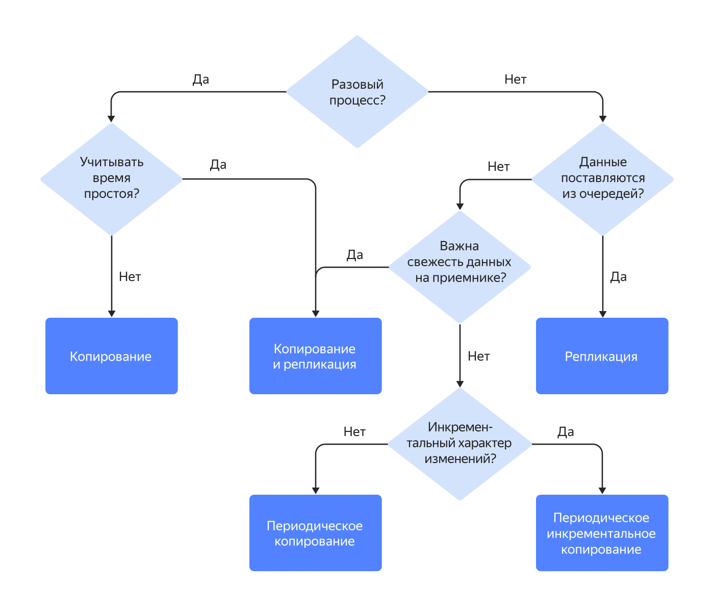
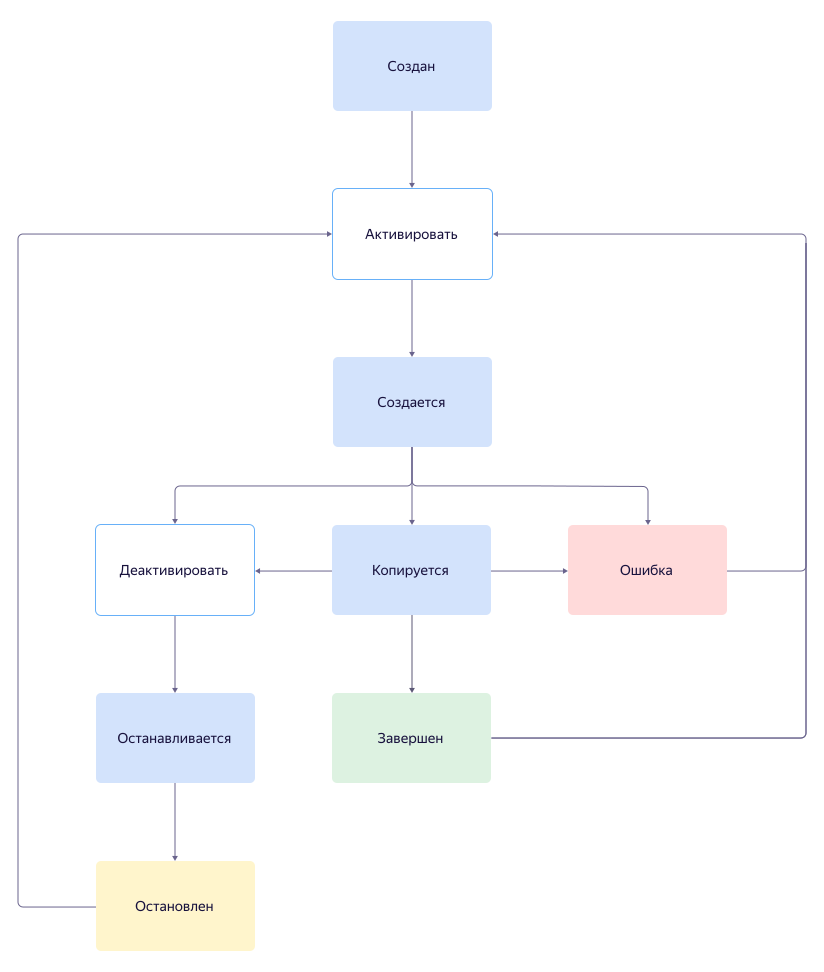
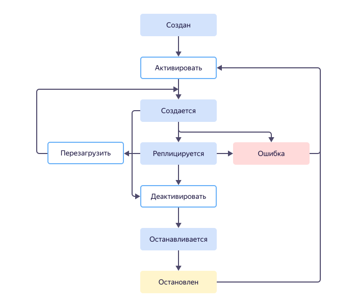
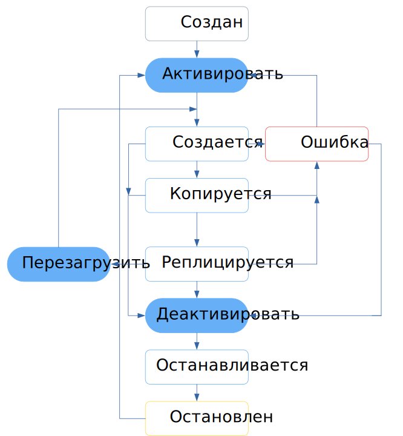

# Типы и жизненные циклы трансферов

Жизненный цикл трансфера — это набор его статусов и переходов между ними. Порядок перехода между статусами зависит от типа трансфера.

## Типы трансферов {#transfer-types}



Выбор того или иного типа трансфера зависит от характера изменений данных на эндпоинте-источнике, требований к частоте поставок и актуальности данных.

### Копирование {#copy}

Трансфер типа _{{ dt-type-copy }}_ предназначен для переноса состояния базы-источника на приемник без поддержания ее в актуальном состоянии. Изменения, произошедшие на источнике после завершения трансфера, перенесены не будут. Трансфер этого типа может быть полезен, когда на источнике нет пишущей нагрузки или нет необходимости в поддержании базы-приемника в актуальном состоянии, например, [при развертывании тестовых сред](./use-cases.md#testing).

Когда трансфер будет подготовлен к работе, он автоматически перейдет в статус {{ dt-status-copy }}. В нем он будет находиться до тех пор, пока все данные, находящиеся в источнике, не будут перенесены на приемник. Затем трансфер автоматически деактивируется и перейдет в статус {{ dt-status-finished }}.

Переход между статусами для трансферов типа _{{ dt-type-copy }}_ показан на схеме:

Сервис {{ data-transfer-full-name }} реализует три вида копирования:

* _{{ dt-copy-snapshot }}_ — копирует все данные из источника в приемник в момент активации трансфера. Копирование выполняется в порядке убывания размера таблиц (самые объемные таблицы копируются первыми). Этот вид копирования может занимать много времени, если объем переносимых данных значительный. Кроме того, однократное копирование не учитывает изменений данных. Повторить копирование можно будет только после завершения предыдущей операции.
* _{{ dt-copy-regular }}_ — копирует все данные из источника в приемник через определенные интервалы времени. Такой способ копирования позволяет настроить регулярную поставку данных. Этот подход рекомендован для небольших, часто меняющихся таблиц.
* _{{dt-copy-regular-incremental}}_ — копирует в приемник через определенные интервалы времени только те данные, которые были изменены в источнике с момента предыдущего копирования. Такой подход позволяет организовать поставку данных в приемник с минимальными задержками и нагрузкой на источник данных, но не позволяет учитывать операции удаления данных в источнике. Подробнее см. в разделе [{#T}](./regular-incremental-copy.md).

### Репликация {#replication}

Трансфер типа _{{ dt-type-repl }}_ предназначен для переноса изменений из источника на приемник без полного копирования всех данных: во время [активации](../operations/transfer.md#activate) будет перенесена только схема данных.

Когда трансфер будет подготовлен к работе, он автоматически перейдет в статус {{ dt-status-repl }}, в котором будет находиться неограниченно долго. Происходящие в источнике изменения будут автоматически передаваться на приемник.

Переход между статусами для трансферов типа _{{ dt-type-repl }}_ показан на схеме:

### Копирование и репликация {#copy-and-replication}

Трансфер типа _{{ dt-type-copy-repl }}_ объединяет функциональность трансферов типа _{{ dt-type-copy }}_ и _{{ dt-type-repl }}_ — данные источника полностью переносятся на приемник и поддерживаются в актуальном состоянии. Чаще всего такие трансферы используются в сценариях миграции.

После успешной [активации](../operations/transfer.md#activate) и подготовки к работе, трансфер автоматически перейдет в статус {{ dt-status-copy }}. В нем он будет находиться до тех пор, пока все данные, находящиеся в источнике, не будут перенесены на приемник.

Затем трансфер перейдет в статус {{ dt-status-repl }}: все происходящие на источнике изменения будут автоматически переноситься на приемник.

Переход между статусами для трансферов типа _{{ dt-type-copy-repl }}_ показан на схеме:

## Статусы {#statuses}

Доступные действия с трансфером определяются его текущим статусом. Подробнее см. в разделе [{#T}](../operations/transfer.md).

* {{ dt-status-created }} (`CREATED`) — присваивается трансферу сразу после [создания](../operations/transfer.md#create).

* {{ dt-status-creation }} (`CREATING`) — присваивается трансферу при [активации](../operations/transfer.md#activate).

  В это время сервис выполняет проверку подключения к источнику и приемнику, а также создает ресурсы, необходимые для работы трансфера. В зависимости от [типа трансфера](./index.md#transfer-type) и настройки [эндпоинтов](./index.md#endpoint) могут выполняться дополнительные действия, например, создание слотов репликации, копирование схемы данных и т. п.

* {{ dt-status-stopping }} (`STOPPING`) — присваивается трансферу при [деактивации](../operations/transfer.md#deactivate).

  В это время сервис выполняет действия, необходимые для корректного отключения от источника и приемника. В зависимости от [типа трансфера](./index.md#transfer-type) и настройки [эндпоинтов](./index.md#endpoint) может выполняться закрытие слотов репликации, перенос триггеров, хранимых процедур и функций, создание индексов в базе-приемнике и т. п.

* {{ dt-status-stopped }} (`STOPPED`) — присваивается трансферу при завершении [деактивации](../operations/transfer.md#deactivate).

  Только успешная деактивация трансфера гарантирует работоспособность приемника и источника.

* {{ dt-status-copy }} (`SNAPSHOTTING`) — присваивается трансферам типа _{{ dt-type-copy }}_ и _{{ dt-type-copy-repl }}_ на время копирования данных из источника.

* {{ dt-status-repl }}(`RUNNING`) — присваивается трансферам типа _{{ dt-type-repl }}_ и _{{ dt-type-copy-repl }}_.
  
  * _{{ dt-type-repl }}_ — после успешной [активации](../operations/transfer.md#activate).
  * _{{ dt-type-copy-repl }}_ — после успешного копирования данных из источника.

* {{ dt-status-finished }} (`DONE`) — присваивается трансферам, успешно завершившим перенос данных.

* {{ dt-status-error }} (`ERROR`) — присваивается трансферу при возникновении неполадок в его работе.

  Трансфер может перейти в статус **{{ dt-status-error }}** во время активации, репликации или копирования данных. В зависимости от статуса, предшествовавшего появлению ошибки, трансфер можно будет повторно [активировать](../operations/transfer.md#activate). Ошибки могут возникать как на источнике, так и на приемнике.

  Подробнее о возможных причинах и способах устранения ошибок можно прочитать в разделе [{#T}](../troubleshooting/index.md).

[Тарификация](../pricing.md) трансферов в платном потреблении осуществляется, когда они находятся в статусах {{ dt-status-repl }} (`RUNNING`), {{ dt-status-copy }} (`SNAPSHOTTING`) или {{ dt-status-stopping }} (`STOPPING`). 

