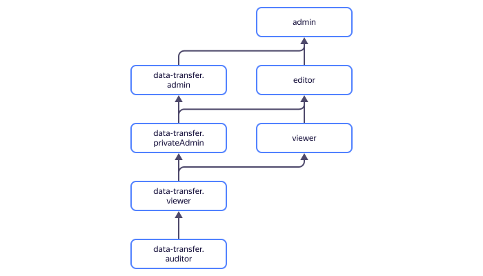

# Управление доступом в {{ data-transfer-name }}

В этом разделе вы узнаете:

* [на какие ресурсы можно назначить роль](#resources);
* [какие роли действуют в сервисе](#roles-list);
* [какие роли необходимы](#required-roles) для того или иного действия.

Для использования сервиса необходимо авторизоваться в консоли управления с [аккаунтом на Яндексе](../../iam/concepts/users/accounts.md#passport) или с [федеративным аккаунтом](../../iam/concepts/users/accounts.md#saml-federation).





## На какие ресурсы можно назначить роль {#resources}



## Какие роли действуют в сервисе {#roles-list}



### Сервисные роли {#service-roles}

#### data-transfer.auditor {#data-transfer-auditor}



#### data-transfer.viewer {#data-transfer-viewer}



#### data-transfer.privateAdmin {#data-transfer-privateadmin}



#### data-transfer.admin {#data-transfer-admin}



### Примитивные роли {#primitive-roles}

#### {{ roles-viewer }} {#viewer}



#### {{ roles-editor }} {#editor}



#### {{ roles-admin }} {#admin}



## Какие роли необходимы {#required-roles}

Чтобы пользоваться сервисом, необходима [роль](../../iam/concepts/access-control/roles.md) `editor` или выше на каталог, в котором создаются проекты. Роль `viewer` позволит только просматривать список проектов и содержимое файлов, которые были загружены.

Для создания или редактирования эндпоинта управляемой базы данных вам потребуется сервисная или примитивная [роль `viewer`](../../iam/roles-reference.md#viewer), выданная на каталог кластера этой управляемой базы данных.

Вы всегда можете назначить роль, которая дает более широкие разрешения, нежели указанная. Например, назначить `admin` вместо `editor`.

## Что дальше {#whats-next}

* [Как назначить роль](../../iam/operations/roles/grant.md).
* [Как отозвать роль](../../iam/operations/roles/revoke.md).
* [Подробнее об управлении доступом в {{ yandex-cloud }}](../../iam/concepts/access-control/index.md).
* [Подробнее о наследовании ролей](../../resource-manager/concepts/resources-hierarchy.md#access-rights-inheritance).

