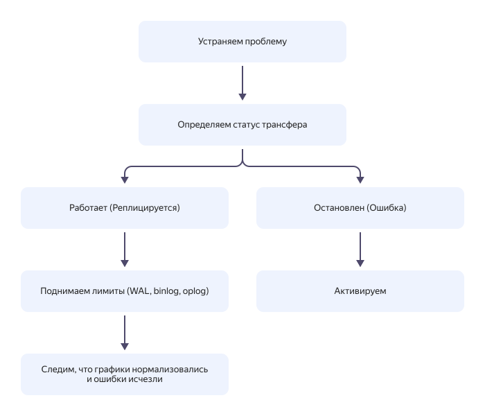

# Решение проблем в {{ data-transfer-name }}

В этом разделе описаны типичные проблемы, которые могут возникать при [активации](../operations/transfer.md#activate) или во время работы [трансферов](../concepts/index.md#transfer), и методы их решения.

* [{#T}](#overview)
* [{#T}](#common)
* [{#T}](#data-transform)
* [{#T}](#api)
* [{#T}](#network)
* [{#T}](#clickhouse)
* [{#T}](#elasticsearch)
* [{#T}](#mongodb)
* [{#T}](#mysql)
* [{#T}](#opensearch)
* [{#T}](#postgresql)
* [{#T}](#ydb)
* [{#T}](#yds)
* [{#T}](#support)

## Проблемы, возникающие при работе с сервисом {{ data-transfer-name }} {#overview}
Чтобы вовремя обнаружить проблему: 

1. Следите за состоянием трансфера на вкладке **{{ ui-key.yacloud.data-transfer.label_monitoring }}** страницы управления трансфером или в сервисе [{{ monitoring-full-name }}](../../monitoring/concepts/index.md).
1. [Настройте алерты](../operations/monitoring.md#monitoring-integration) в сервисе {{ monitoring-full-name }} для получения уведомлений о сбоях в работе трансфера.
1. [Запрашивайте](../../support/request.md) записи о том, что происходило с вашими ресурсами, из логов сервисов {{ yandex-cloud }}.
1. Используйте [мобильное приложение](/mobile-app) {{ yandex-cloud }} для отслеживания состояния трансферов.

Если при переносе данных работа сервиса {{ data-transfer-name }} была нарушена, попробуйте локализовать и проанализировать проблему. Часть решений приводится в этой статье или других разделах документации.

| Источник проблемы     | Проблема                                                    | Решение                                                                                                                                                                                                                                                                                                                                                                                                                                                                                                                                                                                                                                                                                                                                                                                                                                                                                                                                                                          |
|-----------------------|-------------------------------------------------------------|----------------------------------------------------------------------------------------------------------------------------------------------------------------------------------------------------------------------------------------------------------------------------------------------------------------------------------------------------------------------------------------------------------------------------------------------------------------------------------------------------------------------------------------------------------------------------------------------------------------------------------------------------------------------------------------------------------------------------------------------------------------------------------------------------------------------------------------------------------------------------------------------------------------------------------------------------------------------------------|
| Эндпоинт              | Отсутствие сетевой доступности или прав доступа к эндпоинту | Проверьте чтение из источника с помощью графиков: [Maximum data transfer delay](../operations/monitoring.md#sinker.pusher.time.row_max_lag_sec), [Number of source events](../operations/monitoring.md#publisher.data.changeitems) и [Reads](../operations/monitoring.md#publisher.data.bytes).</br>Проверьте запись в приемник с помощью графиков: [Maximum data transfer delay](../operations/monitoring.md#sinker.pusher.time.row_max_lag_sec), [Number of source events](../operations/monitoring.md#publisher.data.changeitems), [Number of target events](../operations/monitoring.md#sinker.pusher.data.changeitems) и [Reads](../operations/monitoring.md#publisher.data.bytes).</br>Если данные читаются и записываются, проверьте [ограничения на работу с СУБД](../operations/transfer.md).</br>Уточните требования для [подготовки](../operations/prepare.md) и [настройки](../operations/index.md) эндпоинта.</br>Поищите уже готовое [решение проблемы](#common). |
| Эндпоинт или трансфер | Недостаток физических ресурсов трансфера или эндпоинтов     | Если данные читаются и записываются, проверьте, достаточно ли физических ресурсов на графиках: [CPU](../operations/monitoring.md#proc.cpu%7Cproc.guarantee.cpu) и [RAM](../operations/monitoring.md#proc.ram%7Cproc.guarantee.mem).</br>Ознакомьтесь с рекомендациями по диагностике СУБД. Например, [{{ MY }}](../../managed-mysql/operations/performance-diagnostics.md), [{{ MG }}](../../managed-mongodb/operations/performance-diagnostics.md) или [{{ PG }}](../../managed-postgresql/operations/performance-diagnostics.md).                                                                                                                                                                                                                                                                                                                                                                                                                                               |
| Данные                | Неактуальные данные из-за изменений в схеме данных          | Ознакомьтесь с различными сценариями передачи данных в разделе [Практические руководства {{ data-transfer-name }}](../tutorials/index.md).                                                                                                                                                                                                                                                                                                                                                                                                                                                                                                                                                                                                                                                                                                                                                                                                                                       |
| Данные                | Неактуальные данные из-за большого объема данных            | Увеличьте количество воркеров для [параллельного копирования](../concepts/sharded.md) или [репликации](../operations/transfer.md#create).</br>Разделите таблицы на несколько трансферов.                                                                                                                                                                                                                                                                                                                                                                                                                                                                                                                                                                                                                                                                                                                                                                                         |

После устранения проблемы, в зависимости от статуса трансфера, активируйте его или измените ограничения передачи данных работающего трансфера.



## Общие {#common}









### Снижение скорости трансфера {#speed-degrade}

**Проблема**:



**Решение**:

Используйте политику очистки `Drop` или `Truncate`.





## Трансформация данных {#data-transform}



## Ошибки в API {#api}

Пример ошибки:

```text
{"code": 13, "message": "internal"}
```

**Решение:** обратитесь в [техническую поддержку]({{ link-console-support }}) или к вашему аккаунт-менеджеру с `request_id` запроса. Если вы используете `curl` для вызовов [API](../../glossary/rest-api.md), добавьте флаг `-v` для упрощения диагностики ошибки.

## Сеть {#network}












## {{ CH }} {#clickhouse}





## {{ ES }} {#elasticsearch}






## {{ MG }} {#mongodb}


















## {{ MY }} {#mysql}















## {{ OS }} {#opensearch}







## {{ PG }} {#postgresql}






































## {{ ydb-full-name }} {#ydb}



## {{ yds-full-name }} {#yds}






## Куда заявить о проблеме {#support}

Если проблему не удалось решить с помощью приведенных советов, обратитесь в [техническую поддержку]({{ link-console-support }}).


