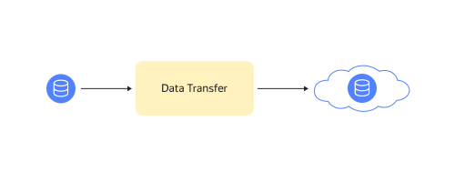
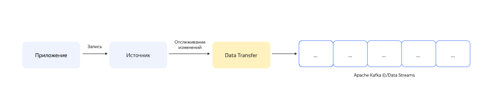
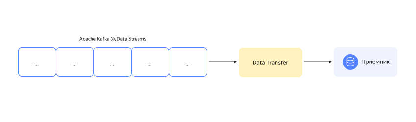
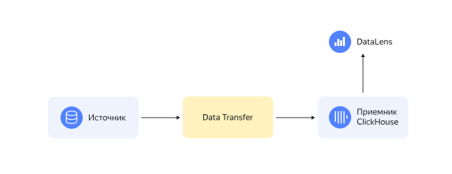
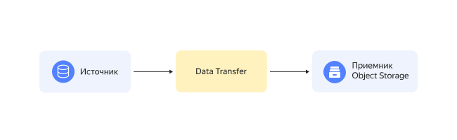

# Практические руководства {{ data-transfer-name }}

C помощью {{ data-transfer-name }} вы можете реализовать различные сценарии миграции данных, захвата изменений, поставок данных из очередей, загрузки в витрины, зеркалирования и загрузки данных в масштабируемое хранилище.

## Миграция данных {#migration}
Миграция — задача, в рамках которой требуется перенести данные из одного хранилища в другое. В {{ data-transfer-name }} миграция часто означает перенос базы в облако из устаревших локальных баз в управляемые облачные.

* [Миграция кластера {{ PG }}](managed-postgresql.md)
* [Миграция кластера {{ MY }}](managed-mysql-to-mysql.md)
* [Миграция кластера {{ CH }}](managed-clickhouse.md)
* [Миграция кластера {{ GP }}](managed-greenplum.md)
* [Миграция кластера {{ MG }}](managed-mongodb.md)

Отдельной задачей миграции является зеркалирование данных между очередями.

* [Зеркалирование {{ KF }}](mkf-to-mkf.md)

Миграция со сменой типа хранения данных.

* [{{ MY }} в {{ ydb-short-name }}](managed-mysql-to-ydb.md)
* [{{ PG }} в {{ ydb-short-name }}](mpg-to-ydb.md)

## Захват изменений данных {#cdc}

[Change Data Capture](../concepts/cdc.md) (СDC) — это процесс отслеживания изменений в базе данных и поставка этих изменений потребителям, поддерживающий публичный формат сериализации при записи в очередь Debezium.
СDC используется для создания приложений, которые чувствительны к изменению данных в реальном времени, обмена данными между различными сервисами, в том числе, с разным уровнем доступности, сбора и поставки данных из продакшен-окружения во внутренние хранилища данных для обработки и анализа.

* Захват изменений {{ MY }} и поставка в 
  * [{{ KF }}](cdc-mmy.md)
  * [{{ DS }}](mmy-to-yds.md)
* Захват изменений {{ PG }} и поставка в
  * [{{ KF }}](cdc-mpg.md)
  * [{{ DS }}](mpg-to-yds.md)
* Захват изменений {{ ydb-short-name }} и поставка в
  * [{{ KF }}](cdc-ydb.md)
  * [{{ DS }}](ydb-to-yds.md)

## Поставка данных из очередей {#delivery-to-queue}

Поставка данных — процесс доставки произвольных данных в целевые хранилища. Процесс поставки включает извлечение данных из очереди и их десериализацию с последующей трансформацией данных в формат целевого хранилища.

* [{{ KF }} в {{ CH }}](mkf-to-mch.md)
* [{{ KF }} в {{ PG }}](mkf-to-mpg.md)
* [{{ KF }} в {{ GP }}](managed-kafka-to-greenplum.md)
* [{{ KF }} в {{ ES }}](mkf-to-mes.md)
* [{{ KF }} в {{ MG }}](mkf-to-mmg.md)
* [{{ KF }} в {{ MY }}](mkf-to-mmy.md)
* [{{ KF }} в {{ OS }}](mkf-to-mos.md)
* [{{ KF }} в {{ ydb-short-name }}](mkf-to-ydb.md)
* [{{ KF }} в {{ DS }}](mkf-to-yds.md)
* [{{ DS }} в {{ CH }}](yds-to-clickhouse.md)
* [{{ DS }} в {{ objstorage-name }}](yds-to-objstorage.md)

## Загрузка данных в витрины {#upload-to-data-mart}

Загрузка данных в витрины — процесс трансфера подготовленных данных в хранилища с целью последующей визуализации. Источники — хранилища, используемые для массивно-параллельной обработки данных. Приемники — хранилища, способные быстро отдать данные.

* [{{ GP }} в {{ CH }}](greenplum-to-clickhouse.md)
* [{{ MY }} в {{ CH }}](mysql-to-clickhouse.md)
* [{{ metrika }} в {{ CH }}](metrika-to-clickhouse.md)
* [{{ PG }} в {{ CH }}](rdbms-to-clickhouse.md)
* [{{ GP }} в {{ PG }}](greenplum-to-postgresql.md)

## Загрузка данных в {{ objstorage-name }} {#upload-to-storage}

Загрузка данных в масштабируемое хранилище {{ objstorage-name }} позволяет удешевить хранение и облегчает обмен данных с контрагентами.

* [{{ MY }} в {{ objstorage-name }}](mmy-objs-migration.md)
* [{{ at-name }} в {{ objstorage-name }}](trails-to-os.md)
* [{{ PG }} в {{ objstorage-name }}](mpg-to-objstorage.md)


