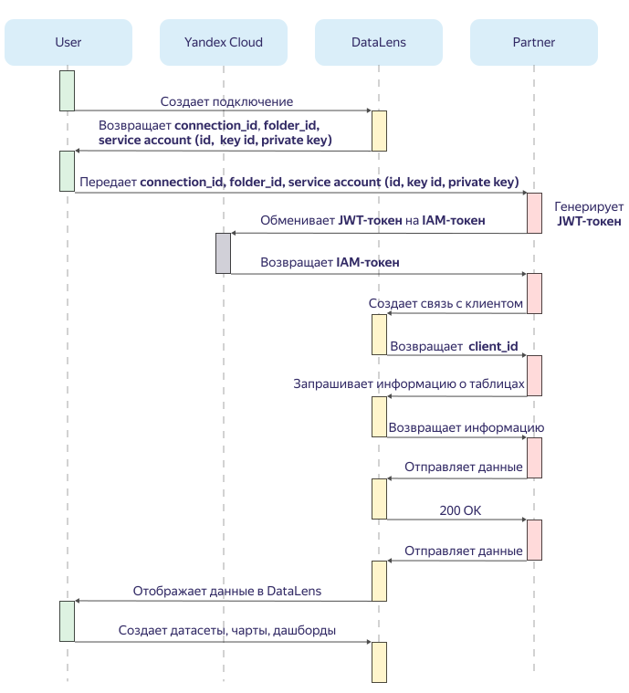

# Принцип работы {{ datalens-api-short-name }}

Диаграмма последовательности работы с {{ datalens-api-short-name }}:




Для создания сервисного аккаунта у пользователя должны быть права администратора на каталог, в котором развернут {{ datalens-short-name }}.



1. Пользователь создает подключение партнера в интерфейсе {{ datalens-short-name }}.
1. {{ datalens-short-name }} возвращает:
   - идентификатор подключения `connection_id`;
   - идентификатор каталога `folder_id`;
   - идентификатор сервисного аккаунта `service_account_id`;
   - идентификатор ключа сервисного аккаунта `svc_acct_key_id`;
   - закрытый ключ сервисного аккаунта `svc_acct_private_key`.     
1. Пользователь передает полученную информацию партнеру и делает запрос на создание клиента для отправки данных.
1. Партнер создает клиента и генерирует JWT-токен. Подробнее о JWT-токене в документации сервиса [{{ iam-name }}](../iam/operations/iam-token/create-for-sa.md#via-jwt).
1. Партнер получает IAM-токен в обмен на JWT-токен.

    Полученный токен используется в дальнейших запросах к {{ datalens-api-short-name }}. Подробнее об IAM-токене в документации сервиса [{{ iam-name }}](../iam/concepts/authorization/iam-token.md).

1. Партнер создает связь клиента с подключением DataLens с помощью метода API [{#T}](api-ref/link-client.md).
    
    {{ datalens-api-short-name }} возвращает идентификатор клиента `client_id`.

1. Партнер запрашивает информацию о подключении и таблицах, в которые необходимо записывать данные, с помощью метода API [{#T}](api-ref/get-connection-info.md).

1. Партнер отправляет данные в {{ datalens-short-name }}.

    В заголовке каждого запроса на отправку данных партнер отправляет уникальный идентификатор операции `Operation UUID`.

1. {{ datalens-short-name }} материализует полученные данные и отображает их в интерфейсе.

1. Пользователь создает датасеты, чарты, дашборды на основе подключения партнера.

## Особенности работы с API {#features}

Необходимо учитывать следующие особенности при работе с {{ datalens-api-short-name }}.

### Operation UUID {#operation-uuid}

При каждом запросе на запись партнер передает в заголовке уникальный идентификатор операции `Operation UUID`.
Идентификатор генерируется на стороне клиента.

Если во время передачи данных запрос будет прерван (например, из-за неполадок сети), клиенту необходимо повторить запрос с идентичными значениями.
Сервер {{ datalens-api-short-name }} проверит статус предыдущего запроса с таким же значением `Operation UUID` и сделает следующее:
* Если сервер {{ datalens-short-name }} успешно записал данные, то он отправит ответ `200 OK`.
* Если сервер {{ datalens-short-name }} находится в процессе записи, то он отправит ответ `423 Locked`.
* Если сервер {{ datalens-short-name }} не записал данные, то он начнет запись в БД.

Подробнее о [генерации UUID](https://ru.wikipedia.org/wiki/UUID#Версия_4_(случайный)).

### Partitioning Key {#partitioning-key}

Для записи данных в таблицу можно указывать ключ партиционирования.

_Ключ партиционирования_ — это произвольное выражение из столбцов таблицы, которые указаны в схеме. Например, `["FieldName1","FieldName2","FieldName3"]`.

С помощью ключа клиент может удалять данные частями (партициями).
Например, партиция может быть по месяцу, по дню или по типу события.

### Replacing Key {#replacing-key}

Для замены существующих данных в таблице можно указать ключ замены данных. 

_Ключ замены данных_ — это произвольное выражение из столбцов таблицы, которые указаны в схеме. Например, `["FieldName1","FieldName2"]`.
 
С помощью ключа клиент может заменить данные, которые были загружены ранее.

#### Пример использования {#replacing-key-example}

Для таблицы из трех полей: **Country**, **City**, **Goods quantity**, в качестве ключа замены данных указан `replacing_key: ["Country", "City"]`.

При первой загрузке переданы следующие данные:
```json
["Russia", "Moscow", 1]
["Russia", "Kazan", 2.1]
["Russia", "Kazan", 2.2]
```
Так как данных в таблице не было, все данные были успешно загружены.

При следующей загрузке переданы данные:
 ```json
 ["Russia", "Kazan", 10]
 ```
 
В результате удалятся все данные, которые соответствуют ключу `["Russia", "Kazan", ...]`.
В таблице останутся следующие данные:
```json
["Russia", "Moscow", 1]
["Russia", "Kazan", 10]
```

### Формат данных {#data-format}

Данные в {{ datalens-api-short-name }} записываются в формате [NDJSON](http://ndjson.org/).
При каждом запросе на запись необходимо указать заголовки, которые определяют формат данных:

```
X-DL-Data-Format: array
Content-Type: application/x-ndjson
```

В теле запроса каждая строка данных передается в виде JSON-массива:

```json
["fieldValue11", "fieldValue21"]
["fieldValue12", "fieldValue22"]
["fieldValue13", "fieldValue23"]
```

Дата и время должны быть переданы в формате [ISO 8601](https://ru.wikipedia.org/wiki/ISO_8601).
Если в дате и времени есть сведения о часовом поясе (time zone), {{ datalens-short-name }} автоматически приведет его к [стандарту UTC](https://ru.wikipedia.org/wiki/Всемирное_координированное_время).



Число и порядок столбцов в теле запроса должны совпадать с числом и порядком столбцов, которые указаны в схеме таблицы.


